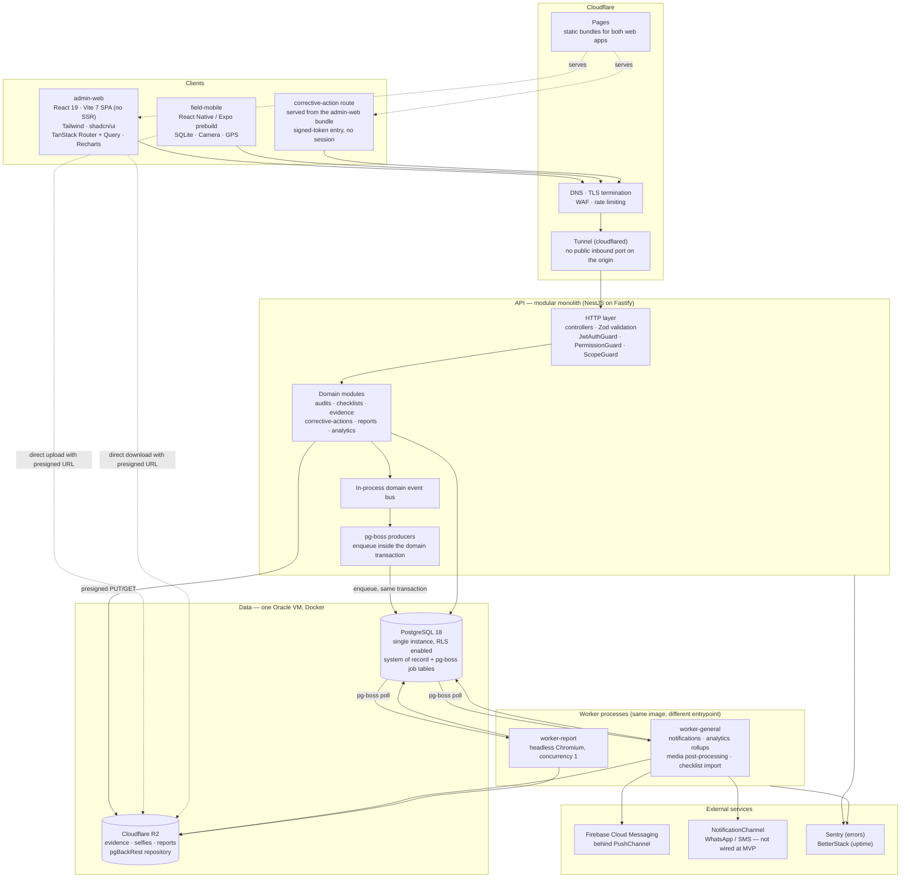
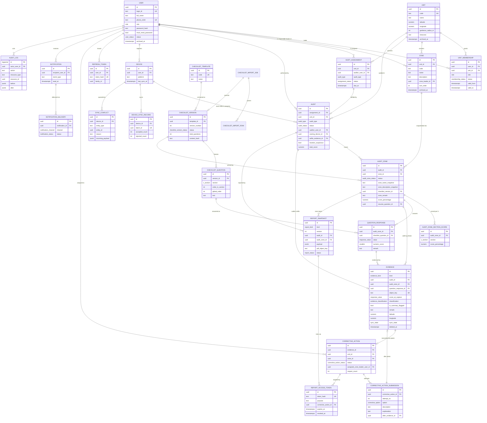
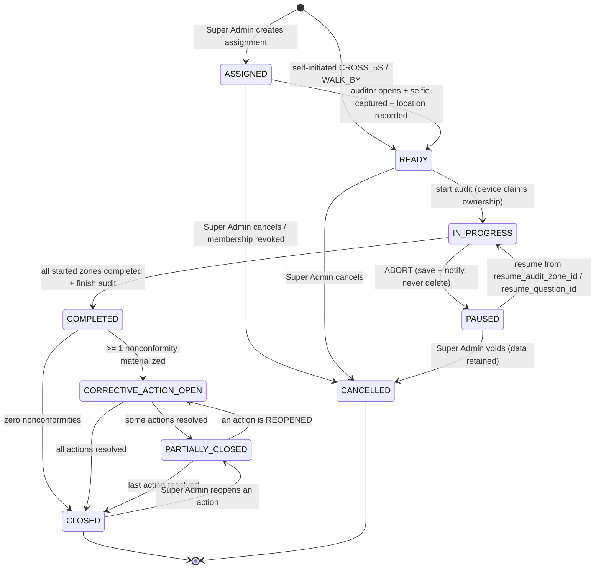
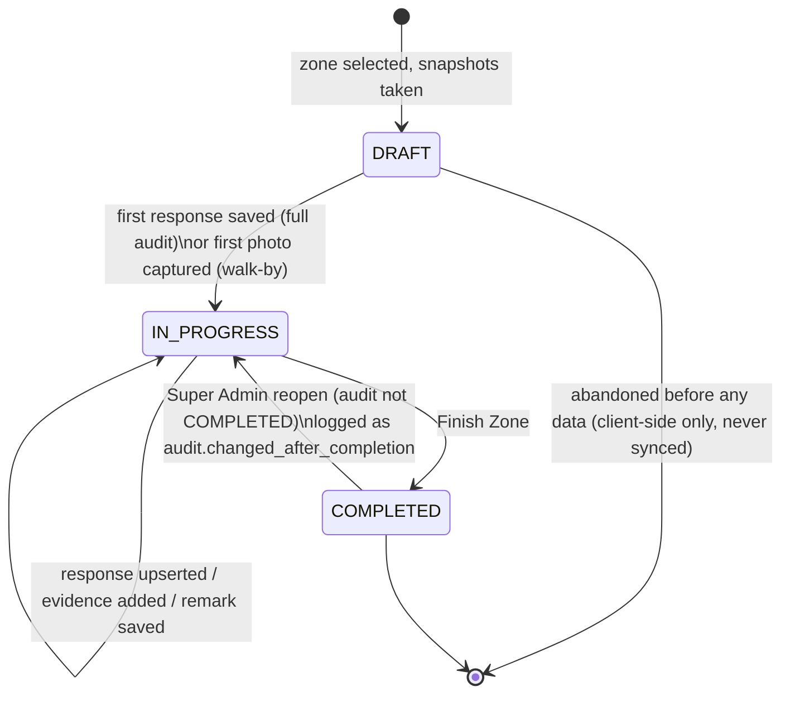
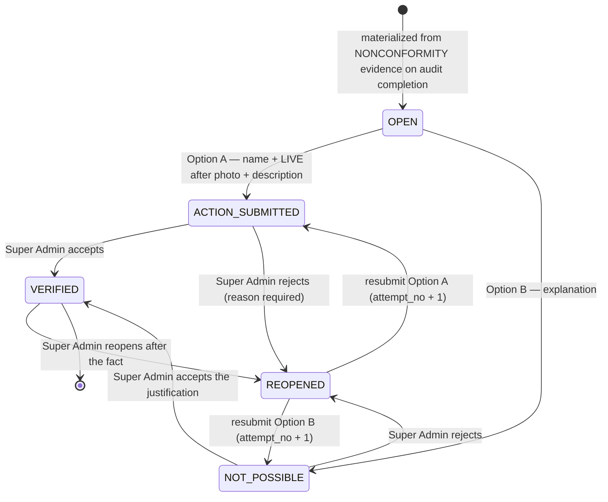
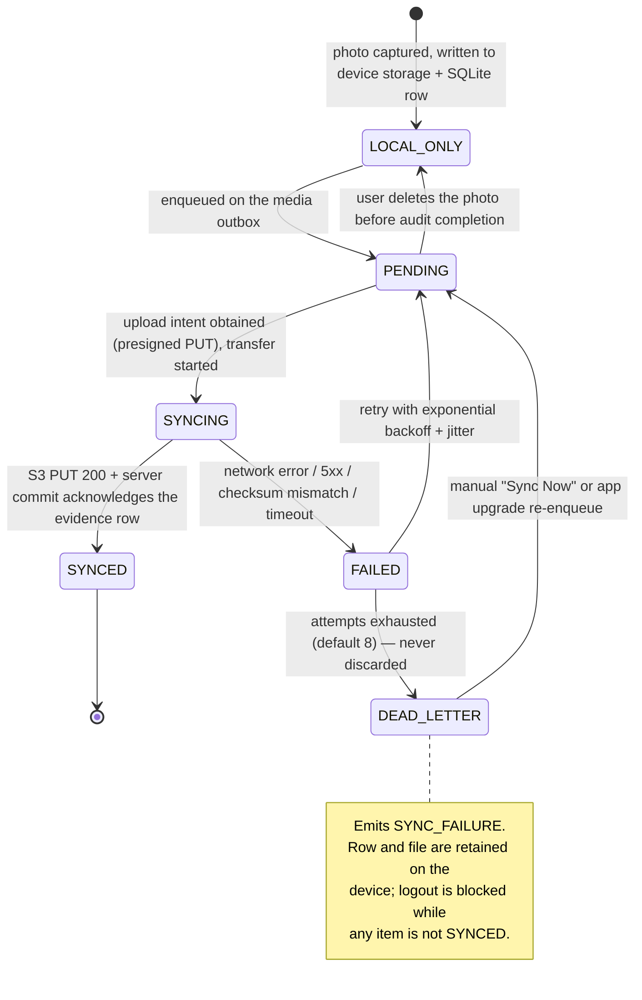

# 5S Audit Management Platform — Architecture & Implementation Blueprint

| | |
| --- | --- |
| **Document version** | 1.0 |
| **Status** | Approved for implementation |
| **Audience** | Engineering (backend, web, mobile), QA, DevOps, product stakeholders |
| **Scope** | Complete domain, data, authorization, sync, reporting and delivery design. No application code. |
| **Repository** | `team-abassociate/audit5s` |

> ### Superseded technology choices — change record
>
> **Precedence rule (R-1): [`STACK.md`](./STACK.md) wins on any technology name; this document
> wins on any behaviour.** Resolutions R-1 … R-11 live in [`DECISIONS.md`](./DECISIONS.md) and
> are binding.
>
> **The body of this document has been swept to match** — every section below now states the
> current choice, so no section needs to be read against this table. It is kept as the record
> of what changed and why, for anyone reading an older copy or wondering why a decision moved.
>
> | Previously | Now | Sections rewritten |
> | --- | --- | --- |
> | Prisma | Drizzle ORM + drizzle-kit | header, §6.1 (AZ-1), §13 |
> | Redis / BullMQ | pg-boss on the same PostgreSQL. **No Redis.** Idempotency keys are Postgres-only, 48 h, with no fast path. | §3.1, §5.9, §8.2 |
> | `domain_event` transactional outbox | Removed — pg-boss is the only enqueue mechanism (R-2) | §5.9, §14 Phase 6 |
> | Next.js `admin-web` | React 19 + Vite 7 SPA, no SSR | §3.1, §13 |
> | Separate `corrective-action-web` client | A token-gated route inside `admin-web` | §3.1, §13 |
> | PostgreSQL 16 + read replica | PostgreSQL 18, single instance, no replica | §3.1 |
> | Five workers (notification · report · analytics · media · import) | Two: `worker-general` and `worker-report` | §3.1, §4 |
> | Generic S3-compatible object storage | Cloudflare R2 via `@aws-sdk/client-s3` | §3.1, §5.6 |
> | Managed backups + PITR | Self-hosted pgBackRest → R2 (RPO < 5 min unchanged) | §16 |
> | WhatsApp BSP + SMS gateway wired at MVP | `NotificationChannel` interface defined; in-app + FCM only at MVP. No channel wired. | §2.8, §14 Phase 6 |
> | react-native-vision-camera | `expo-camera` (R-11). The only case where `STACK.md` lost a technology name: the row was stale, not a decision. | §12.10 (unchanged — it already named `expo-camera`), `STACK.md` §2 |
> | SQLCipher on mobile | Not used (R-4) | §14 Phase 4 |
> | Staging + production environments | One environment. Migrations are files in git applied by CI. | §13, §14, §16 |
> | Chaos test "Redis down" | Removed | §15 |
>
> **Redis did five jobs in this document. Each has a new home**, since removing Redis is not a
> pure name swap:
>
> | Job | Now |
> | --- | --- |
> | Queues (§3.1, §10, §11) | pg-boss on the same PostgreSQL |
> | Idempotency fast path (§5.9, §8.2) | Postgres only — the `idempotency_key` table, 48 h |
> | `jti` denylist / refresh revocation (§12.1) | A Postgres table, checked on the auth path |
> | Rate limiting (§12.6) | Cloudflare edge rules. The API does not rate-limit itself. |
> | Analytics cache (§11) | None at MVP — the `metric_daily_*` rollup tables are the cache |
>
> Two additions from `DECISIONS.md`, now folded into §5.2 and §5.6: the `unit_membership`
> partial unique index for invariant M-1 ships in the first migration with a test that proves
> it (R-3a), and `evidence` carries `redacted_at` / `redacted_by_user_id` / `redaction_reason`
> with a matching carve-out in its append-only trigger (R-5).
>
> **Phase 6 implementation (2026-09-12).** Corrective actions materialise on the completing
> transaction, one per nonconformity photograph, and the audit rolls along §7.1's edges;
> submissions are append-only and answerable offline through the outbox; notifications fan
> out from pg-boss events in `worker-general`, with WhatsApp and SMS behind an unwired port
> whose deliveries are recorded `SKIPPED`. Migration `0009` adds the five Phase 6 tables;
> `0010` is next. Six decisions are recorded as `DECISIONS.md` **R-13** — including the one
> ambiguity worth a second look: **"resolved" means VERIFIED**, so an audit stays
> `CORRECTIVE_ACTION_OPEN` while attempts await review, which is how §2.8 and §5.7 define
> it and *not* how §7.3's worked case reads.
>
> **Phase 5 implementation (2026-09-11).** Walk-by capture now runs end to end through the
> mobile SQLite outbox, including offline evidence patches, preview/delete, re-judgement and
> summary flags. The admin audit detail has the cursor-paged evidence gallery and on-demand
> original viewer. `acceptance-phase5.e2e.test.ts` enforces the three-Zone offline acceptance
> row and both sides of the empty-Zone photo guard. No migration was added; `0009` remains next.

**How to read this document.** PART 1 fixes the vocabulary and settles every contradiction in
the source brainstorm — read it first, and treat its decisions as binding. PART 5 (database)
and PART 8 (API) are the implementation contract: together they are sufficient to write the
Drizzle schema and the first controllers without asking a business question. PART 9 is the
mobile contract. PART 14 is the delivery plan. Anything not stated here is a genuine open
question and must be escalated, not invented.

**A note on inputs.** The source `brainstorm.md`, the department-question `.xlsx` and both
sample report PDFs now live in `docs/requirements/`; the written specification supplied by the
business remains authoritative on intent. Question text, department names and the exact report
colour hex values are **seed data and styling tokens, not architecture** — they load through
the Excel import pipeline (PART 5.4, PART 8.5) and a theme token file (PART 11.6) without any
structural change, which is why reconciling this document against the real files changed no
structure. Assumptions A1–A6 in §1.6 are resolved against those files; `HANDOFF.md` §3 carries
the reconciliation and `DECISIONS.md` R-6 records it.

---

## Table of contents

| Part | Title |
| --- | --- |
| [1](#part-1--requirement-normalization) | Requirement normalization |
| [2](#part-2--user-journeys) | User journeys |
| [3](#part-3--system-architecture) | System architecture |
| [4](#part-4--backend-module-architecture) | Backend module architecture |
| [5](#part-5--database-architecture) | Database architecture |
| [6](#part-6--authorization-matrix) | Authorization matrix |
| [7](#part-7--state-machines) | State machines |
| [8](#part-8--api-design) | API design |
| [9](#part-9--offline-synchronization-design) | Offline synchronization design |
| [10](#part-10--reporting-architecture) | Reporting architecture |
| [11](#part-11--analytics-architecture) | Analytics architecture |
| [12](#part-12--security-review) | Security review |
| [13](#part-13--repository-structure) | Repository structure |
| [14](#part-14--implementation-roadmap) | Implementation roadmap |
| [15](#part-15--testing-strategy) | Testing strategy |
| [16](#part-16--production-readiness-checklist) | Production readiness checklist |
| [A](#appendix-a--requirement-traceability-matrix) | Requirement traceability matrix |
| [B](#appendix-b--glossary) | Glossary |

---

# PART 1 — Requirement normalization

## 1.1 Actors

Four business roles, one system actor. These names are canonical and appear verbatim in code,
enums, database rows, API payloads and UI copy. No synonyms are permitted anywhere in the
codebase — in particular, **"Admin" is not a role**; the word `ADMIN` must not appear as a
role value.

| Role | Enum value | Tenancy | Population | Authenticates on |
| --- | --- | --- | --- | --- |
| Super Admin | `SUPER_ADMIN` | Organization-wide | Very few (2–10) | Admin web |
| Consultant | `CONSULTANT` | Many Units, via active membership | Tens | Field mobile (primary), admin web (read-only history) |
| Coordinator | `COORDINATOR` | Exactly one Unit | One or two per Unit | Admin web |
| Zone Leader | `ZONE_LEADER` | Exactly one Unit | Tens per Unit | Field mobile + corrective-action web |
| System | — | — | — | Queue workers, schedulers. Acts with an explicit `system` actor in audit logs, never with a borrowed user identity. |

**Tenancy anchor.** The tenant boundary of this system is the **Unit**. Every business row is
reachable to a `unit_id` in at most two hops. Super Admin is the only role that crosses Unit
boundaries. This single sentence drives PART 6 and most of PART 12.

## 1.2 Capability matrix

Authoritative summary. The enforceable version — with the exact scope predicate per cell — is
PART 6; this table is the human-readable index into it.

| Capability | Super Admin | Consultant | Coordinator | Zone Leader |
| --- | :---: | :---: | :---: | :---: |
| Create / archive Units | ✅ | — | — | — |
| Edit own Unit master data | ✅ | — | ✅ (own Unit; **cannot rename the Unit**) | — |
| Set Unit geofence (lat/lng/radius) | ✅ | — | ✅ own Unit | — |
| Create Consultant accounts | ✅ | — | — | — |
| Assign / revoke Consultant ↔ Unit | ✅ | — | — | — |
| Create Coordinator accounts | ✅ | — | — | — |
| Assign Coordinator → Unit | ✅ | — | — | — |
| Create / manage Zone Leader accounts | ✅ | — | ✅ own Unit | — |
| Create / edit / archive Zones | ✅ | — | ✅ own Unit | — |
| Import checklist from Excel | ✅ | — | — | — |
| Publish / deactivate a checklist version | ✅ | — | — | — |
| Create external audit assignment | ✅ | — | — | — |
| View external audit assignments | ✅ all | ✅ own | ✅ own Unit | ✅ own Unit |
| Perform `EXTERNAL_5S` audit | — | ✅ assigned Units | — | — |
| Perform `WALK_BY` audit | — | ✅ assigned Units | — | — |
| Perform `CROSS_5S` audit | — | — | — | ✅ any active Zone in own Unit |
| View own audit history | ✅ all | ✅ own | ✅ own Unit | ✅ own Unit |
| View own zone score summaries | ✅ all | ✅ own audits | ✅ own Unit | ✅ own Unit |
| **Generate official report PDF** | ✅ | ❌ | ❌ | ❌ |
| Download / share an official report | ✅ | ❌ | ✅ view own Unit | ✅ view own Unit |
| Submit corrective action | — | — | — | ✅ own Unit |
| Verify / reopen corrective action | ✅ | — | — | — |
| Organization-wide analytics | ✅ | — | — | — |
| Unit / Zone analytics | ✅ | — | ✅ own Unit | — |
| Read audit logs | ✅ | — | — | — |

Legend: ✅ permitted · ❌ explicitly denied (a stated business rule, not an omission) · — not applicable.

## 1.3 Contradictions found in the source requirements, and their resolution

| # | Contradiction | Resolution (binding) |
| --- | --- | --- |
| C1 | "Admin" and "Coordinator" both appear as unit-level administrators. | **One role: `COORDINATOR`.** No `ADMIN` role exists. |
| C2 | Zone Leader described both as bound to a single Zone and as able to conduct cross audits. | Zone Leader is bound to a **Unit**, not a Zone. `Zone.zone_leader_id` is a *responsibility* pointer used for reporting and corrective-action routing; it is **not** an audit-permission grant. Any Zone Leader of the Unit may audit **any active Zone** of that Unit. |
| C3 | "50 questions hardcoded into application screens" vs. "create a versioned checklist system". | Questions are **versioned data**. The mobile app caches the active version locally so the questionnaire never requires a network call — the offline goal behind "hardcoded" is met without losing versioning. See §1.5-D1. |
| C4 | Consultants appear to need reports, but official reporting is Super-Admin-only. | Consultants see a **score summary** (read model, in-app, no PDF). Only Super Admin generates official `ReportSnapshot` PDFs. |
| C5 | "Abort" implies discarding an audit. | **Abort never deletes.** It is `IN_PROGRESS → PAUSED`, persists all progress, notifies Super Admin, and stores a resume cursor. |
| C6 | Interactive PDF with embedded logic vs. a maintainable delivery. | PDF stays a conventional document with **one signed hyperlink**. All interaction happens on a responsive web page. No JavaScript logic inside the PDF. |
| C7 | Phone number proposed as the account password. | Accepted **only as a bootstrap credential** with forced reset. See §1.4 and PART 12.1. |
| C8 | Evidence described as belonging to an Audit in some places, to a question in others. | Evidence belongs to a **`QuestionResponse`** (with `audit_id` / `audit_zone_id` denormalized for querying). Walk-by evidence, which has no questionnaire, attaches to the `AuditZone`. |
| C9 | Scoring denominator ambiguous when `NA` is used. | Denominator **always excludes** `NA`. See §1.5-D3. |
| C10 | "Zone dropdown Zone 1 to Zone 100" reads like a fixed list, but Coordinators create Zones. | Zones are **created rows**, unique per Unit by `code`. The 1–100 range is a UI convenience for generating codes, not a schema constraint. A Unit may have fewer than 100 Zones; the dropdown lists only that Unit's **active** Zones. |

## 1.4 Final architectural decisions

The eight normalization decisions supplied by the business are restated here as binding, each
with its enforcement point — a decision with no enforcement point is a wish, not a decision.

| # | Decision | Enforced by |
| --- | --- | --- |
| N1 | Consultant mobile navigation is exactly: **Units · History · Profile**. | Mobile route table; no other top-level tab ships. |
| N2 | **Coordinator** is the canonical unit-administrator term; no separate Admin role. | `Role` enum has four values; a CI lint rejects the string `ADMIN` as a role literal. |
| N3 | Coordinator manages Zone Leader accounts. | PART 6, `User:create/update` where `target.unit_id = actor.unit_id AND target.role = ZONE_LEADER`. |
| N4 | Zone Leaders may audit **any active Zone** in their Unit. | PART 6, `Audit:create(CROSS_5S)` scope predicate. No self-audit restriction (§1.5-D9). |
| N5 | Official report generation is Super-Admin-only. | `Report:generate` permission granted to `SUPER_ADMIN` alone; the renderer queue rejects jobs whose requester is not Super Admin. |
| N6 | Consultants view scoring summaries for their own audits; no official PDFs. | `Report:read_summary` scoped to `audit.auditor_id = actor.id`; no `Report:generate`. |
| N7 | Abort = save + pause + notify + resume. | Audit state machine (PART 7.1); no `DELETE` endpoint exists for `Audit`. |
| N8 | Corrective-action upload happens on a live web page, not inside the PDF. | Report renderer emits a link only; corrective-action write endpoints require a `ReportAccessToken` or a session (PART 10.3). |

Additional decisions taken during this design and locked by the business:

| # | Decision | Rationale |
| --- | --- | --- |
| D1 | **Checklists are versioned data with an offline-cached active version.** | Resolves C3 without sacrificing either immutability or offline reliability. |
| D2 | **Checklist templates are organization-wide**, keyed by department. Units select from a shared library. | Makes Unit ranking, benchmarking and cross-Unit trend analysis statistically meaningful. A per-Unit template library would make every cross-Unit comparison a category error. |
| D3 | **`NA` is excluded from the denominator**, always: `pct = Σscore / ((answered − NA) × 2) × 100`. | Stated business formula. Edge case: if every question in an S is `NA`, that S's percentage is **`null`, not 0** — see §1.5-D4. |
| D4 | **A fully-`NA` section scores `null`**, is rendered as "N/A" and is **excluded** from the parent average. | 0/0 is undefined. Recording it as 0% would silently destroy the Unit trend. |
| D5 | **Server is authoritative for all scoring.** | Prevents a tampered or buggy client from writing a score. The device's number is display-only. |
| D6 | **Historical audits are immutable by snapshot**, not by locking master data. | Coordinators must stay free to rename Zones and edit descriptions; history must not move. Both are satisfied by copying the display values onto `AuditZone` at start. |
| D7 | **One device owns an in-progress audit.** | Makes offline conflict resolution provably safe (PART 9.5) rather than heuristic. |
| D8 | **Nothing in the audit trail is hard-deleted.** No `DELETE` verb exists for `Audit`, `AuditZone`, `QuestionResponse`, `Evidence` (post-completion), `CorrectiveAction`, `ReportSnapshot`, `AuditLog`. | "Preserve historical audit data at all costs." |
| D9 | **No self-audit restriction on cross audits.** A Zone Leader may audit a Zone for which they are the recorded leader. | Explicit business instruction: Zone Leaders are the intended cross-audit auditors. No blocking rule and no gating flag is implemented. |
| D10 | **Modular monolith.** One deployable API, hard internal module boundaries. | No concrete scaling boundary justifies microservices at this volume. The module boundaries in PART 4 are drawn so that extraction later is mechanical, should that change. |
| D11 | **REST + JSON, versioned at `/api/v1`.** | Simplest thing that serves both clients. GraphQL adds a query-authorization surface this domain does not need. |
| D12 | **Sync is a batched, idempotent, client-PK protocol.** | PART 9. |

## 1.5 Challenged requirements

The brief asked for requirements that create risk to be challenged. Five do.

### CH-1 — Phone number as password (**high severity**)

Using the phone number as the password means the credential is public, guessable from the
login ID itself (the login ID contains the last four digits), non-rotatable, and identical
across any other system that adopts the same convention. Combined with a deterministic login
ID, an attacker who knows an employee's name and phone number has complete account access —
and for a Zone Leader that means the ability to submit falsified corrective-action evidence.

**Recommendation (adopted):** the phone number is a **bootstrap credential only**.

- Stored **only** as an Argon2id hash — never in plaintext, never recoverable.
- `User.must_reset_password = true` on creation. Every authenticated route except
  `POST /auth/change-password` and `GET /auth/me` returns `403 PASSWORD_RESET_REQUIRED`
  until it is cleared.
- Bootstrap credential expires after **72 hours**; after that the account requires an
  admin-issued reset or OTP.
- Preferred alternative offered to the business: **phone OTP login** with no long-lived
  password at all — a better fit for field users who forget passwords.

**If the business insists on a permanent phone-number password**, the following are
non-negotiable compensating controls and are already designed into PART 12.1: Argon2id
hashing, per-login-ID and per-IP rate limiting with exponential lockout, mandatory
device binding, notification to Super Admin on every login from a new device, and a shortened
refresh-token lifetime. This must be recorded as an accepted risk with a named owner.

### CH-2 — "Hardcode the 50 questions into screens" (**medium severity**)

Hardcoding makes questions un-versionable, forces an app-store release for a wording change,
prevents department-specific checklists, and — most seriously — makes historical audits
misleading, because last year's report would render this year's question text. Resolved by D1:
data-driven questions with an offline-cached active version. The *user-visible* behaviour the
business wanted (instant, always-available questionnaire) is fully preserved.

### CH-3 — Interactive logic inside the PDF (**medium severity**)

PDF JavaScript is unevenly supported (essentially absent in mobile and browser viewers),
cannot authenticate, cannot upload reliably, and is a recurring malware vector that many mail
gateways strip. Resolved by N8: a conventional PDF with one signed link to a responsive web
page.

### CH-4 — GPS as proof of presence (**medium severity**)

Mobile GPS can be spoofed with a developer-mode mock provider or a rooted device; no client-side
check is authoritative. This system therefore **records location as evidence and surfaces
suspicion signals** — it never claims to prove presence and never blocks an audit on location
alone (blocking would strand honest auditors indoors with poor GPS). See PART 12.9.

### CH-5 — Unbounded photo capture on field devices (**low severity, high operational cost**)

Unlimited full-resolution photos will exhaust device storage on a long offline audit and
generate very large S3 bills. Mitigation designed in: client-side downscale to ≤1920px long
edge at ~80% JPEG quality before it ever touches SQLite, a per-`AuditZone` soft cap
(configurable, default 30 photos) with a warning, and an S3 lifecycle policy (PART 16.8).

## 1.6 Assumptions

Numbered so they can be confirmed or corrected in one pass. A1–A6 existed because the source
files were unavailable. All six are now **settled against the real files** in
`docs/requirements/` — three confirmed, three corrected — and each row below states which.
They affected **content and styling only**: nothing structural moved when they were settled.
A7–A12 remain open assumptions.

| # | Assumption | Impact if wrong |
| --- | --- | --- |
| A1 | **Confirmed.** The 50 questions are exactly 5 sections × 10 questions, ordered 1S→5S and numbered globally 1–50. Every department sheet in the workbook has this shape. | None. `questions_per_section = 10` and `total_questions = 50` stay configurable on `ChecklistVersion`; no change was needed. |
| A2 | **Resolved.** Nine departments, one per workbook sheet, in this order: Shop Floor (`SHOP_FLOOR`), Office (`OFFICE`), Stores (RM) (`STORES_RM`), Production (`PRODUCTION`), FG Stores (`FG_STORES`), Packing Area (`PACKING_AREA`), Boiler & Utility (`BOILER_UTILITY`), Maintenance (`MAINTENANCE`), Premises (`PREMISES`). The workbook's first three sheets — `5S Audit Team`, `Audit Schedule`, `Monthly Zone Scores` — are legacy planning sheets and are **not** imported. | None. Departments are `ChecklistTemplate` rows created by the import; the skip rule is in the PARSE profile (§8.5). |
| A3 | **Corrected.** Four bands, boundaries **90 / 75 / 60** — Outstanding, On Track, Improving, Needs Support. The placeholder had the wrong labels and a third boundary at 50. Exact hex values, response colours and brand tokens: §11.6. | None. Colours and boundaries live in one token file consumed by the PDF templates, the web charts and the mobile chips; swapping them is a one-file change (PART 11.6). |
| A4 | **Corrected.** The workbook is **not** one row per question. It is one **sheet per department**, each with a merged section-header row above every block of ten questions, a sub-total row after each block, and trailing total/percentage/rating/signature rows. Full layout and parse rules: §8.5. | As predicted: the mapping is configuration in `ChecklistImportProfile`, so the corrected layout changes the PARSE stage only. The six-stage pipeline is unchanged. |
| A5 | **Confirmed, with specifics.** A4 portrait, English. Maroon header band with an orange rounded "5S" badge at the left, the title and a one-line subtitle in white, and the AB Associates logo in a white card at the right; a footer on every page. Tokens: §11.6. | Template-only change. |
| A6 | **Confirmed.** Percentages render to one decimal (`75.0%`); marks render as `achieved / max` integers. | Presentation-only; the database stores `numeric(6,3)`. |
| A7 | A Unit has one Coordinator (the schema permits several; no rule forbids it). | None — `UnitMembership` already models many. |
| A8 | Volume: ≲100 Units, ≲500 Zones/Unit, ≲2,000 audits/month, ≲60 photos/audit. | Sets the "modular monolith, single Postgres" decision (D10). An order of magnitude more would trigger read-replica + partitioning, both anticipated in PART 11.4. |
| A9 | WhatsApp delivery is via an approved Business Solution Provider with pre-approved message templates; SMS is a fallback provider. | Provider is behind a `NotificationChannel` interface; swapping providers touches one adapter. |
| A10 | Single organization (single tenant at the top). Multi-organization is **not** built now, but `Unit` is the tenancy anchor so adding an `Organization` parent later is additive. | Adding it later is one nullable FK plus a scope-predicate change. |
| A11 | Timezone: all timestamps stored `timestamptz` in UTC; display in the Unit's configured IANA timezone (`Unit.timezone`, default `Asia/Kolkata`). | Analytics "per day" buckets depend on this; it is explicit for that reason. |
| A12 | Data retention: audit records retained indefinitely; evidence originals ≥7 years. | Drives S3 lifecycle (PART 16.8). |

---

# PART 2 — User journeys

Each journey is written as **step → actor action → system reaction → state change**. These
are the acceptance-test scripts for PART 14; QA should be able to execute them verbatim.

## 2.1 Super Admin — organization setup and oversight

| # | Action | System reaction | State / side effect |
| --- | --- | --- | --- |
| 1 | Logs in with password + (optional) TOTP | Issues access JWT (15 min) + refresh token (rotating, 30 d) | `AuditLog: auth.login` |
| 2 | Creates a Unit (name, code, address, lat/lng, geofence radius, timezone) | Validates unique `code`; radius default 300 m | `Unit` row; `AuditLog: unit.created` |
| 3 | Creates a Consultant (name, phone, email) | Generates login ID `RA3210` (PART 12.2), hashes bootstrap credential, sets `must_reset_password` | `User`; `AuditLog: user.created`; notification `USER_CREATED` (WhatsApp: credentials + reset link) |
| 4 | Assigns Consultant → one or many Units | Creates `UnitMembership(role=CONSULTANT, active)` per Unit | Event `UNIT_ASSIGNED` → notification to Consultant |
| 5 | Creates a Coordinator and assigns to exactly one Unit | Rejects a second active Coordinator membership for the same user | `UnitMembership(role=COORDINATOR)`; event `UNIT_ASSIGNED` |
| 6 | Imports the department checklist Excel | Upload → parse → **validation report + preview** (no writes yet) | `ChecklistImportJob(status=PREVIEW)` |
| 7 | Confirms the import | Creates `ChecklistVersion(status=DRAFT)` + 50 `ChecklistQuestion` rows | `AuditLog: checklist.imported` |
| 8 | Publishes the version | Version becomes `PUBLISHED`; previous active version becomes `SUPERSEDED`; questions are frozen | Mobile clients pick it up on next catalogue sync |
| 9 | Creates an audit assignment (Unit + Consultant + type + due date + optional Zone hints) | Validates the Consultant has an **active** membership for that Unit | `AuditAssignment(status=ASSIGNED)`; event `AUDIT_ASSIGNED` |
| 10 | Watches the live board | Sees assignments, in-progress audits, sync health, suspicious-location flags | Read model only |
| 11 | Reviews a completed audit and generates the **Initial Zone Report** | Enqueues a render job; worker freezes a payload and renders a PDF | `ReportSnapshot(v1)`; event `REPORT_GENERATED`; `AuditLog: report.generated` |
| 12 | Shares the report with the Unit | Report contains a signed **"View / Submit Corrective Action"** link per nonconformity | `ReportAccessToken` rows minted with expiry |
| 13 | Receives corrective-action submissions | Notification per submission | `CorrectiveAction → ACTION_SUBMITTED` |
| 14 | Verifies or reopens each corrective action | `VERIFIED` or `REOPENED` | `AuditLog: corrective_action.verified` |
| 15 | Generates the **After-Evidence Report** | New snapshot **version 2**; v1 untouched | `ReportSnapshot(v2)` |
| 16 | Selects Zones (one / several / all) for a **Summary Report** | Aggregates over **only the selected** Zones | `ReportSnapshot(kind=MULTI_ZONE_SUMMARY)` |
| 17 | Opens organization analytics | Trends, rankings, closure rates, recurrence | Read-only, from rollups |

## 2.2 Coordinator — Unit master data

| # | Action | System reaction | Notes |
| --- | --- | --- | --- |
| 1 | Logs in (forced password reset first time) | Session scoped to exactly one `unit_id` | Scope is derived server-side from `UnitMembership`, **never** from a client-supplied `unitId` |
| 2 | Edits Unit master data | Address, contact, geofence, timezone, shift info are editable | **`Unit.name` and `Unit.code` are read-only for Coordinator** (C-level rule); attempting it returns `403` |
| 3 | Creates Zones (`code` e.g. `Z-01`…`Z-100`, name, description, department default) | `code` unique per Unit | `AuditLog: zone.created` |
| 4 | Edits a Zone description | Live Zone changes; **historical `AuditZone` snapshots are unaffected** | This is the D6 guarantee |
| 5 | Archives a Zone | `archived_at` set; Zone disappears from audit dropdowns; **history and reports remain intact** | No hard delete |
| 6 | Creates Zone Leader accounts | Login ID generated; bootstrap credential; membership to own Unit only | `AuditLog: user.created` |
| 7 | Assigns a Zone Leader as the responsible leader for a Zone | `Zone.zone_leader_id` set — a routing pointer, **not** an audit permission | Corrective actions route here |
| 8 | Views external audit assignments for the Unit | Read-only | |
| 9 | Views cross-audit activity and Unit/Zone trends | Unit-scoped analytics | |

## 2.3 Consultant — mobile, offline-first

| # | Action | System reaction |
| --- | --- | --- |
| 1 | Logs in on device | Tokens stored in OS keychain/keystore; **device registered** (`Device` row, `owning_device_id` candidate); location captured at login |
| 2 | App bootstraps | Downloads catalogue: assigned Units, their active Zones, published `ChecklistVersion`s, own open assignments → **written to SQLite** |
| 3 | Opens **Units** tab | Renders **from SQLite**. Works with the radio off. |
| 4 | Selects a Unit and an assignment | Assignment `ASSIGNED → READY` locally, queued for sync |
| 5 | **Captures selfie** (front camera, live only) | Mandatory. Stored locally, queued for upload. Audit cannot start without it. |
| 6 | Location captured | `lat/lng/accuracy/provider/is_mocked`; compared to the Unit geofence → `location_suspicious` if outside |
| 7 | Starts the audit | `Audit` row created **locally with a client UUIDv7**; `IN_PROGRESS`; `owning_device_id` claimed |
| 8 | Selects Zone → confirms description → confirms Zone leader → selects department/checklist | `AuditZone` created with **snapshots** of Zone name, description, leader and checklist version |
| 9 | Answers 1S q1…q10, then 2S…5S | **Each selection writes to SQLite immediately** (one transaction per response) and enqueues a sync item. Never blocks on network. |
| 10 | Optionally adds a per-question remark | Optional free text on the response |
| 11 | Captures evidence photos against a question | Classification derived from the score at capture time; queued on the **media** queue independently |
| 12 | Optionally flags one GOOD and one NONCONFORMITY photo for the summary | Enforced one-of-each per `AuditZone`, locally and on the server |
| 13 | Previews / deletes a photo before completion | Permitted while the audit is not `COMPLETED`; removes local file + queue item; if already uploaded, server marks `deleted_at` and the object is lifecycle-purged |
| 14 | Writes an optional overall Zone remark | `AuditZone.zone_remark` |
| 15 | Finishes the Zone | Client computes a display score; `AuditZone → COMPLETED` |
| 16 | Adds another Zone **or** finishes the audit | Loop to step 8, or → 17 |
| 17 | Finishes the audit | `Audit → COMPLETED` locally; **server recomputes every score** on sync and is authoritative |
| 18 | Presses **Abort** at any point | `IN_PROGRESS → PAUSED`. Nothing is discarded. `resume_question_id` recorded. Event `AUDIT_PAUSED` → Super Admin notified |
| 19 | Resumes later | Reopens at the exact stored question |
| 20 | Watches the sync banner | Shows status, unsynced count, last successful sync, **Sync Now** |
| 21 | Opens **History** | Own audits and own completed zone score summaries. **No PDF generation** (N6) |
| 22 | Attempts logout with pending items | Blocked with "N items not yet synced"; force-logout requires explicit confirmation and retains the encrypted local queue |

## 2.4 Zone Leader — cross audit and corrective action

| # | Action | System reaction |
| --- | --- | --- |
| 1 | Logs in on mobile | Scope = own Unit |
| 2 | Opens Zones | **All active Zones of the Unit** — not only their own (N4). No self-audit restriction (D9). |
| 3 | Starts a `CROSS_5S` audit | Same engine as external: selfie, location, zone selection, 50 questions, evidence |
| 4 | Completes and syncs | Server recomputes scores; nonconformities materialize as corrective actions |
| 5 | Opens **Nonconformities** | Sees open items for their Unit — from external audits and cross audits alike |
| 6 | Opens an item from a report link or in-app | Live web page or mobile screen, both hitting the same API |
| 7a | **Option A — completed**: name, **live** after-photo, description → Submit | `OPEN → ACTION_SUBMITTED`; event `CORRECTIVE_ACTION_SUBMITTED` → Super Admin |
| 7b | **Option B — not possible**: explanation → Submit | `OPEN → NOT_POSSIBLE`; same notification |
| 8 | Submits 3 of 5 items today, 2 next week | **The 3 are permanently saved.** Each item is independently tracked; there is no batch that can discard them (PART 7.3) |
| 9 | Sees a reopened item | `REOPENED → ACTION_SUBMITTED` on resubmission; every attempt is retained as a `CorrectiveActionSubmission` row |
| 10 | Views audit history for the Unit | Read-only |

## 2.5 External audit (`EXTERNAL_5S`) — end to end

```
Super Admin creates AuditAssignment(unit, consultant, EXTERNAL_5S, due_at)
  → event AUDIT_ASSIGNED → in-app + WhatsApp to Consultant
  → Consultant device syncs assignment into SQLite            [ASSIGNED]
  → Consultant opens it, captures selfie + location            [READY]
  → Start                                                      [IN_PROGRESS]  event AUDIT_STARTED
     └─ per Zone: snapshot zone + checklist version            [AuditZone IN_PROGRESS]
        └─ 1S..5S × 10 questions, each saved to SQLite on selection
        └─ evidence per response, classification derived from score
        └─ optional per-question remarks; optional zone remark
        └─ Finish Zone                                         [AuditZone COMPLETED]
     └─ add another Zone, or Finish Audit                      [COMPLETED]     event AUDIT_COMPLETED
  → sync: server validates, recomputes scores, materializes CorrectiveActions
  → Super Admin generates Initial Zone Report                  [ReportSnapshot v1]
  → nonconformities                                            [CorrectiveAction OPEN]
  → audit                                                      [CORRECTIVE_ACTION_OPEN]
```

## 2.6 Cross audit (`CROSS_5S`)

Identical to 2.5 with three differences:

1. **No `AuditAssignment` is required.** A Zone Leader self-initiates; the audit starts at
   `READY`. (Super Admin *may* still assign one; both paths are supported.)
2. The auditor is a `ZONE_LEADER` whose Unit is the audited Unit.
3. Zone eligibility is "any **active** Zone of the auditor's Unit", with **no** exclusion of
   Zones the auditor leads (D9).

Everything else — selfie, location, checklist version pinning, scoring, evidence,
corrective actions, reporting — is the same code path. This is deliberate: one audit engine,
three types.

## 2.7 Walk-by audit (`WALK_BY`)

No questionnaire, no score. Photo-led observation.

| # | Step | Rule |
| --- | --- | --- |
| 1 | Auditor selfie | **Mandatory**, live camera, before anything else |
| 2 | Select Zone | From the Unit's active Zones |
| 3 | Zone description | Optional; defaults to the Zone's current description, snapshotted either way |
| 4 | Zone leader | Confirmed/selected, snapshotted |
| 5 | Open camera | **Live capture only** — gallery selection is not offered |
| 6 | Capture **≥1** photo | Server-enforced: `AuditZone` cannot complete with zero evidence rows |
| 7 | Additional photos | Optional |
| 8 | Remarks | Optional, per photo and per Zone |
| 9 | Save Zone | `AuditZone → COMPLETED` |
| 10 | Add another Zone or Finish | → `Audit COMPLETED` |

Walk-by evidence has **no** `question_response_id`; it attaches directly to the `AuditZone`
and its `classification` is auditor-selected (`GOOD` / `NONCONFORMITY` / `NEUTRAL`) rather
than score-derived, since there is no score. A walk-by `NONCONFORMITY` **does** create a
corrective action — this is the mechanism that makes walk-bys actionable. Walk-by audits are
excluded from score trends and included in activity/nonconformity metrics (PART 11).

## 2.8 Corrective action

```
Evidence(classification = NONCONFORMITY)  ──on audit COMPLETED──▶  CorrectiveAction(OPEN)
        (one action per evidence item — independently trackable)
                 │
                 ├─ notification to Zone Leader (in-app + WhatsApp), and to the Coordinator
                 │
                 ├─ opened via signed report link  ─▶ token validated (audience, expiry, revocation)
                 │  or via authenticated mobile/web session
                 │
                 ├─ OPTION A  name + LIVE after-photo + description   ─▶ ACTION_SUBMITTED
                 └─ OPTION B  explanation only                        ─▶ NOT_POSSIBLE
                                   │
                                   ├─ event CORRECTIVE_ACTION_SUBMITTED ─▶ Super Admin
                                   │
                                   ├─ Super Admin VERIFIED    ─▶ terminal (audit may reach CLOSED)
                                   └─ Super Admin REOPENED    ─▶ back to submission, prior attempt retained
```

Every submission attempt is an **append-only `CorrectiveActionSubmission` row**. The
`CorrectiveAction` holds current state; the submissions hold the history. This is what makes
"3 of 5 submitted, 2 later" safe by construction: there is no operation anywhere in the API
that writes more than one corrective action at a time, so a later submission cannot overwrite
an earlier one.

Audit rollup: `COMPLETED → CORRECTIVE_ACTION_OPEN` when ≥1 action exists;
`→ PARTIALLY_CLOSED` when some are resolved; `→ CLOSED` when every action is `VERIFIED` or
`NOT_POSSIBLE`-accepted.

## 2.9 Reporting

| # | Step | Detail |
| --- | --- | --- |
| 1 | Super Admin picks a completed audit / Zone | Only `COMPLETED` or later |
| 2 | Chooses report kind | `INITIAL_ZONE`, `AFTER_EVIDENCE_ZONE`, `MULTI_ZONE_SUMMARY` |
| 3 | System **freezes a payload** | All scores, responses, remarks, evidence keys, auditor selfie, metadata copied into `ReportSnapshot.payload` (JSONB) |
| 4 | Renderer worker produces the PDF | Headless Chromium over an HTML template; deterministic |
| 5 | PDF stored in S3 | `report_pdf_key`; `checksum_sha256` recorded |
| 6 | Corrective-action links minted | One signed `ReportAccessToken` per nonconformity, plus one report-level token |
| 7 | Distribution | Download by Super Admin; WhatsApp/email link to the Unit |
| 8 | After corrective actions land, regenerate | **New snapshot version**; v1 is never mutated or replaced |
| 9 | Summary report | Aggregates only the **selected** Zones; includes the flagged GOOD/NONCONFORMITY photo per Zone |

---

# PART 3 — System architecture

## 3.1 Deployment topology



## 3.2 Component responsibilities

| Component | Responsibility | Explicitly **not** responsible for |
| --- | --- | --- |
| `admin-web` | Super Admin + Coordinator portal; report request/preview; analytics dashboards | Business rules, scoring, authorization decisions |
| `field-mobile` | Offline audit capture, camera, GPS, SQLite, outbox sync | Being the source of truth for scores or permissions |
| corrective-action route | Public, responsive, signed-token page for Zone Leaders to submit corrective actions from a report link. Served from the `admin-web` bundle. | Long-lived sessions; it holds a single-purpose token |
| API (HTTP) | AuthN, AuthZ (role **and** scope), validation, transactions | Long-running work, external HTTP calls |
| Domain modules | All invariants, state transitions, scoring | Rendering, messaging |
| Domain event bus | In-process publish; handlers enqueue jobs | Delivering external messages synchronously |
| `worker-general` | Notifications, rollups, checklist imports, media post-processing | Serving user requests; PDF rendering |
| `worker-report` | PDF rendering only, concurrency 1 | Anything else — it is memory-capped for Chromium |
| PostgreSQL | System of record, pg-boss job tables, idempotency records, JTI denylist | Blob storage |
| Cloudflare R2 | Evidence, selfies, rendered PDFs, Excel uploads, pgBackRest repository | Any public object — **no bucket is public** |
| Cloudflare edge | TLS, WAF, rate limiting, static hosting, tunnel ingress | Business rules |
| `PushChannel` / `NotificationChannel` | Outbound delivery — FCM at MVP; WhatsApp and SMS are interfaces only | Being called from inside a request transaction |

## 3.3 Cross-cutting rules

1. **No external HTTP call inside a database transaction.** Domain events are published after
   commit; handlers enqueue pg-boss jobs **inside the same transaction as the domain write**
   (R-2), so a job can never reference a state change that rolled back. A push-delivery outage
   can never fail an audit save.
2. **The API is stateless.** All session state is in the JWT plus PostgreSQL (JTI denylist,
   refresh-token family). Horizontal scaling is a replica-count change — though at Stage 1
   there is one replica.
3. **Workers share the API image** and therefore the domain layer — one implementation of
   scoring, one of authorization.
4. **Media never transits the API.** Clients upload with a presigned PUT and download with a
   short-TTL presigned GET, both minted only after a scope check.
5. **Analytics reads the primary.** There is no read replica at Stage 1. Contention is kept
   off the transactional path by the `metric_daily_*` rollup tables (PART 11), not by routing.
   A replica is added only when analytics measurably contends — see `STACK.md` §6.

---

# PART 4 — Backend module architecture

Twenty-three modules. Rules that hold for all of them:

- A module **owns** its tables. No other module may query them directly — cross-module reads
  go through the owning module's service, cross-module writes through domain events.
- A module declares its dependencies explicitly in its NestJS module definition. A CI check
  (`dependency-cruiser`) fails the build on an undeclared or cyclic import.
- Shared kernel (`packages/domain`) holds pure functions and types only — scoring, login-ID
  generation, state-machine tables, validation schemas. No I/O, so it is trivially testable
  and is shared verbatim by the mobile app.

| # | Module | Owns (tables) | Responsibility | Depends on | Emits |
| --- | --- | --- | --- | --- | --- |
| 1 | **Auth** | `RefreshToken`, `LoginAttempt`, `OtpChallenge` | Login, token issue/rotate/revoke, password reset, OTP, device binding, rate limiting | Users, Devices | `USER_LOGGED_IN`, `PASSWORD_RESET` |
| 2 | **Users** | `User` | Identity, profile, login-ID generation, activation/deactivation | RolesPermissions | `USER_CREATED`, `USER_DISABLED` |
| 3 | **RolesPermissions** | `Permission`, `RolePermission` | Permission catalogue, role→permission mapping, guard metadata | — | `PERMISSION_CHANGED` |
| 4 | **Units** | `Unit` | Unit master data, geofence, timezone, archive | — | `UNIT_CREATED`, `UNIT_UPDATED` |
| 5 | **UnitMemberships** | `UnitMembership` | The scope table: who may act in which Unit, with validity windows | Units, Users | `UNIT_ASSIGNED`, `UNIT_ACCESS_REVOKED` |
| 6 | **Consultants** | — (profile projection over `User`) | Consultant-specific views: assigned Units, workload, activity | Users, UnitMemberships, Audits | — |
| 7 | **Coordinators** | — (projection) | Coordinator views; enforces one-Unit binding and the name/code read-only rule | Users, UnitMemberships | — |
| 8 | **ZoneLeaders** | — (projection) | Zone Leader roster, per-Unit; leader→zone responsibility assignment | Users, UnitMemberships, Zones | — |
| 9 | **Zones** | `Zone` | Zone CRUD, codes, descriptions, archive, leader pointer | Units | `ZONE_CREATED`, `ZONE_UPDATED`, `ZONE_ARCHIVED` |
| 10 | **AuditAssignments** | `AuditAssignment` | External assignment lifecycle, due dates, reassignment | Units, Users, UnitMemberships | `AUDIT_ASSIGNED` |
| 11 | **ChecklistTemplates** | `ChecklistTemplate` | Department checklist identity (organization-wide, D2) | — | — |
| 12 | **ChecklistVersions** | `ChecklistVersion` | Version lifecycle DRAFT→PUBLISHED→SUPERSEDED/ARCHIVED; immutability enforcement | ChecklistTemplates | `CHECKLIST_PUBLISHED` |
| 13 | **ChecklistQuestions** | `ChecklistQuestion` | Frozen question set per version; section/order integrity (5×10) | ChecklistVersions | — |
| 14 | **ChecklistImport** | `ChecklistImportJob`, `ChecklistImportRow` | Excel upload, parse, validate, preview, duplicate detection, error report, version creation | ChecklistVersions, ChecklistQuestions | `CHECKLIST_IMPORTED` |
| 15 | **Audits** | `Audit` | Audit lifecycle + state machine, device ownership, selfie/location capture record, score rollup | AuditAssignments, Units, Zones, ChecklistVersions | `AUDIT_STARTED`, `AUDIT_PAUSED`, `AUDIT_COMPLETED`, `AUDIT_CLOSED` |
| 16 | **AuditZones** | `AuditZone` | Per-Zone audit unit; **snapshots** zone/leader/checklist; zone remark; per-zone scoring; resume cursor | Audits, Zones | `AUDIT_ZONE_COMPLETED` |
| 17 | **QuestionResponses** | `QuestionResponse` | Answer capture (2/1/0/NA), per-question remark, response-level integrity | AuditZones, ChecklistQuestions | — |
| 18 | **Evidence** | `Evidence` | Photo metadata, classification derivation, summary flags, GPS, sync state, soft delete | QuestionResponses, AuditZones, Storage | `EVIDENCE_ATTACHED` |
| 19 | **CorrectiveActions** | `CorrectiveAction`, `CorrectiveActionSubmission` | Materialize one action per nonconformity; submission history; verify/reopen | Evidence, Audits, Users | `CORRECTIVE_ACTION_SUBMITTED`, `CORRECTIVE_ACTION_VERIFIED`, `CORRECTIVE_ACTION_REOPENED` |
| 20 | **Reports** | `ReportSnapshot`, `ReportAccessToken` | Payload freezing, render orchestration, versioning, signed-link minting and revocation | Audits, AuditZones, Evidence, CorrectiveActions, Storage | `REPORT_GENERATED` |
| 21 | **Notifications** | `Notification`, `NotificationDelivery`, `NotificationPreference` | In-app centre, channel fan-out, template rendering, delivery tracking, retries | Users, external adapters | — (consumes) |
| 22 | **Sync** | `DeviceSyncRecord`, `Device`, `SyncConflict`, `IdempotencyKey` | Batch pull/push, idempotency, conflict quarantine, device registry, sync telemetry | Audits, AuditZones, QuestionResponses, Evidence | `SYNC_FAILURE` |
| 23 | **Analytics** | `MetricDailyUnit`, `MetricDailyZone`, `MetricSectionDaily` | Metric definitions, time-series queries, rollup jobs, dashboard read models | read-only over audit tables (replica) | — |
| 24 | **AuditLogs** | `AuditLog` | Immutable administrative trail: actor, action, before/after, IP/device | all (consumes events) | — |
| — | **Storage** *(infrastructure)* | — | S3 client, presigned URL minting, key conventions, checksum, lifecycle tags | — | — |
| — | **Jobs** *(infrastructure)* | — | pg-boss setup, retry/backoff policy, DLQ | — | — |

## 4.1 Dependency rules

**Allowed direction** — leaf → core, never the reverse:

```
Reports, Analytics, Notifications, Sync   (consumers)
        │
        ▼
CorrectiveActions → Evidence → QuestionResponses → AuditZones → Audits
        │                                                        │
        ▼                                                        ▼
   AuditAssignments                            ChecklistQuestions → ChecklistVersions → ChecklistTemplates
        │
        ▼
   Zones → Units ← UnitMemberships → Users → RolesPermissions
```

**Forbidden, and enforced in CI:**

- `Units` must not import `Audits` (a core master-data module must never depend on a
  transactional one).
- `Audits` must not import `Reports`, `Analytics` or `Notifications` — those consume events.
- `Notifications` must not be called synchronously from any domain service; it only handles
  jobs.
- No module may import another module's Drizzle repository. Only its service.
- No cycles. Any cycle is a design error, not a build-tool problem.

## 4.2 Domain events

Published through **pg-boss, enqueued in the same transaction as the state change** (R-2).
Because pg-boss stores its jobs in this same PostgreSQL database, the enqueue is part of the
domain commit — which makes "state changed but notification lost" impossible without a second
outbox table or a dispatcher. A permanent test asserts it: enqueue inside a transaction, roll
back, assert the job never runs.

| Event | Payload (essential) | Consumers |
| --- | --- | --- |
| `UNIT_ASSIGNED` | userId, unitId, role | Notifications, AuditLogs |
| `UNIT_ACCESS_REVOKED` | userId, unitId | Notifications, Sync (invalidate device catalogue), AuditLogs |
| `AUDIT_ASSIGNED` | assignmentId, unitId, auditorId, dueAt | Notifications |
| `AUDIT_STARTED` | auditId, unitId, auditorId, locationSuspicious | Notifications, Analytics |
| `AUDIT_PAUSED` | auditId, reason, resumeCursor | Notifications (**Super Admin**) |
| `AUDIT_COMPLETED` | auditId, unitId, scores | CorrectiveActions (materialize), Notifications, Analytics |
| `EVIDENCE_ATTACHED` | evidenceId, classification | media worker (thumbnail, EXIF strip) |
| `CORRECTIVE_ACTION_SUBMITTED` | actionId, auditId, option, submitterId | Notifications (**Super Admin**), Analytics |
| `CORRECTIVE_ACTION_VERIFIED` | actionId, verifierId | Audits (rollup), Notifications, AuditLogs |
| `CORRECTIVE_ACTION_REOPENED` | actionId, reason | Notifications (Zone Leader) |
| `REPORT_GENERATED` | snapshotId, kind, version | Notifications, AuditLogs |
| `SYNC_FAILURE` | deviceId, userId, itemCount, lastError | Notifications (Super Admin), observability |
| `CHECKLIST_PUBLISHED` | versionId, templateId | Sync (catalogue bump), Notifications |
| `PERMISSION_CHANGED` | subjectId, before, after | AuditLogs |

---

# PART 5 — Database architecture

PostgreSQL 18, accessed through Drizzle ORM. Conventions used throughout:

| Convention | Rule |
| --- | --- |
| Primary keys | `uuid`. **Client-generated UUIDv7** for `Audit`, `AuditZone`, `QuestionResponse`, `Evidence` (the sync-critical tables) — time-ordered so index locality is preserved. Server-generated UUIDv7 elsewhere. Never sequential integers (IDOR, PART 12.4). |
| Naming | `snake_case` tables and columns; table names singular. |
| Timestamps | Every table has `created_at timestamptz NOT NULL DEFAULT now()` and `updated_at timestamptz NOT NULL`. All UTC (A11). |
| Soft delete | Master data uses `archived_at timestamptz NULL`. Transactional audit data is **never deleted** (D8); the only exception is pre-completion evidence removal, which sets `deleted_at` and is itself audit-logged. |
| Optimistic concurrency | `version integer NOT NULL DEFAULT 1`, bumped on update, on `Audit`, `AuditZone`, `CorrectiveAction`, `Zone`, `Unit`. |
| Money/score types | `numeric(6,3)` for percentages. Never floats. |
| Text | `text` everywhere; length limits enforced by DTO validation, not by `varchar(n)`. |
| Deferred FKs | None. All FKs immediate; sync ordering guarantees parents arrive first (PART 9.4). |

## 5.1 Enums

```sql
CREATE TYPE role                     AS ENUM ('SUPER_ADMIN','CONSULTANT','COORDINATOR','ZONE_LEADER');
CREATE TYPE user_status              AS ENUM ('INVITED','ACTIVE','DISABLED','LOCKED');
CREATE TYPE membership_status        AS ENUM ('ACTIVE','REVOKED');
CREATE TYPE audit_type               AS ENUM ('EXTERNAL_5S','CROSS_5S','WALK_BY');
CREATE TYPE audit_status             AS ENUM ('ASSIGNED','READY','IN_PROGRESS','PAUSED','COMPLETED',
                                              'CORRECTIVE_ACTION_OPEN','PARTIALLY_CLOSED','CLOSED','CANCELLED');
CREATE TYPE audit_zone_status        AS ENUM ('DRAFT','IN_PROGRESS','COMPLETED');
CREATE TYPE assignment_status        AS ENUM ('ASSIGNED','ACCEPTED','IN_PROGRESS','COMPLETED','CANCELLED','EXPIRED');
CREATE TYPE s_section                AS ENUM ('S1_SORT','S2_SET_IN_ORDER','S3_SHINE','S4_STANDARDIZE','S5_SUSTAIN');
CREATE TYPE response_value           AS ENUM ('SCORE_2','SCORE_1','SCORE_0','NA');
CREATE TYPE evidence_classification  AS ENUM ('GOOD','NONCONFORMITY','NEUTRAL');
CREATE TYPE evidence_kind            AS ENUM ('AUDITOR_SELFIE','QUESTION_EVIDENCE','WALK_BY_PHOTO','CORRECTIVE_AFTER');
CREATE TYPE sync_state               AS ENUM ('LOCAL_ONLY','PENDING','SYNCING','SYNCED','FAILED');
CREATE TYPE corrective_action_status AS ENUM ('OPEN','ACTION_SUBMITTED','NOT_POSSIBLE','VERIFIED','REOPENED');
CREATE TYPE corrective_option        AS ENUM ('COMPLETED','NOT_POSSIBLE');
CREATE TYPE checklist_version_status AS ENUM ('DRAFT','PUBLISHED','SUPERSEDED','ARCHIVED');
CREATE TYPE import_job_status        AS ENUM ('UPLOADED','VALIDATING','PREVIEW','FAILED','COMMITTED','CANCELLED');
CREATE TYPE report_kind              AS ENUM ('INITIAL_ZONE','AFTER_EVIDENCE_ZONE','MULTI_ZONE_SUMMARY');
CREATE TYPE report_status            AS ENUM ('QUEUED','RENDERING','READY','FAILED');
CREATE TYPE notification_channel     AS ENUM ('IN_APP','WHATSAPP','SMS','EMAIL');
CREATE TYPE notification_status      AS ENUM ('PENDING','SENT','DELIVERED','FAILED','SKIPPED');
CREATE TYPE location_provider        AS ENUM ('GPS','NETWORK','FUSED','UNKNOWN');
```

**`response_value` is an enum, not an integer**, because `NA` is not a number. The numeric
weight (`2`, `1`, `0`, `null`) is derived by a pure function in `packages/domain`, so client
and server cannot disagree about it.

## 5.2 Identity and access

### `user`

| Column | Type | Notes |
| --- | --- | --- |
| `id` | `uuid` PK | |
| `login_id` | `text` | **UNIQUE**. Generated (PART 12.2), e.g. `RA3210`, `RA3210-2` |
| `full_name` | `text` | |
| `phone_e164` | `text` | **UNIQUE** where not archived |
| `email` | `text` NULL | UNIQUE where not null |
| `role` | `role` | Single role per user (D: no multi-role) |
| `password_hash` | `text` | Argon2id. Never null, never plaintext |
| `password_algo` | `text` | `argon2id`; present to allow rehash-on-login migration |
| `must_reset_password` | `boolean` DEFAULT true | CH-1 |
| `bootstrap_expires_at` | `timestamptz` NULL | 72 h from creation |
| `status` | `user_status` | |
| `failed_login_count` | `integer` DEFAULT 0 | |
| `locked_until` | `timestamptz` NULL | |
| `last_login_at` | `timestamptz` NULL | |
| `created_by_user_id` | `uuid` FK→`user.id` NULL | |
| `archived_at` | `timestamptz` NULL | |

Indexes: `UNIQUE(login_id)`; `UNIQUE(phone_e164) WHERE archived_at IS NULL`;
`UNIQUE(lower(email)) WHERE email IS NOT NULL AND archived_at IS NULL`; `(role, status)`.

### `unit`

| Column | Type | Notes |
| --- | --- | --- |
| `id` | `uuid` PK | |
| `code` | `text` | **UNIQUE** — immutable after creation |
| `name` | `text` | Editable by Super Admin only |
| `address`, `city`, `state`, `country`, `postal_code` | `text` NULL | Coordinator-editable |
| `contact_name`, `contact_phone`, `contact_email` | `text` NULL | Coordinator-editable |
| `latitude` | `numeric(9,6)` NULL | |
| `longitude` | `numeric(9,6)` NULL | |
| `geofence_radius_m` | `integer` NULL DEFAULT 300 | NULL = geofencing disabled |
| `timezone` | `text` NOT NULL DEFAULT `'Asia/Kolkata'` | IANA (A11) |
| `photo_cap_per_zone` | `integer` DEFAULT 30 | CH-5 soft cap |
| `version` | `integer` | |
| `archived_at` | `timestamptz` NULL | |

Indexes: `UNIQUE(code)`; `(archived_at)`.

> **Invariant U-1.** `unit.name` and `unit.code` are not writable by a Coordinator. Enforced
> at the field level in the update DTO resolver, not merely in the UI.

### `unit_membership` — the scope table

This is the single most security-critical table in the system: every scope predicate in
PART 6 resolves through it.

| Column | Type | Notes |
| --- | --- | --- |
| `id` | `uuid` PK | |
| `user_id` | `uuid` FK→`user.id` ON DELETE RESTRICT | |
| `unit_id` | `uuid` FK→`unit.id` ON DELETE RESTRICT | |
| `role` | `role` | Denormalized from user for fast predicates; kept consistent by trigger |
| `status` | `membership_status` | |
| `valid_from` | `timestamptz` NOT NULL DEFAULT now() | |
| `valid_to` | `timestamptz` NULL | Set on revoke — the row is **never deleted**, so history stays explainable |
| `assigned_by_user_id` | `uuid` FK→`user.id` | |

Indexes:
- `UNIQUE(user_id, unit_id) WHERE status = 'ACTIVE'` — one active membership per pair.
- `(unit_id, role, status)` — "who are the Zone Leaders of this Unit".
- `(user_id, status)` — "which Units may this user touch" (hot path on every request).

> **Invariant M-1.** A `COORDINATOR` or `ZONE_LEADER` may have **at most one** `ACTIVE`
> membership. Enforced by a partial unique index on `(user_id) WHERE status='ACTIVE' AND role IN ('COORDINATOR','ZONE_LEADER')`.
> A `CONSULTANT` may have many. `SUPER_ADMIN` has none — organization scope is implicit.
>
> **R-3a.** This index ships in the **first** migration and is covered by a test that inserts
> a second `ACTIVE` membership for a Coordinator and asserts a unique violation. Every
> `own_unit` predicate in PART 6 depends on it — including its `LIMIT 1`, which is
> deterministic only because of this invariant.

### `permission` / `role_permission`

| `permission` | `id uuid PK`, `resource text`, `action text`, `description text`; `UNIQUE(resource, action)` |
| --- | --- |
| `role_permission` | `role role`, `permission_id uuid`, `scope_rule text`; PK `(role, permission_id)` |

`scope_rule` names the resolver that produces the SQL predicate (e.g. `own_unit`,
`assigned_units`, `own_audits`, `organization`). The table is **seed data generated from
PART 6**, so the matrix and the runtime cannot drift; a test asserts that the seed matches the
document's table.

### `device`

| Column | Type | Notes |
| --- | --- | --- |
| `id` | `uuid` PK | Client-generated, stable per install |
| `user_id` | `uuid` FK→`user.id` | |
| `platform` | `text` | `ios` / `android` |
| `model`, `os_version`, `app_version` | `text` | |
| `push_token` | `text` NULL | |
| `last_seen_at`, `last_sync_at` | `timestamptz` NULL | |
| `revoked_at` | `timestamptz` NULL | |

Indexes: `(user_id, revoked_at)`.

### `refresh_token`

| Column | Type | Notes |
| --- | --- | --- |
| `id` | `uuid` PK | = JTI |
| `user_id` | `uuid` FK | |
| `device_id` | `uuid` FK NULL | |
| `token_hash` | `text` | SHA-256 of the token — the token itself is never stored |
| `family_id` | `uuid` | Rotation family for reuse detection |
| `expires_at`, `used_at`, `revoked_at` | `timestamptz` | |
| `replaced_by_id` | `uuid` NULL | |

Indexes: `UNIQUE(token_hash)`; `(user_id, revoked_at)`; `(family_id)`.

> **Invariant R-1.** Presenting an already-used refresh token revokes the **entire family**
> and forces re-login — standard reuse detection (PART 12.2).

## 5.3 Zones

### `zone`

| Column | Type | Notes |
| --- | --- | --- |
| `id` | `uuid` PK | |
| `unit_id` | `uuid` FK→`unit.id` | |
| `code` | `text` | e.g. `Z-01`. **UNIQUE per Unit** |
| `name` | `text` | e.g. "Zone 1 — Assembly Line A" |
| `description` | `text` NULL | Freely editable — history is protected by snapshot (D6) |
| `department_hint` | `text` NULL | Suggests a default `ChecklistTemplate` |
| `default_checklist_template_id` | `uuid` FK NULL | |
| `zone_leader_id` | `uuid` FK→`user.id` NULL | **Responsibility pointer, not a permission** (C2) |
| `sort_order` | `integer` | Drives the Zone 1…100 dropdown ordering |
| `version` | `integer` | |
| `archived_at` | `timestamptz` NULL | Archived Zones vanish from dropdowns, remain in history |

Indexes: `UNIQUE(unit_id, code)`; `(unit_id, archived_at, sort_order)`; `(zone_leader_id)`.

> **Invariant Z-1.** `zone.unit_id` is immutable. A Zone cannot be moved between Units — that
> would silently rewrite every historical Unit trend.

## 5.4 Checklists

### `checklist_template` (organization-wide, D2)

`id uuid PK` · `code text UNIQUE` · `name text` (department, e.g. "Production") ·
`description text NULL` · `is_active boolean` · `archived_at`.

### `checklist_version`

| Column | Type | Notes |
| --- | --- | --- |
| `id` | `uuid` PK | |
| `template_id` | `uuid` FK→`checklist_template.id` | |
| `version_number` | `integer` | **UNIQUE per template** |
| `status` | `checklist_version_status` | |
| `questions_per_section` | `integer` NOT NULL DEFAULT 10 | A1 |
| `total_questions` | `integer` NOT NULL | Must equal `5 × questions_per_section` |
| `published_at`, `published_by_user_id` | | |
| `superseded_at`, `superseded_by_version_id` | | |
| `source_import_job_id` | `uuid` FK NULL | Provenance back to the Excel file |
| `content_hash` | `text` | SHA-256 over the ordered question set — duplicate-import detection |

Indexes: `UNIQUE(template_id, version_number)`;
`UNIQUE(template_id) WHERE status='PUBLISHED'` — **at most one published version per
template at a time**; `(status)`; `UNIQUE(content_hash, template_id)`.

> **Invariant CV-1 (immutability).** Once `status='PUBLISHED'`, neither the version row nor
> any of its questions may be updated or deleted. Enforced by a database trigger, not only by
> application code — this is the guarantee that historical audits stay readable, so it gets
> defence in depth.

### `checklist_question`

| Column | Type | Notes |
| --- | --- | --- |
| `id` | `uuid` PK | |
| `version_id` | `uuid` FK→`checklist_version.id` ON DELETE RESTRICT | |
| `section` | `s_section` | |
| `order_in_section` | `integer` | 1…10 |
| `global_order` | `integer` | 1…50, generated |
| `text` | `text` | |
| `guidance` | `text` NULL | Help text shown on long-press |
| `allows_na` | `boolean` DEFAULT true | Some questions may be mandatory-answer |
| `requires_evidence_on_nonconformity` | `boolean` DEFAULT false | Configurable per question |

Indexes: `UNIQUE(version_id, section, order_in_section)`;
`UNIQUE(version_id, global_order)`; `(version_id, global_order)`.

> **Invariant CQ-1.** A `PUBLISHED` version must contain exactly `5 × questions_per_section`
> questions, 10 per section, contiguous `order_in_section` 1…N. Validated at publish time and
> asserted by a check constraint on `total_questions`.

### `checklist_import_job` / `checklist_import_sheet` / `checklist_import_row`

Three levels, because the real workbook is **nine department sheets in one file** (R-6a) and
each sheet becomes one template version: a job fans out to sheets, and a sheet to rows. The
per-sheet level is where the duplicate verdict and the committed version live; `template_id`
and `committed_version_id` are properties of a *sheet*, not of the upload (DECISIONS.md R-7a).

| `checklist_import_job` | `id uuid PK` · `uploaded_by_user_id uuid FK` · `file_name text` · `file_object_key text` · `file_checksum text` · `file_byte_size int` · `status import_job_status` · `sheet_count int` · `parsed_row_count int` · `error_count int` · `warning_count int` · `preview_expires_at` · `error_report_object_key text NULL` · `skipped_sheets jsonb` (the non-checklist tabs and why, Q7) |
| --- | --- |
| `checklist_import_sheet` | `id uuid PK` · `job_id uuid FK` · `sheet_name text` · `sheet_index int` · `template_code text` · `template_name text` · `template_id uuid FK NULL` (null = create new template) · `content_hash text` · `question_count int` · `severity text` · `duplicate_of_version_id uuid NULL` · `duplicate_is_published boolean` · `committed_version_id uuid FK NULL` · `messages text[]` |
| `checklist_import_row` | `id uuid PK` · `job_id uuid FK` · `sheet_id uuid FK` · `source_row_number int` · `raw jsonb` · `parsed_section s_section NULL` · `parsed_order int NULL` · `parsed_global_order int NULL` · `parsed_text text NULL` · `severity text` (`OK`/`WARNING`/`ERROR`) · `messages text[]` |

Indexes: `(job_id, severity)` on both child tables; `(sheet_id, source_row_number)`;
`UNIQUE(job_id, sheet_index)`; `(status, preview_expires_at)` for cleanup.

`checklist_version.source_import_job_id` remains the link in the other direction — the
provenance of a version back to the file it came from.

## 5.5 Assignments and audits

### `audit_assignment`

| Column | Type | Notes |
| --- | --- | --- |
| `id` | `uuid` PK | |
| `unit_id` | `uuid` FK | |
| `auditor_user_id` | `uuid` FK→`user.id` | |
| `audit_type` | `audit_type` | |
| `status` | `assignment_status` | |
| `due_at` | `timestamptz` NULL | |
| `instructions` | `text` NULL | |
| `suggested_zone_ids` | `uuid[]` NULL | Hints only; auditor may choose others |
| `created_by_user_id` | `uuid` FK | |
| `cancelled_at`, `cancel_reason` | | |

Indexes: `(auditor_user_id, status, due_at)`; `(unit_id, status)`; `(status, due_at)`.

> **Invariant AA-1.** At creation, the assignee must hold an `ACTIVE` `UnitMembership` for
> `unit_id`. Revoking that membership later does **not** delete the assignment — it moves it
> to `CANCELLED` and emits `UNIT_ACCESS_REVOKED` so the device drops it from its catalogue.

### `audit`

| Column | Type | Notes |
| --- | --- | --- |
| `id` | `uuid` PK | **Client-generated UUIDv7** |
| `assignment_id` | `uuid` FK NULL | Null for self-initiated cross audits (2.6) |
| `unit_id` | `uuid` FK | |
| `audit_type` | `audit_type` | |
| `status` | `audit_status` | |
| `auditor_user_id` | `uuid` FK | |
| `owning_device_id` | `uuid` FK→`device.id` NULL | **Single-writer lock** (D7) |
| `checklist_version_id` | `uuid` FK NULL | Null for `WALK_BY`. Audit-level default; the binding one is on `audit_zone` |
| `selfie_evidence_id` | `uuid` FK→`evidence.id` NULL | Mandatory before `IN_PROGRESS` for `EXTERNAL_5S`/`CROSS_5S`/`WALK_BY` |
| `started_at`, `completed_at`, `closed_at` | `timestamptz` NULL | |
| `start_latitude`, `start_longitude` | `numeric(9,6)` NULL | |
| `start_accuracy_m` | `numeric(8,2)` NULL | |
| `start_location_provider` | `location_provider` NULL | |
| `start_location_is_mocked` | `boolean` NULL | Reported by OS; advisory only (CH-4) |
| `start_distance_from_unit_m` | `numeric(10,2)` NULL | Computed server-side |
| `location_suspicious` | `boolean` DEFAULT false | Computed; **never blocks** |
| `total_score` | `numeric(6,3)` NULL | Cache; recomputable |
| `applicable_questions`, `na_questions`, `raw_score`, `max_score` | `integer` NULL | Cache |
| `paused_at`, `pause_reason` | | Abort trail |
| `resume_audit_zone_id` | `uuid` NULL | Resume cursor at audit level |
| `client_created_at`, `client_updated_at` | `timestamptz` | Device clock — for conflict ordering only, never for business dates |
| `server_received_at` | `timestamptz` | |
| `version` | `integer` | |

Indexes: `(unit_id, status, completed_at DESC)` · `(auditor_user_id, completed_at DESC)` ·
`(unit_id, audit_type, completed_at DESC)` · `(status)` ·
`(location_suspicious) WHERE location_suspicious` · `(owning_device_id) WHERE status='IN_PROGRESS'`.

> **Invariant A-1.** No API path deletes an `audit`. `CANCELLED` exists for administrative
> voiding and preserves all rows.
> **Invariant A-2.** After `COMPLETED`, `audit`, `audit_zone` and `question_response` are
> append-only; any change requires a Super Admin override endpoint that writes an `AuditLog`
> entry with before/after (`audit.changed_after_completion`).

### `audit_zone`

| Column | Type | Notes |
| --- | --- | --- |
| `id` | `uuid` PK | Client-generated UUIDv7 |
| `audit_id` | `uuid` FK→`audit.id` | |
| `zone_id` | `uuid` FK→`zone.id` ON DELETE RESTRICT | Live pointer |
| `sequence_no` | `integer` | Order within the audit |
| `status` | `audit_zone_status` | |
| **`zone_code_snapshot`** | `text` | **D6** |
| **`zone_name_snapshot`** | `text` | **D6** |
| **`zone_description_snapshot`** | `text` NULL | **D6** — this is what the report renders |
| **`zone_leader_user_id_snapshot`** | `uuid` FK→`user.id` NULL | **D6** |
| **`zone_leader_name_snapshot`** | `text` NULL | Survives even a user rename |
| `checklist_version_id` | `uuid` FK NULL | **The binding version** for this Zone's questions |
| `checklist_template_name_snapshot` | `text` NULL | Department label at audit time |
| `zone_remark` | `text` NULL | Optional overall remark after all 50 questions |
| `score_percentage` | `numeric(6,3)` NULL | Null if every question is NA (D4) |
| `applicable_questions`, `na_questions`, `raw_score`, `max_score` | `integer` | |
| `resume_question_id` | `uuid` FK→`checklist_question.id` NULL | Resume cursor (N7) |
| `started_at`, `completed_at` | | |
| `client_updated_at` | `timestamptz` | |
| `version` | `integer` | |

Indexes: `UNIQUE(audit_id, zone_id)` — **a Zone appears at most once per audit** ·
`UNIQUE(audit_id, sequence_no)` · `(zone_id, completed_at DESC)` — Zone trend hot path ·
`(audit_id, status)`.

### `audit_zone_section_score`

Materialized per-S score, written on Zone completion. Denormalized deliberately: the radar
chart and the S-trend query are the two most frequent analytics reads, and recomputing them
from 50 rows per zone per request is wasteful.

`id uuid PK` · `audit_zone_id uuid FK` · `section s_section` ·
`applicable_questions int` · `na_questions int` · `raw_score int` · `max_score int` ·
`score_percentage numeric(6,3) NULL`.
`UNIQUE(audit_zone_id, section)`.

### `question_response`

| Column | Type | Notes |
| --- | --- | --- |
| `id` | `uuid` PK | Client-generated UUIDv7 |
| `audit_zone_id` | `uuid` FK→`audit_zone.id` | |
| `audit_id` | `uuid` FK→`audit.id` | Denormalized for query performance |
| `checklist_question_id` | `uuid` FK→`checklist_question.id` ON DELETE RESTRICT | |
| `section` | `s_section` | Denormalized from the question — makes S-wise aggregation index-only |
| `global_order` | `integer` | Denormalized |
| `value` | `response_value` | `SCORE_2` / `SCORE_1` / `SCORE_0` / `NA` |
| `numeric_score` | `smallint` NULL | 2/1/0, **null for NA** — the denominator rule (D3) falls out of `COUNT(numeric_score)` |
| `remark` | `text` NULL | **Optional per-question remark** — appears in the zone report |
| `answered_at` | `timestamptz` | Device time of selection |
| `client_updated_at` | `timestamptz` | Conflict ordering |
| `sync_state` | `sync_state` | Server-side view of device state (telemetry) |

Indexes: `UNIQUE(audit_zone_id, checklist_question_id)` — **the idempotency backbone: a
retried sync can only ever update the same row** · `(audit_id)` ·
`(audit_zone_id, global_order)` · `(checklist_question_id, value)` for recurrence analytics.

> **Invariant QR-1.** `numeric_score` must be `NULL` iff `value = 'NA'`, and must equal
> 2/1/0 for the corresponding enum. Enforced by a `CHECK` constraint so no client bug can
> poison the scoring maths.
> **Invariant QR-2.** `checklist_question_id` must belong to `audit_zone.checklist_version_id`.
> Enforced in the service and asserted by an integration test; it is what stops a mid-audit
> checklist republish from mixing versions.

## 5.6 Evidence

### `evidence`

| Column | Type | Notes |
| --- | --- | --- |
| `id` | `uuid` PK | Client-generated UUIDv7 |
| `kind` | `evidence_kind` | selfie / question evidence / walk-by / corrective-after |
| `audit_id` | `uuid` FK→`audit.id` | Always present |
| `audit_zone_id` | `uuid` FK→`audit_zone.id` NULL | Null only for the audit-level selfie |
| `question_response_id` | `uuid` FK→`question_response.id` NULL | **Present for `QUESTION_EVIDENCE`** (C8); null for walk-by and selfie |
| `corrective_action_id` | `uuid` FK→`corrective_action.id` NULL | For `CORRECTIVE_AFTER` (R-13): the action whose scope governs the photo, and the only route to it before an attempt exists |
| `corrective_action_submission_id` | `uuid` NULL | For `CORRECTIVE_AFTER`. The device mints it when the form opens, so it carries **no** FK; the submission's own trigger enforces the link (R-13) |
| `object_key` | `text` | S3 key. **UNIQUE** |
| `thumbnail_object_key` | `text` NULL | Produced by the media worker |
| `content_type`, `byte_size`, `width`, `height` | | |
| `checksum_sha256` | `text` | Upload dedupe + tamper evidence |
| `local_device_id` | `uuid` FK→`device.id` | "local device ID" from the requirement |
| `local_file_uri` | `text` NULL | Device-side path, retained for support diagnostics |
| `score_at_capture` | `response_value` NULL | **Score at the time the photo was taken** |
| `classification` | `evidence_classification` | Derived (see below) |
| `remark` | `text` NULL | **Optional** |
| `is_summary_flagged` | `boolean` DEFAULT false | The one-per-zone summary flag |
| `latitude`, `longitude`, `accuracy_m` | `numeric` NULL | Where available |
| `location_provider` | `location_provider` NULL | |
| `captured_at` | `timestamptz` | Device capture time |
| `uploaded_at` | `timestamptz` NULL | |
| `sync_state` | `sync_state` | |
| `is_live_capture` | `boolean` | False ⇒ gallery. Enforced true where the flow demands live capture |
| `deleted_at` | `timestamptz` NULL | Pre-completion deletion only |
| `deleted_by_user_id` | `uuid` NULL | |
| `redacted_at` | `timestamptz` NULL | **R-5.** Set when the stored object has been overwritten with a placeholder |
| `redacted_by_user_id` | `uuid` FK→`user.id` NULL | **R-5.** Super Admin only |
| `redaction_reason` | `text` NULL | **R-5.** Recorded in `audit_log` as `evidence.redacted` |

Indexes:
- `UNIQUE(object_key)`
- `(audit_zone_id, classification) WHERE deleted_at IS NULL`
- `(question_response_id)`
- `(audit_id, kind)`
- `(checksum_sha256, audit_id)` — upload dedupe
- **`UNIQUE(audit_zone_id) WHERE is_summary_flagged AND classification='GOOD' AND deleted_at IS NULL`**
- **`UNIQUE(audit_zone_id) WHERE is_summary_flagged AND classification='NONCONFORMITY' AND deleted_at IS NULL`**

Those last two partial unique indexes are the enforcement of *"one optional flagged GOOD image
and one optional flagged NONCONFORMITY image per Zone"*. Enforcing it in the database rather
than in application logic means a duplicated sync request cannot produce two flagged photos.

> **Invariant E-1 (classification is derived, never client-asserted).**
> `QUESTION_EVIDENCE`: `SCORE_2 → GOOD`; `SCORE_1`/`SCORE_0 → NONCONFORMITY`; `NA → NEUTRAL`.
> Computed server-side from the linked response. The client may send it; the server overwrites it.
> `WALK_BY_PHOTO`: auditor-selected, since there is no score (2.7).
> `AUDITOR_SELFIE` / `CORRECTIVE_AFTER`: always `NEUTRAL`.
>
> **Invariant E-2.** If a response's `value` changes before completion, every attached
> evidence row's `classification` and `score_at_capture` are recomputed in the same
> transaction — otherwise a photo silently misfiles into the wrong report section.
>
> **Invariant E-3.** `is_summary_flagged` requires `classification IN ('GOOD','NONCONFORMITY')`
> — a `CHECK` constraint.
>
> **Invariant E-4.** Evidence may be soft-deleted only while the parent audit is not
> `COMPLETED`. After completion the delete endpoint returns `409`.

### Object-key convention

```
evidence/{unit_id}/{audit_id}/{audit_zone_id}/{evidence_id}.jpg
selfie/{unit_id}/{audit_id}/{evidence_id}.jpg
corrective/{unit_id}/{corrective_action_id}/{submission_id}/{evidence_id}.jpg
report/{unit_id}/{snapshot_id}/v{version}.pdf
import/{job_id}/{filename}.xlsx
```

Keys embed `unit_id` so an S3 lifecycle or a per-Unit export can be expressed as a prefix
operation, and so a leaked key still cannot be fetched without a presigned URL.

## 5.7 Corrective actions

### `corrective_action`

| Column | Type | Notes |
| --- | --- | --- |
| `id` | `uuid` PK | |
| `evidence_id` | `uuid` FK→`evidence.id` | **UNIQUE** — exactly one action per nonconformity evidence item |
| `audit_id`, `audit_zone_id` | `uuid` FK | Denormalized |
| `unit_id`, `zone_id` | `uuid` FK | Denormalized for scope predicates and analytics |
| `checklist_question_id` | `uuid` FK NULL | Null for walk-by items |
| `status` | `corrective_action_status` | |
| `assigned_zone_leader_user_id` | `uuid` FK NULL | Routed from `zone.zone_leader_id` at materialization |
| `due_at` | `timestamptz` NULL | |
| `opened_at` | `timestamptz` | |
| `last_submitted_at` | `timestamptz` NULL | |
| `resolved_at` | `timestamptz` NULL | `VERIFIED` or accepted `NOT_POSSIBLE` |
| `verified_by_user_id` | `uuid` FK NULL | |
| `reopen_count` | `integer` DEFAULT 0 | |
| `version` | `integer` | |

Indexes: `UNIQUE(evidence_id)` · `(unit_id, status)` · `(assigned_zone_leader_user_id, status)`
· `(audit_id, status)` · `(zone_id, opened_at DESC)` ·
`(status, due_at) WHERE status IN ('OPEN','REOPENED')`.

### `corrective_action_submission` — append-only

| Column | Type | Notes |
| --- | --- | --- |
| `id` | `uuid` PK | |
| `corrective_action_id` | `uuid` FK | |
| `attempt_no` | `integer` | 1, 2, 3… |
| `option` | `corrective_option` | `COMPLETED` (Option A) / `NOT_POSSIBLE` (Option B) |
| `submitted_by_user_id` | `uuid` FK | |
| `submitted_by_name` | `text` | Typed by the Zone Leader as required by Option A; snapshotted |
| `description` | `text` NULL | Required for Option A |
| `explanation` | `text` NULL | Required for Option B |
| `after_evidence_id` | `uuid` FK→`evidence.id` NULL | Required for Option A, `is_live_capture = true` |
| `submitted_via` | `text` | `MOBILE` / `WEB_TOKEN` / `WEB_SESSION` |
| `access_token_id` | `uuid` FK NULL | Which signed link was used |
| `ip_address`, `user_agent` | `text` NULL | |
| `review_outcome` | `text` NULL | `VERIFIED` / `REOPENED` |
| `reviewed_by_user_id`, `reviewed_at`, `review_comment` | | |

Indexes: `UNIQUE(corrective_action_id, attempt_no)` · `(corrective_action_id, created_at DESC)`.

> **Invariant CA-1.** Submission rows are **never updated except to record review outcome, and
> never deleted**. A resubmission after `REOPENED` inserts `attempt_no + 1`. This is the
> structural guarantee behind "3 of 5 submitted must never be discarded".
> **Invariant CA-2.** `option='COMPLETED'` requires a non-null `after_evidence_id` whose
> evidence has `is_live_capture = true`; `option='NOT_POSSIBLE'` requires a non-empty
> `explanation`. Both are `CHECK` constraints plus DTO validation.

## 5.8 Reporting

### `report_snapshot`

| Column | Type | Notes |
| --- | --- | --- |
| `id` | `uuid` PK | |
| `kind` | `report_kind` | |
| `version` | `integer` | 1, 2, 3… **Never overwritten** |
| `supersedes_snapshot_id` | `uuid` FK NULL | Chain to the previous version |
| `unit_id` | `uuid` FK | |
| `audit_id` | `uuid` FK NULL | Null for a multi-audit summary |
| `audit_zone_id` | `uuid` FK NULL | Set for zone reports |
| `selected_zone_ids` | `uuid[]` NULL | For `MULTI_ZONE_SUMMARY` — **the exact selection**, so the summary is reproducible |
| `payload` | `jsonb` | **The frozen data**: scores, responses, remarks, evidence keys, auditor name + selfie key, snapshots |
| `payload_schema_version` | `integer` | Lets the renderer evolve without breaking old snapshots |
| `template_version` | `text` | Which HTML template rendered it |
| `status` | `report_status` | |
| `pdf_object_key` | `text` NULL | |
| `pdf_checksum_sha256` | `text` NULL | |
| `page_count` | `integer` NULL | |
| `generated_by_user_id` | `uuid` FK | Always a Super Admin (N5) |
| `generated_at`, `failed_reason` | | |

Indexes: `(audit_id, kind, version DESC)` · `UNIQUE(audit_zone_id, kind, version)` ·
`(unit_id, generated_at DESC)` · `(status)` · GIN on `payload` (report search).

> **Invariant RS-1.** A `READY` snapshot is immutable. Regeneration inserts a new row with
> `version + 1` and sets `supersedes_snapshot_id`. There is no `UPDATE` path that changes
> `payload` or `pdf_object_key` of a `READY` row.

### `report_access_token`

| Column | Type | Notes |
| --- | --- | --- |
| `id` | `uuid` PK | = JTI, embedded in the link |
| `token_hash` | `text` | SHA-256 of the secret; **UNIQUE**. The raw token exists only in the link |
| `purpose` | `text` | `CORRECTIVE_ACTION` / `VIEW_REPORT` |
| `snapshot_id` | `uuid` FK NULL | |
| `corrective_action_id` | `uuid` FK NULL | Single-item audience |
| `unit_id` | `uuid` FK | Scope guard even for token access |
| `issued_to_user_id` | `uuid` FK NULL | Bound to a Zone Leader where known |
| `expires_at` | `timestamptz` | Default 30 days (config) |
| `max_uses` | `integer` NULL | Null = unlimited within expiry |
| `use_count` | `integer` DEFAULT 0 | |
| `last_used_at`, `last_used_ip` | | |
| `revoked_at`, `revoked_by_user_id`, `revoke_reason` | | |

Indexes: `UNIQUE(token_hash)` · `(corrective_action_id)` · `(expires_at)` ·
`(snapshot_id, revoked_at)`.

## 5.9 Notifications, sync, analytics, logs

### `notification` / `notification_delivery` / `notification_preference`

| `notification` | `id uuid PK` · `event_id uuid` (with the recipient, unique — a redelivered job tells nobody twice, R-13) · `recipient_user_id uuid FK` · `event_type text` · `title text` · `body text` · `data jsonb` · `unit_id uuid FK NULL` · `resource_type text` · `resource_id uuid` · `read_at timestamptz NULL` · `created_at` |
| --- | --- |
| `notification_delivery` | `id uuid PK` · `notification_id uuid FK` · `channel notification_channel` · `fallback_of_delivery_id uuid FK NULL` (the WhatsApp delivery an SMS fell back from, R-13) · `status notification_status` · `provider_message_id text NULL` · `attempt_count int` · `last_error text NULL` · `sent_at` · `delivered_at` |
| `notification_preference` | `id uuid PK` · `user_id uuid FK` · `event_type text` · `channel notification_channel` · `enabled boolean`; `UNIQUE(user_id, event_type, channel)` |

Indexes: `(recipient_user_id, read_at, created_at DESC)` — the notification centre query ·
`(notification_id, channel)` · `(status, created_at)` for retry sweeps.

> **Channel policy.** `IN_APP` always. `WHATSAPP` when the user has a verified phone and the
> event type is in the WhatsApp template set. `SMS` **only** as a fallback after a WhatsApp
> failure or when WhatsApp is unavailable for that user — recorded as two `notification_delivery`
> rows, so the fallback is auditable rather than invisible.

### `device_sync_record`

One row per sync batch — the operational telemetry that makes field problems diagnosable.

`id uuid PK` · `device_id uuid FK` · `user_id uuid FK` · `direction text` (`PUSH`/`PULL`) ·
`batch_id uuid` **UNIQUE** · `started_at` · `finished_at` · `item_count int` ·
`accepted_count int` · `rejected_count int` · `conflict_count int` ·
`bytes_uploaded bigint` · `status text` · `error text NULL` · `app_version text` ·
`network_type text NULL`.

Indexes: `UNIQUE(batch_id)` · `(device_id, started_at DESC)` · `(user_id, status)`.

### `sync_conflict` — quarantine, never silent loss

`id uuid PK` · `device_id uuid FK` · `user_id uuid FK` · `entity_type text` ·
`entity_id uuid` · `reason text` (`AUDIT_ALREADY_COMPLETED`, `DEVICE_NOT_OWNER`,
`CHECKLIST_VERSION_MISMATCH`, `SCOPE_REVOKED`, `VALIDATION_FAILED`) ·
`incoming_payload jsonb` · `existing_payload jsonb NULL` · `resolved_at timestamptz NULL` ·
`resolved_by_user_id uuid NULL` · `resolution text NULL`.

Indexes: `(resolved_at, created_at)` · `(entity_type, entity_id)` · `(user_id)`.

> A rejected sync item is **never dropped**. It lands here with its full payload so a Super
> Admin can inspect and, if warranted, apply it through the post-completion override path.

### `idempotency_key`

`key text PK` · `user_id uuid` · `endpoint text` · `request_hash text` ·
`response_status int` · `response_body jsonb` · `created_at` · `expires_at`.

Index: `(expires_at)`. Retained 48 h in Postgres. There is no cache tier in front of it.

### `domain_event` — transactional outbox — **REMOVED (R-2)**

> This table is **not built.** pg-boss stores its jobs in this same database, so a second
> outbox and dispatcher would duplicate one mechanism. The guarantee it existed to provide —
> a job enqueued in a domain transaction never runs if that transaction rolls back — is
> instead asserted by a permanent test in the API suite. See `DECISIONS.md` R-2.
> Retained here struck through for traceability only:

~~`id bigserial PK` · `event_type text` · `payload jsonb` · `occurred_at timestamptz` ·
`dispatched_at timestamptz NULL` · `attempt_count int` · `last_error text NULL`.
Index: `(dispatched_at, id) WHERE dispatched_at IS NULL`.~~

### `audit_log`

| Column | Type | Notes |
| --- | --- | --- |
| `id` | `bigserial` PK | Sequential — this table is append-only and never exposed by ID |
| `actor_user_id` | `uuid` FK NULL | Null for `system` |
| `actor_role` | `role` NULL | Snapshotted |
| `actor_label` | `text` | `"Rahul Sharma (RA3210)"` or `"system:report-worker"` |
| `action` | `text` | Dotted, e.g. `user.created`, `zone.updated`, `audit.changed_after_completion` |
| `resource_type` | `text` | |
| `resource_id` | `uuid` NULL | |
| `unit_id` | `uuid` FK NULL | Enables Unit-scoped log views |
| `before` | `jsonb` NULL | |
| `after` | `jsonb` NULL | |
| `ip_address` | `inet` NULL | |
| `user_agent`, `device_id` | | |
| `request_id` | `text` | Correlates with application logs and traces |
| `occurred_at` | `timestamptz` | |

Indexes: `(resource_type, resource_id, occurred_at DESC)` · `(actor_user_id, occurred_at DESC)`
· `(action, occurred_at DESC)` · `(unit_id, occurred_at DESC)`.

**Mandatory logged actions** (the business list, made concrete): `user.created`,
`user.disabled`, `user.password_reset`, `consultant.assigned`, `consultant.revoked`,
`coordinator.assigned`, `zone.created`, `zone.updated`, `zone.archived`,
`checklist.imported`, `checklist.published`, `checklist.deactivated`,
`audit.changed_after_completion`, `audit.cancelled`, `report.generated`,
`report.token_revoked`, `corrective_action.verified`, `corrective_action.reopened`,
`permission.changed`, `unit.created`, `unit.updated`, `device.revoked`,
`sync_conflict.resolved`.

> **Invariant AL-1.** `audit_log` is insert-only. The application role has no `UPDATE` or
> `DELETE` grant on it — enforced by PostgreSQL privileges, not by convention.

### Analytics rollup tables

| Table | Grain | Key columns |
| --- | --- | --- |
| `metric_daily_unit` | (unit, day) | `audit_count`, `completed_count`, `avg_score`, `open_nc`, `closed_nc`, `avg_closure_hours`, `active_auditors` |
| `metric_daily_zone` | (zone, day) | `audit_count`, `last_score`, `avg_score`, `open_nc` |
| `metric_section_daily` | (unit, zone, section, day) | `avg_score_percentage`, `sample_count` |

Each has `UNIQUE(<dims>, day)` so the nightly rollup is an idempotent `INSERT … ON CONFLICT
DO UPDATE`, safely re-runnable for any backfill window.

## 5.10 Versioning strategy — summary

| What | Mechanism |
| --- | --- |
| Checklist content | `ChecklistVersion` rows; published versions immutable (CV-1); audits pin `checklist_version_id` on `audit_zone` |
| Zone identity/description | Snapshot columns on `audit_zone` (D6) |
| Auditor/leader names | Snapshot columns; survive renames and deactivation |
| Reports | `ReportSnapshot.version`, append-only, `supersedes_snapshot_id` chain (RS-1) |
| Report payload shape | `payload_schema_version` + `template_version` |
| Row concurrency | `version` integer, optimistic locking on mutable aggregates |
| API | URI-versioned `/api/v1`; additive changes only within a version |
| Mobile schema | `user_version` pragma in SQLite with forward-only migrations (PART 9.1) |

## 5.11 ER diagram



---

# PART 6 — Authorization matrix

## 6.1 The rule

Every request passes **three** checks, in order. Failing any one is a denial.

```
1. AUTHENTICATION   valid, unexpired access JWT; user ACTIVE; password reset not pending
2. ROLE PERMISSION  role holds (resource, action)             ← the coarse gate
3. RESOURCE SCOPE   the row is inside the actor's scope        ← the real gate
```

**Role alone never authorizes anything.** The canonical example from the brief:

```ts
// A Coordinator may edit a Zone only if BOTH hold.
can(actor, 'zone', 'update', zone) ===
     actor.role === 'COORDINATOR'
  && zone.unit_id === actor.activeUnitId    // resolved server-side from UnitMembership
```

### Implementation shape

```ts
@RequirePermission('zone', 'update')
@Scope('own_unit', { param: 'zoneId', resolver: ZoneScopeResolver })
@Patch(':zoneId')
update(...) { ... }
```

`PermissionGuard` performs check 2 from `role_permission` (seeded from this matrix).
`ScopeGuard` runs the named resolver, which returns a **SQL predicate**, not a boolean — so
list endpoints and single-row endpoints share one definition and cannot diverge.

### Non-negotiable engineering rules

| # | Rule |
| --- | --- |
| AZ-1 | **No repository method may execute without a scope predicate.** A base repository requires an explicit `ScopeContext` argument; a lint rule forbids constructing a Drizzle query outside a repository class. |
| AZ-2 | **Scope is derived server-side.** A `unitId` in a request body or query string is a *filter*, never a grant. It is intersected with the actor's scope. |
| AZ-3 | **Out-of-scope reads return `404`, not `403`** — so object IDs cannot be probed for existence (PART 12.4). Out-of-scope *writes* on a resource the actor can read return `403`. |
| AZ-4 | **`SUPER_ADMIN` is not a bypass flag.** It resolves to the predicate `TRUE`, through the same code path, so every query is still built the same way. |
| AZ-5 | Permission checks happen in the **service layer** as well as the controller for anything reachable from the sync batch endpoint, which multiplexes many operations through one HTTP call. |

## 6.2 Scope resolvers

| Resolver | Predicate | Used by |
| --- | --- | --- |
| `organization` | `TRUE` | Super Admin |
| `own_unit` | `resource.unit_id = (SELECT unit_id FROM unit_membership WHERE user_id = :actor AND status='ACTIVE' LIMIT 1)` | Coordinator, Zone Leader |
| `assigned_units` | `resource.unit_id IN (SELECT unit_id FROM unit_membership WHERE user_id = :actor AND status='ACTIVE' AND now() BETWEEN valid_from AND COALESCE(valid_to,'infinity'))` | Consultant |
| `own_audits` | `audit.auditor_user_id = :actor` | Consultant, Zone Leader |
| `own_record` | `user.id = :actor` | All |
| `assigned_actions` | `corrective_action.assigned_zone_leader_user_id = :actor OR corrective_action.unit_id = :actorUnit` | Zone Leader |
| `signed_token` | `corrective_action.id = :token.corrective_action_id AND token valid AND NOT revoked AND now() < expires_at` | Public corrective-action page |

> **R-3b — the `assigned_actions` `OR` clause is intentional.** Any Zone Leader of a Unit may
> act on any corrective action belonging to that Unit, not only those assigned to them.
> Assigned leaders take leave and corrective actions must not stall. Do not narrow it without
> a replacement for the stall case.

## 6.3 The matrix

`SA` = Super Admin · `CON` = Consultant · `COO` = Coordinator · `ZL` = Zone Leader.
Cell = the scope resolver that applies. `—` = denied.

### Identity & access

| Resource | Action | SA | CON | COO | ZL |
| --- | --- | --- | --- | --- | --- |
| User | create | `organization` | — | `own_unit` **and** target role = `ZONE_LEADER` | — |
| User | read | `organization` | `own_record` | `own_unit` | `own_record` |
| User | update | `organization` | `own_record` (profile fields only) | `own_unit`, role = `ZONE_LEADER` | `own_record` (profile fields only) |
| User | disable | `organization` | — | `own_unit`, role = `ZONE_LEADER` | — |
| User | reset_password | `organization` | `own_record` | `own_unit`, role = `ZONE_LEADER` | `own_record` |
| Role/Permission | read | `organization` | — | — | — |
| Role/Permission | update | `organization` | — | — | — |
| Device | list | `organization` | `own_record` | — | `own_record` |
| Device | revoke | `organization` | `own_record` | — | `own_record` |

### Units & memberships

| Resource | Action | SA | CON | COO | ZL |
| --- | --- | --- | --- | --- | --- |
| Unit | create | `organization` | — | — | — |
| Unit | read | `organization` | `assigned_units` | `own_unit` | `own_unit` |
| Unit | update (name, code) | `organization` | — | **—** (U-1) | — |
| Unit | update (address, contact, geofence, timezone) | `organization` | — | `own_unit` | — |
| Unit | archive | `organization` | — | — | — |
| UnitMembership | create (assign) | `organization` | — | — | — |
| UnitMembership | revoke | `organization` | — | — | — |
| UnitMembership | read | `organization` | `own_record` | `own_unit` | `own_unit` |

### Zones

| Resource | Action | SA | CON | COO | ZL |
| --- | --- | --- | --- | --- | --- |
| Zone | create | `organization` | — | `own_unit` | — |
| Zone | read | `organization` | `assigned_units` | `own_unit` | `own_unit` |
| Zone | update | `organization` | — | `own_unit` | — |
| Zone | archive | `organization` | — | `own_unit` | — |
| Zone | assign leader | `organization` | — | `own_unit` | — |

### Checklists

| Resource | Action | SA | CON | COO | ZL |
| --- | --- | --- | --- | --- | --- |
| ChecklistTemplate | create / update / archive | `organization` | — | — | — |
| ChecklistTemplate | read | `organization` | `organization` (read-only catalogue) | `organization` | `organization` |
| ChecklistVersion | read (published) | `organization` | `organization` | `organization` | `organization` |
| ChecklistVersion | publish / deactivate | `organization` | — | — | — |
| ChecklistImport | upload / preview / commit | `organization` | — | — | — |

> Checklists are organization-wide reference data (D2). Read access is intentionally broad —
> it contains no Unit-identifying information, and every field client must cache it offline.

### Assignments & audits

| Resource | Action | SA | CON | COO | ZL |
| --- | --- | --- | --- | --- | --- |
| AuditAssignment | create | `organization` | — | — | — |
| AuditAssignment | read | `organization` | `own_record` (assignee) | `own_unit` | `own_unit` |
| AuditAssignment | cancel | `organization` | — | — | — |
| Audit | create `EXTERNAL_5S` | — | `assigned_units` **and** an active assignment exists | — | — |
| Audit | create `WALK_BY` | — | `assigned_units` | — | — |
| Audit | create `CROSS_5S` | — | — | — | `own_unit` (**any active Zone**, N4; no self-audit restriction, D9) |
| Audit | read | `organization` | `own_audits` | `own_unit` | `own_unit` |
| Audit | update (in progress) | — | `own_audits` **and** `owning_device_id = :device` | — | `own_audits` **and** device owner |
| Audit | pause (abort) | `organization` | `own_audits` | — | `own_audits` |
| Audit | resume | — | `own_audits` | — | `own_audits` |
| Audit | complete | — | `own_audits` | — | `own_audits` |
| Audit | cancel | `organization` | — | — | — |
| Audit | **delete** | **— (nobody, ever)** | — | — | — |
| Audit | edit_after_completion | `organization` (writes `AuditLog`) | — | — | — |
| AuditZone | create / update / complete | — | `own_audits` + device owner | — | `own_audits` + device owner |
| AuditZone | read | `organization` | `own_audits` | `own_unit` | `own_unit` |
| QuestionResponse | upsert | — | `own_audits` + device owner + audit not COMPLETED | — | same |
| QuestionResponse | read | `organization` | `own_audits` | `own_unit` | `own_unit` |

### Evidence

| Resource | Action | SA | CON | COO | ZL |
| --- | --- | --- | --- | --- | --- |
| Evidence | create (upload intent) | — | `own_audits` | — | `own_audits`, or `assigned_actions` for `CORRECTIVE_AFTER` |
| Evidence | read metadata | `organization` | `own_audits` | `own_unit` | `own_unit` |
| Evidence | get presigned view URL | `organization` | `own_audits` | `own_unit` | `own_unit` (or `signed_token` for the linked item) |
| Evidence | soft delete | — | `own_audits` **and** audit not COMPLETED (E-4) | — | same |
| Evidence | set summary flag | — | `own_audits` | — | `own_audits` |

### Corrective actions

| Resource | Action | SA | CON | COO | ZL |
| --- | --- | --- | --- | --- | --- |
| CorrectiveAction | read | `organization` | `own_audits` (items raised by their audit) | `own_unit` | `own_unit` |
| CorrectiveAction | submit (A or B) | — | — | — | `own_unit` **or** `signed_token` |
| CorrectiveAction | verify | `organization` | — | — | — |
| CorrectiveAction | reopen | `organization` | — | — | — |
| CorrectiveAction | reassign | `organization` | — | `own_unit` | — |
| Submission | read | `organization` | `own_audits` | `own_unit` | `own_unit` |

### Reporting

| Resource | Action | SA | CON | COO | ZL |
| --- | --- | --- | --- | --- | --- |
| Report | **generate (official PDF)** | `organization` | **—** (N5/N6) | **—** | **—** |
| Report | read snapshot metadata | `organization` | — | `own_unit` | `own_unit` |
| Report | download PDF | `organization` | — | `own_unit` | `own_unit` |
| Report | score summary (non-official) | `organization` | `own_audits` | `own_unit` | `own_unit` |
| ReportAccessToken | mint | `organization` | — | — | — |
| ReportAccessToken | revoke | `organization` | — | — | — |

### Analytics, notifications, logs, sync

| Resource | Action | SA | CON | COO | ZL |
| --- | --- | --- | --- | --- | --- |
| Analytics | organization dashboards | `organization` | — | — | — |
| Analytics | unit / zone dashboards | `organization` | — | `own_unit` | — |
| Analytics | own activity | `organization` | `own_record` | `own_record` | `own_record` |
| Notification | read / mark read | `own_record` | `own_record` | `own_record` | `own_record` |
| NotificationPreference | update | `own_record` | `own_record` | `own_record` | `own_record` |
| AuditLog | read | `organization` | — | — | — |
| SyncConflict | read / resolve | `organization` | — | — | — |
| Sync | push / pull | — | `assigned_units` ∩ `own_audits` | — | `own_unit` ∩ `own_audits` |

## 6.4 Worked scope examples

| Scenario | Outcome |
| --- | --- |
| Coordinator of Unit A `PATCH /zones/{zone-in-unit-B}` | `404` (AZ-3). The Zone exists but is outside scope; the response must not reveal that. |
| Coordinator `PATCH /units/{own}` with `{ "name": "New name" }` | `403 FIELD_NOT_EDITABLE` listing the rejected fields (U-1). |
| Consultant whose membership was revoked mid-audit, syncing | Push rejected with `SCOPE_REVOKED`, quarantined in `sync_conflict` with the full payload; the field data is never lost, and Super Admin can apply it. |
| Zone Leader opens a corrective-action link for another Unit | Token audience check fails → `403 TOKEN_AUDIENCE_MISMATCH`. |
| Consultant `POST /reports/generate` | `403` — permission absent for the role entirely (N5). |
| Zone Leader starts a `CROSS_5S` on a Zone they lead | **Allowed** (D9). |
| Second device pushes to an audit owned by another device | `409 DEVICE_NOT_OWNER`, quarantined, user prompted to sync from the owning device (PART 9.5). |

---

# PART 7 — State machines

Transitions are declared as a **table in `packages/domain`**, not as scattered `if` statements.
One function, `canTransition(entity, from, to, ctx)`, is the only way state changes anywhere —
API, sync handler, worker or admin override. Illegal transitions raise
`InvalidStateTransition` and are logged. This is what makes "status is not an arbitrary
string" true in practice rather than in intent.

## 7.1 Audit



| From → To | Actor | Guard | Side effects |
| --- | --- | --- | --- |
| `ASSIGNED → READY` | Consultant | selfie evidence exists; location captured | — |
| `READY → IN_PROGRESS` | Consultant / Zone Leader | `owning_device_id` claimed and free; ≥1 active Zone in Unit; published checklist version exists (non-walk-by) | `started_at`; geofence check → `location_suspicious`; event `AUDIT_STARTED` |
| `IN_PROGRESS → PAUSED` | Auditor | — | `paused_at`, `pause_reason`, resume cursors persisted; event `AUDIT_PAUSED` → **Super Admin notified** |
| `PAUSED → IN_PROGRESS` | Same auditor, same device | audit not cancelled; membership still active | — |
| `IN_PROGRESS → COMPLETED` | Auditor | every `audit_zone` is `COMPLETED`; ≥1 zone; walk-by zones each have ≥1 photo | `completed_at`; **server recomputes all scores**; event `AUDIT_COMPLETED` |
| `COMPLETED → CORRECTIVE_ACTION_OPEN` | system | ≥1 `NONCONFORMITY` evidence | one `CorrectiveAction` per nonconformity; notifications |
| `* → CANCELLED` | Super Admin | reason required | `AuditLog: audit.cancelled`. **All rows retained.** |
| `CLOSED → PARTIALLY_CLOSED` | Super Admin | an action reopened | event `CORRECTIVE_ACTION_REOPENED` |

**No transition deletes anything.** `CANCELLED` is the strongest administrative action and it
only sets a status.

## 7.2 AuditZone



| Guard on `IN_PROGRESS → COMPLETED` | Applies to |
| --- | --- |
| Every question of the pinned `checklist_version` has a `question_response` | `EXTERNAL_5S`, `CROSS_5S` |
| ≥1 non-deleted evidence row | `WALK_BY` (the "minimum one live photo per Zone" rule) |
| Evidence required on nonconformity where `requires_evidence_on_nonconformity` | all |
| ≤1 flagged GOOD and ≤1 flagged NONCONFORMITY | all (also a DB constraint) |
| Section scores computed and written to `audit_zone_section_score` | all scored types |

An `AuditZone` in `DRAFT` that was never touched exists only in device SQLite and is discarded
locally — it is never pushed, so it cannot create orphan rows on the server.

## 7.3 CorrectiveAction



| Rule | Enforcement |
| --- | --- |
| **Every submission is appended, never replaced** | `corrective_action_submission` insert-only, `UNIQUE(action_id, attempt_no)` (CA-1) |
| **Partial completion is permanent** | Each action is an independent aggregate; there is no bulk endpoint that touches more than one. Submitting item 3 cannot read, lock or modify items 4 and 5. |
| Option A requires a live after-photo | CA-2 `CHECK` + `is_live_capture` verified server-side |
| Option B requires an explanation | CA-2 `CHECK` |
| Submission notifies Super Admin | event `CORRECTIVE_ACTION_SUBMITTED` via outbox |
| Reopen increments `reopen_count`, keeps every prior attempt | — |
| Actions are never deleted | no `DELETE` route exists |

**Worked case — the five-nonconformity scenario.** Five actions open. The Zone Leader submits
items 1, 2 and 3 on Monday: three independent `POST /corrective-actions/{id}/submissions`
calls, three inserted rows, three state transitions to `ACTION_SUBMITTED`. Items 4 and 5 stay
`OPEN`. On Friday they submit 4 and 5: two more inserts. Nothing in the write path for items 4
and 5 references items 1–3. The audit rolls `CORRECTIVE_ACTION_OPEN → PARTIALLY_CLOSED` on
Monday and `→ CLOSED` on Friday once all five are verified. **No batch operation exists that
could discard the Monday work**, which is a stronger guarantee than "we remember not to".

## 7.4 Evidence synchronization



| State | Device meaning | Server view |
| --- | --- | --- |
| `LOCAL_ONLY` | Saved in SQLite + filesystem; not queued | no row |
| `PENDING` | In the outbox, waiting for connectivity | no row, or metadata row awaiting the object |
| `SYNCING` | Transfer in flight | upload intent issued |
| `SYNCED` | Server confirmed metadata **and** object checksum | `sync_state='SYNCED'`, `uploaded_at` set |
| `FAILED` | Last attempt failed, retry scheduled | possibly a metadata row with no object |
| `DEAD_LETTER` | Needs attention; surfaced in the UI banner | `SYNC_FAILURE` event raised |

**Two-phase commit for media.** Metadata and bytes are separate: the client first creates the
evidence row (metadata, `sync_state='SYNCING'`), then uploads the object, then confirms. An
evidence row whose object never arrives is visible in the admin console as `orphan_metadata`
and is swept by a reconciliation job (PART 16.4) rather than silently rendering a broken image
in a report.

---

# PART 8 — API design

## 8.1 Conventions

| Aspect | Rule |
| --- | --- |
| Base | `/api/v1`. Additive changes only within a major version. |
| Auth | `Authorization: Bearer <access JWT>` (15 min). Exceptions: `/auth/*`, `/public/corrective-actions/*` (signed token). |
| Content | `application/json`. Media never transits the API (presigned URLs only). |
| Errors | RFC 7807 `application/problem+json`: `{ type, title, status, detail, code, requestId, errors[] }`. `code` is a stable machine string (`DEVICE_NOT_OWNER`, `FIELD_NOT_EDITABLE`, `TOKEN_EXPIRED`, `AUDIT_ALREADY_COMPLETED`, `PASSWORD_RESET_REQUIRED`). |
| Pagination | Cursor-based: `?limit=50&cursor=<opaque>` → `{ data[], nextCursor }`. No offset paging on audit tables. |
| Filtering | Explicit query params only. Any `unitId` supplied is intersected with scope (AZ-2). |
| Time | All timestamps ISO-8601 UTC with `Z`. |
| Correlation | `X-Request-Id` echoed; written into `audit_log.request_id`. |
| Device | `X-Device-Id` required on every mobile write. |
| Validation | Zod schemas in `packages/validation`, shared byte-for-byte with both clients. |

## 8.2 Idempotency

Two mechanisms, used for different shapes of request.

**(a) Client-generated primary keys** — for the four sync-critical entities. The client mints a
UUIDv7 and the server upserts:

```sql
INSERT INTO question_response (id, audit_zone_id, checklist_question_id, value, ...)
VALUES (...)
ON CONFLICT (audit_zone_id, checklist_question_id)
DO UPDATE SET value = EXCLUDED.value, remark = EXCLUDED.remark, ...
WHERE question_response.client_updated_at < EXCLUDED.client_updated_at;
```

A retried request is therefore a no-op or a same-value update. **Duplication is impossible by
construction, not by convention** — this is the answer to "duplicated sync requests".

**(b) `Idempotency-Key` header** — for operations without a natural key (report generation,
corrective-action submission, notification sends). First call stores
`(key, user, endpoint, request_hash) → (status, body)` in the Postgres `idempotency_key`
table (48 h). There is no cache tier in front of it. A repeat with the same key and the same body replays the
stored response; the same key with a *different* body returns `422 IDEMPOTENCY_KEY_REUSE`.

| Endpoint class | Mechanism | Retry semantics |
| --- | --- | --- |
| `PUT` entity by client ID | (a) | Idempotent upsert |
| `POST /sync/batch` | (a) per item + `batchId` dedupe | Whole batch replayable |
| `POST` corrective submission | (b) | Replays the created submission; **never** creates `attempt_no + 1` twice |
| `POST /reports/generate` | (b) | Returns the same snapshot; never renders twice |
| `POST /auth/*` | none (intentionally) | Rate-limited instead |

## 8.3 Auth module

| Method | Path | Role | Request | Response | Authorization | Idempotency |
| --- | --- | --- | --- | --- | --- | --- |
| POST | `/auth/login` | public | `{ loginId, password, deviceId?, platform?, location? }` | `{ accessToken, refreshToken, user, mustResetPassword, scope }` | rate-limited per loginId (5/15 min) and per IP (20/15 min); lockout after 10 | none |
| POST | `/auth/refresh` | public | `{ refreshToken }` | new pair | rotation + family reuse detection (R-1) | single-use by design |
| POST | `/auth/logout` | any | `{ refreshToken, deviceId? }` | `204` | revokes the family | idempotent |
| POST | `/auth/change-password` | any | `{ currentPassword, newPassword }` | `204` | `own_record`; clears `must_reset_password`; revokes all other sessions | none |
| POST | `/auth/forgot-password` | public | `{ loginId }` | `202` (always, no enumeration) | rate-limited | none |
| POST | `/auth/otp/request` · `/auth/otp/verify` | public | `{ phone }` / `{ phone, code }` | `202` / token pair | 3 requests / 10 min; codes hashed, 5-minute TTL, 5 attempts | none |
| GET | `/auth/me` | any | — | user + role + resolved scope (unit IDs) | `own_record` | — |

> `/auth/me` returns the **server-resolved scope**. The clients render navigation from it and
> never compute permissions themselves.

## 8.4 Users, Units, Memberships, Zones

| Method | Path | Role | Notes |
| --- | --- | --- | --- |
| POST | `/users` | SA; COO (Zone Leaders only) | Body `{ fullName, phone, email?, role, unitId? }`. Generates `loginId` (PART 12.2) inside the transaction. `201 { user, loginId, bootstrapExpiresAt }`. **Never returns a password.** Coordinator body with `role != ZONE_LEADER` → `403`. |
| GET | `/users` | SA `organization`; COO `own_unit` | `?role=&status=&unitId=&cursor=` |
| PATCH | `/users/{id}` | scope-checked | Field-level allow-list per role |
| POST | `/users/{id}/disable` | SA; COO for Zone Leaders | Revokes sessions + devices; `AuditLog: user.disabled` |
| POST | `/units` | SA | `{ code, name, address?, latitude?, longitude?, geofenceRadiusM?, timezone? }` |
| GET | `/units` | scope-filtered | Consultant sees only assigned Units |
| PATCH | `/units/{id}` | SA all fields; COO subset | **Coordinator sending `name`/`code` → `403 FIELD_NOT_EDITABLE`** with the offending fields listed |
| POST | `/units/{id}/memberships` | SA | `{ userId, role }` → creates `ACTIVE` membership; event `UNIT_ASSIGNED` |
| DELETE | `/units/{id}/memberships/{membershipId}` | SA | Soft revoke (`status=REVOKED`, `valid_to=now()`); event `UNIT_ACCESS_REVOKED`; **cancels open assignments, quarantines in-flight sync** |
| POST | `/units/{unitId}/zones` | SA, COO `own_unit` | `{ code, name, description?, defaultChecklistTemplateId?, zoneLeaderId?, sortOrder? }`; `409` on duplicate `code` |
| GET | `/units/{unitId}/zones` | scope | `?active=true` (default) returns only non-archived — this is the Zone dropdown source |
| PATCH | `/zones/{id}` | SA, COO `own_unit` | Description changes do **not** touch history (D6) |
| POST | `/zones/{id}/archive` | SA, COO `own_unit` | `409` if the Zone has an `IN_PROGRESS` audit zone |

## 8.5 Checklists and Excel import

| Method | Path | Role | Notes |
| --- | --- | --- | --- |
| GET | `/checklist-templates` | all authenticated | Catalogue; cached by clients |
| GET | `/checklist-versions/{id}` | all authenticated | Full question set; `ETag` + `Cache-Control: immutable` for published versions |
| GET | `/checklist-versions?status=PUBLISHED` | all | The mobile catalogue-sync source |
| POST | `/checklist-imports` | SA | Multipart or presigned upload → `{ jobId, status: UPLOADED }` |
| POST | `/checklist-imports/{jobId}/validate` | SA | Runs the pipeline → `PREVIEW` or `FAILED` |
| GET | `/checklist-imports/{jobId}/preview` | SA | `{ summary, rows[], errors[], warnings[], duplicateOfVersionId }` — **no writes have occurred** |
| GET | `/checklist-imports/{jobId}/error-report` | SA | Presigned link to an annotated `.xlsx` |
| POST | `/checklist-imports/{jobId}/commit` | SA | Idempotency-Key. Creates `ChecklistVersion(DRAFT)` + questions |
| POST | `/checklist-versions/{id}/publish` | SA | `DRAFT → PUBLISHED`; supersedes the previous published version; event `CHECKLIST_PUBLISHED` |
| POST | `/checklist-versions/{id}/deactivate` | SA | `PUBLISHED → ARCHIVED`. **In-flight audits keep their pinned version** — deactivation affects only new audits |

### Import pipeline (the six required stages)

```
1 UPLOAD      store to S3, checksum, create job                       → UPLOADED
2 PARSE       read sheets, map columns per ChecklistImportProfile     → VALIDATING
3 VALIDATE    per-row rules → ChecklistImportRow with severity
              • section ∈ {1S..5S}                     ERROR if not
              • exactly 10 questions per section        ERROR
              • order 1..10 contiguous, no gaps         ERROR
              • Sr. contiguous 1..50 across the sheet,
                and agreeing with the section position  ERROR
              • question text non-empty, ≤500 chars     ERROR
              • duplicate text within a section         WARNING
              • duplicate text across sections          WARNING
              • trailing whitespace / smart quotes      WARNING (auto-normalized)
                — and nothing else: the workbook punctuates
                  with en dashes, so they are content (R-7b)
4 DUPLICATE   content_hash vs existing versions
              • identical to the published version      BLOCK "no changes to import"
              • identical to an older version           WARNING "reverting to v{n}"
5 PREVIEW     side-by-side diff vs current published version,
              per-section counts, error/warning report  → PREVIEW  (expires in 24 h)
6 COMMIT      transaction: create version + 50 questions,
              link source_import_job_id                 → COMMITTED (DRAFT version)
  ACTIVATE    separate explicit publish step
```

**The PARSE profile is sheet-per-department.** The department workbook is not a flat
one-row-per-question table, so `ChecklistImportProfile` declares a *sheet-per-department,
section-header-row* layout in which one sheet becomes one `ChecklistTemplate`:

- A sheet is a checklist only if cell `A1` matches `^5S AUDIT CHECK SHEET [–—-] (.+)$`. Every
  other sheet is skipped, which is how the workbook's three legacy planning sheets are excluded.
- The template `name` is the **sheet name** (`Stores (RM)`). It is authoritative: the `A1` title
  is upper-cased, and the `Area / Dept.` cell mirrors the sheet name on most sheets but is blank
  on `Office`.
- A section begins at a row whose column A matches
  `^([1-5])S\s*[–—-]\s*(SEIRI|SEITON|SEISO|SEIKETSU|SHITSUKE)`, with en dash, em dash and
  hyphen normalized. Row numbers are never relied on — rows may shift.
- A question row is one whose column A is an integer and whose column B is non-empty: column A
  is the global `Sr.`, column B the question text. `order_in_section` is the position within the
  current section (1–10), `global_order` is `Sr.`, and VALIDATE asserts the two agree.
- Sub-total rows and the trailing `TOTAL SCORE` / `PERCENTAGE` / `RATING` / rating-scale note /
  signature rows are skipped.
- The `Yes / No` and `Marks` columns are **legacy** — the sheet's own note reads "Yes = 2 marks,
  No = 0 marks". They are not imported. The application scale is `2 / 1 / 0 / NA` (D3), which is
  what the sample reports already use.
- Section display labels are carried through exactly as written: `1S – SEIRI (SORT)`,
  `2S – SEITON (SET IN ORDER)`, `3S – SEISO (SHINE)`, `4S – SEIKETSU (STANDARDIZE)`,
  `5S – SHITSUKE (SUSTAIN)`. The `s_section → label` map lives in `packages/domain`.

The import runs in `worker-general`. The seed (`apps/api/src/seed.ts`) imports all nine
templates through this same pipeline, so the seed doubles as the importer's first integration
test.

**Nothing is written to `checklist_version` before stage 6.** Preview is genuinely a dry run,
so a bad spreadsheet can never leave half a checklist behind.

## 8.6 Audits

| Method | Path | Role | Request → Response | Authorization | Idempotency |
| --- | --- | --- | --- | --- | --- |
| POST | `/audits` | CON, ZL | `{ id (client UUIDv7), auditType, unitId, assignmentId?, checklistVersionId?, deviceId, selfie: {evidenceId}, location: {lat,lng,accuracyM,provider,isMocked,capturedAt} }` → `201 Audit` | scope + assignment check; `CROSS_5S` requires `own_unit` | (a) — same `id` returns the existing audit |
| GET | `/audits` | all | `?unitId=&status=&type=&auditorId=&from=&to=&cursor=` | scope-filtered | — |
| GET | `/audits/{id}` | all | full audit with zones, scores | scope | — |
| POST | `/audits/{id}/start` | CON, ZL | `{ deviceId, location }` → audit `IN_PROGRESS` | device claims ownership; `409 DEVICE_NOT_OWNER` if held | idempotent if already started by the same device |
| POST | `/audits/{id}/pause` | CON, ZL, SA | `{ reason?, resumeAuditZoneId?, resumeQuestionId? }` | `own_audits` | idempotent |
| POST | `/audits/{id}/resume` | CON, ZL | `{ deviceId }` → `IN_PROGRESS` + resume cursor | same auditor | idempotent |
| POST | `/audits/{id}/complete` | CON, ZL | `{ completedAt }` → recomputed scores | all zones complete | idempotent; a second call on a `COMPLETED` audit returns `200` with the same body |
| POST | `/audits/{id}/cancel` | SA | `{ reason }` | `organization` | idempotent |
| PATCH | `/audits/{id}/post-completion` | SA | `{ changes, justification }` | `organization`; writes `AuditLog: audit.changed_after_completion` with before/after | Idempotency-Key |
| PUT | `/audits/{auditId}/zones/{auditZoneId}` | CON, ZL | Upsert with snapshots `{ id, zoneId, sequenceNo, checklistVersionId, zoneRemark? }` | device owner | (a) |
| POST | `/audits/{auditId}/zones/{auditZoneId}/complete` | CON, ZL | Guards per 7.2 | device owner | idempotent |
| PUT | `/audit-zones/{auditZoneId}/responses/{responseId}` | CON, ZL | `{ id, checklistQuestionId, value, remark?, answeredAt, clientUpdatedAt }` | device owner; audit not `COMPLETED` | (a) — `UNIQUE(audit_zone_id, checklist_question_id)` makes a retry a same-row update |
| GET | `/audits/{id}/summary` | CON own, COO, ZL, SA | S-wise + zone + audit scores. **Not** an official report (N6) | `own_audits` / `own_unit` | — |

**Score response shape** (identical in every scoring context, so one renderer serves all):

```jsonc
{
  "auditId": "...",
  "auditZoneId": "...",
  "totals":   { "applicableQuestions": 47, "naQuestions": 3, "rawScore": 79,
                "maxScore": 94, "scorePercentage": 84.043 },
  "sections": [
    { "section": "S1_SORT",           "applicable": 10, "na": 0, "raw": 17, "max": 20, "pct": 85.000 },
    { "section": "S2_SET_IN_ORDER",   "applicable":  9, "na": 1, "raw": 15, "max": 18, "pct": 83.333 },
    { "section": "S3_SHINE",          "applicable":  0, "na": 10, "raw": 0, "max": 0,  "pct": null   }
    // pct null ⇒ rendered "N/A", excluded from the parent average (D4)
  ]
}
```

## 8.7 Evidence

| Method | Path | Role | Notes |
| --- | --- | --- | --- |
| POST | `/evidence/upload-intent` | CON, ZL | `{ id, kind, auditId, auditZoneId?, questionResponseId?, contentType, byteSize, checksumSha256, capturedAt, isLiveCapture, location? }` → `{ uploadUrl, objectKey, expiresIn }`. Creates the metadata row `SYNCING`. Same `id` returns the same intent. |
| POST | `/evidence/{id}/commit` | CON, ZL | `{ checksumSha256 }` → server `HEAD`s the object, verifies size + checksum, sets `SYNCED`, **derives `classification`** (E-1), emits `EVIDENCE_ATTACHED` |
| PATCH | `/evidence/{id}` | CON, ZL | `{ remark?, isSummaryFlagged? }`. Flag conflict → `409 SUMMARY_FLAG_TAKEN` naming the currently flagged evidence |
| DELETE | `/evidence/{id}` | CON, ZL | Soft delete; `409 AUDIT_ALREADY_COMPLETED` after completion (E-4) |
| GET | `/evidence/{id}/view-url` | scope | Short-TTL presigned GET (default 300 s), minted **after** the scope check |
| GET | `/audit-zones/{id}/evidence` | scope | `?classification=&includeDeleted=false` |

> **Classification is never trusted from the client.** `commit` reads the linked
> `question_response.value` and writes `classification` itself (E-1). A client that lies about
> it is simply overwritten.

## 8.8 Corrective actions

| Method | Path | Role | Notes |
| --- | --- | --- | --- |
| GET | `/corrective-actions` | scope | `?unitId=&zoneId=&status=&assignedTo=&auditId=&overdue=true` |
| GET | `/corrective-actions/{id}` | scope | Includes the full submission history |
| POST | `/corrective-actions/{id}/submissions` | ZL (`own_unit`) | **Idempotency-Key required.** Option A `{ option:"COMPLETED", submittedByName, description, afterEvidenceId }` · Option B `{ option:"NOT_POSSIBLE", explanation }` → `201`; state → `ACTION_SUBMITTED`/`NOT_POSSIBLE`; event to Super Admin. Touches exactly one action (7.3). A device sends the attempt's own `id` instead, minted when the form opened, so a replayed sync item finds its attempt rather than making `attempt_no + 1` (R-13). |
| POST | `/corrective-actions/{id}/verify` | SA | `{ comment? }` → `VERIFIED`; may roll the audit to `CLOSED` |
| POST | `/corrective-actions/{id}/reopen` | SA | `{ reason }` (required) → `REOPENED`, `reopen_count++` |
| POST | `/corrective-actions/{id}/reassign` | SA, COO | `{ zoneLeaderUserId }` |

### Public, signed-token surface (the live report page)

| Method | Path | Auth | Notes |
| --- | --- | --- | --- |
| GET | `/public/corrective-actions/{token}` | signed token | Returns **only** that one item: question text, before photo (presigned), zone, due date. No listing, no navigation to siblings. |
| POST | `/public/corrective-actions/{token}/upload-intent` | signed token | Live-capture after-photo; `isLiveCapture` must be true |
| POST | `/public/corrective-actions/{token}/submissions` | signed token | Same domain service as the authenticated route — one implementation |

Token rules: audience is a **single** corrective action; `expires_at` (default 30 days);
revocable individually or per snapshot; `use_count` recorded; every use written to
`corrective_action_submission.access_token_id` and to the audit log. A revoked or expired token
returns `410 TOKEN_EXPIRED` with a "request a new link" path that notifies Super Admin — never
a silent failure a Zone Leader would interpret as "the system lost my work".

## 8.9 Reports

| Method | Path | Role | Notes |
| --- | --- | --- | --- |
| POST | `/reports/generate` | **SA only** | Idempotency-Key. `{ kind, auditId?, auditZoneId?, selectedZoneIds?, fromDate?, toDate? }` → `202 { snapshotId, version, status:"QUEUED" }` |
| GET | `/reports/{snapshotId}` | SA; COO/ZL `own_unit` | Metadata + status |
| GET | `/reports/{snapshotId}/download-url` | SA; COO/ZL `own_unit` | Short-TTL presigned GET |
| GET | `/reports?auditId=&kind=` | scope | Version history, newest first |
| POST | `/reports/{snapshotId}/regenerate` | SA | Creates **version + 1**; the original is untouched (RS-1) |
| GET | `/reports/{snapshotId}/tokens` | SA | Lists minted links with use counts |
| POST | `/reports/{snapshotId}/tokens/{tokenId}/revoke` | SA | `AuditLog: report.token_revoked` |
| POST | `/reports/preview` | SA | Renders HTML (no PDF, no snapshot) for template iteration |

Consultants have **no** route here. `GET /audits/{id}/summary` (8.6) is their read model.

## 8.10 Notifications, analytics, admin

| Method | Path | Role | Notes |
| --- | --- | --- | --- |
| GET | `/notifications` | own | `?unread=true&cursor=` |
| POST | `/notifications/{id}/read` · `/notifications/read-all` | own | idempotent |
| GET/PUT | `/notification-preferences` | own | per event type × channel |
| GET | `/analytics/organization/overview` | SA | KPI tiles |
| GET | `/analytics/units/{unitId}/overview` | SA, COO `own_unit` | |
| GET | `/analytics/units/{unitId}/trend` | SA, COO | `?metric=score&granularity=month&from=&to=` |
| GET | `/analytics/units/{unitId}/sections` | SA, COO | Radar data, per S |
| GET | `/analytics/units/{unitId}/zones/ranking` | SA, COO | `?order=best|worst&limit=` |
| GET | `/analytics/units/{unitId}/nonconformities/recurrent` | SA, COO | Grouped by `checklist_question_id` |
| GET | `/analytics/corrective-actions/closure` | SA, COO | Rate + average closure time |
| GET | `/analytics/activity/consultants` · `/zone-leaders` | SA, COO | |
| GET | `/audit-logs` | SA | `?actorId=&action=&resourceType=&resourceId=&from=&to=` |
| GET | `/sync-conflicts` | SA | `?resolved=false` |
| POST | `/sync-conflicts/{id}/resolve` | SA | `{ resolution: "APPLY" \| "DISCARD", note }` — `APPLY` routes through the post-completion override path so it is fully audit-logged |
| GET | `/health` · `/health/ready` | public / internal | liveness, readiness (DB, R2) |

## 8.11 Sync endpoints

| Method | Path | Role | Notes |
| --- | --- | --- | --- |
| GET | `/sync/catalogue` | CON, ZL | `?since=<ISO>` → assigned Units, active Zones, published checklist versions, open assignments, open corrective actions. Returns `serverTime` + `catalogueVersion`. This is the entire offline bootstrap. |
| POST | `/sync/batch` | CON, ZL | The push path. See PART 9.3. |
| GET | `/sync/status` | CON, ZL | Server's view of the device: last batch, pending server-side items, conflicts awaiting resolution |
| POST | `/devices/register` | any | `{ id, platform, model, osVersion, appVersion, pushToken? }` — idempotent on `id` |

---

# PART 9 — Offline synchronization design

## 9.1 Principle

> **SQLite is the source of truth while an audit is in progress.** The server is the source of
> truth for everything else.

The questionnaire never issues a network request. The flow is strictly:

```
UI event
  → SQLite transaction (committed before the UI advances)
    → outbox row enqueued in the same transaction
      → sync worker (when connectivity permits)
        → POST /sync/batch  /  presigned S3 PUT
          → PostgreSQL / object storage
            → server ack → outbox row marked SYNCED
```

**The UI never waits on the network.** A save is complete when SQLite commits. If the app is
killed a millisecond later, nothing is lost, because the outbox row committed atomically with
the data.

### Local schema (`expo-sqlite`, WAL mode, forward-only migrations via `user_version`)

```sql
-- Cached reference data (replaced wholesale on catalogue sync)
CREATE TABLE unit               (id TEXT PRIMARY KEY, code TEXT, name TEXT, latitude REAL,
                                 longitude REAL, geofence_radius_m INTEGER, timezone TEXT,
                                 photo_cap_per_zone INTEGER, synced_at TEXT);
CREATE TABLE zone               (id TEXT PRIMARY KEY, unit_id TEXT, code TEXT, name TEXT,
                                 description TEXT, zone_leader_id TEXT, zone_leader_name TEXT,
                                 default_checklist_template_id TEXT, sort_order INTEGER,
                                 archived INTEGER DEFAULT 0);
CREATE TABLE checklist_version  (id TEXT PRIMARY KEY, template_id TEXT, template_name TEXT,
                                 version_number INTEGER, total_questions INTEGER, status TEXT);
CREATE TABLE checklist_question (id TEXT PRIMARY KEY, version_id TEXT, section TEXT,
                                 order_in_section INTEGER, global_order INTEGER,
                                 text TEXT, guidance TEXT, allows_na INTEGER);
CREATE TABLE assignment         (id TEXT PRIMARY KEY, unit_id TEXT, audit_type TEXT,
                                 status TEXT, due_at TEXT, instructions TEXT);
CREATE TABLE corrective_action  (id TEXT PRIMARY KEY, unit_id TEXT, zone_id TEXT, status TEXT,
                                 question_text TEXT, before_evidence_id TEXT, due_at TEXT);

-- Locally authored data (mirrors the server schema; same UUIDv7 PKs)
CREATE TABLE audit              (id TEXT PRIMARY KEY, assignment_id TEXT, unit_id TEXT,
                                 audit_type TEXT, status TEXT, checklist_version_id TEXT,
                                 selfie_evidence_id TEXT, started_at TEXT, completed_at TEXT,
                                 paused_at TEXT, resume_audit_zone_id TEXT,
                                 start_latitude REAL, start_longitude REAL, start_accuracy_m REAL,
                                 start_location_provider TEXT, start_location_is_mocked INTEGER,
                                 client_updated_at TEXT, sync_state TEXT NOT NULL DEFAULT 'LOCAL_ONLY');
CREATE TABLE audit_zone         (id TEXT PRIMARY KEY, audit_id TEXT, zone_id TEXT,
                                 sequence_no INTEGER, status TEXT,
                                 zone_code_snapshot TEXT, zone_name_snapshot TEXT,
                                 zone_description_snapshot TEXT,
                                 zone_leader_user_id_snapshot TEXT, zone_leader_name_snapshot TEXT,
                                 checklist_version_id TEXT, zone_remark TEXT,
                                 resume_question_id TEXT, client_updated_at TEXT,
                                 sync_state TEXT NOT NULL DEFAULT 'LOCAL_ONLY');
CREATE TABLE question_response  (id TEXT PRIMARY KEY, audit_zone_id TEXT, audit_id TEXT,
                                 checklist_question_id TEXT, section TEXT, global_order INTEGER,
                                 value TEXT, numeric_score INTEGER, remark TEXT,
                                 answered_at TEXT, client_updated_at TEXT,
                                 sync_state TEXT NOT NULL DEFAULT 'LOCAL_ONLY',
                                 UNIQUE (audit_zone_id, checklist_question_id));
CREATE TABLE evidence           (id TEXT PRIMARY KEY, kind TEXT, audit_id TEXT, audit_zone_id TEXT,
                                 question_response_id TEXT, local_file_uri TEXT, object_key TEXT,
                                 content_type TEXT, byte_size INTEGER, checksum_sha256 TEXT,
                                 score_at_capture TEXT, classification TEXT, remark TEXT,
                                 is_summary_flagged INTEGER DEFAULT 0, is_live_capture INTEGER,
                                 latitude REAL, longitude REAL, accuracy_m REAL,
                                 captured_at TEXT, deleted_at TEXT,
                                 sync_state TEXT NOT NULL DEFAULT 'LOCAL_ONLY',
                                 upload_attempts INTEGER DEFAULT 0);

-- The outbox
CREATE TABLE outbox (
  id                TEXT PRIMARY KEY,          -- UUIDv7, also the dedupe key
  entity_type       TEXT NOT NULL,             -- audit | audit_zone | question_response | evidence | ...
  entity_id         TEXT NOT NULL,
  operation         TEXT NOT NULL,             -- upsert | complete | pause | delete | submit
  payload           TEXT NOT NULL,             -- JSON snapshot at enqueue time
  queue             TEXT NOT NULL DEFAULT 'data',  -- 'data' | 'media'
  priority          INTEGER NOT NULL DEFAULT 100,
  attempts          INTEGER NOT NULL DEFAULT 0,
  next_attempt_at   TEXT,
  last_error        TEXT,
  state             TEXT NOT NULL DEFAULT 'PENDING', -- PENDING|SYNCING|SYNCED|FAILED|DEAD_LETTER
  created_at        TEXT NOT NULL,
  UNIQUE (entity_type, entity_id, operation)   -- coalescing: a re-save replaces the pending row
);
CREATE INDEX idx_outbox_ready ON outbox (queue, state, next_attempt_at, priority, created_at);

CREATE TABLE sync_meta (key TEXT PRIMARY KEY, value TEXT);
  -- last_catalogue_sync_at, last_successful_push_at, catalogue_version, server_time_offset_ms
```

`DEAD_LETTER` is a **device-local** sub-state of `FAILED` (attempts exhausted). The server enum
has five states; the device tracks the sixth so the UI can distinguish "retrying" from "needs
your attention".

## 9.2 Write path

Every significant save is one SQLite transaction that writes the data **and** the outbox row:

```ts
await db.withTransactionAsync(async () => {
  await db.runAsync(
    `INSERT INTO question_response (id, audit_zone_id, ..., client_updated_at, sync_state)
     VALUES (?, ?, ..., ?, 'PENDING')
     ON CONFLICT (audit_zone_id, checklist_question_id)
     DO UPDATE SET value=excluded.value, remark=excluded.remark,
                   client_updated_at=excluded.client_updated_at, sync_state='PENDING'`, args);

  await db.runAsync(
    `INSERT INTO outbox (id, entity_type, entity_id, operation, payload, queue, created_at)
     VALUES (?, 'question_response', ?, 'upsert', ?, 'data', ?)
     ON CONFLICT (entity_type, entity_id, operation)
     DO UPDATE SET payload=excluded.payload, state='PENDING', attempts=0, next_attempt_at=NULL`, args);
});
// only now does the UI advance to the next question
```

Two properties matter here:

1. **Atomicity** — a crash between the data write and the queue write is impossible.
2. **Coalescing** — the `UNIQUE(entity_type, entity_id, operation)` upsert means changing an
   answer three times offline produces **one** queued item carrying the final value, not three.
   Bandwidth on a weak connection is spent on distinct facts only.

**Trigger points:** every question selection · remark blur · photo capture · summary-flag
toggle · zone completion · audit start/pause/resume/complete · corrective-action submission.

## 9.3 Sync engine

```
                        ┌──────────── data queue (small JSON, ordered) ────────────┐
outbox ──dispatcher──▶  │  batch ≤100 items, topologically ordered                │──▶ POST /sync/batch
                        └──────────────────────────────────────────────────────────┘
                        ┌──────────── media queue (large binary, parallel) ────────┐
                        │  ≤2 concurrent uploads, Wi-Fi-preferred, resumable       │──▶ presigned S3 PUT
                        └──────────────────────────────────────────────────────────┘
```

**Triggers:** connectivity regained · app foreground · every 60 s while online ·
after audit/zone completion (high priority) · manual **Sync Now** · background fetch
(`expo-background-task`, ~15-minute OS-governed cadence).

**Ordering.** Items are topologically sorted so a parent always precedes its children:
`audit → audit_zone → question_response → evidence(metadata) → evidence(commit)`. Phase 6
appends `corrective_action_submission(submit)`, after the commit of the after-photo an
Option A cites (R-13). The server
additionally validates parent existence and returns `RETRY_AFTER_PARENT` rather than failing
the whole batch, so a device with a partially-torn queue self-heals.

**Batch request / response:**

```jsonc
// POST /sync/batch
{ "batchId": "0192...uuidv7",         // dedupes the entire batch
  "deviceId": "...", "appVersion": "1.4.2", "clientTime": "2026-09-09T10:02:11Z",
  "items": [
    { "outboxId": "...", "entityType": "question_response", "operation": "upsert",
      "payload": { "id": "...", "auditZoneId": "...", "checklistQuestionId": "...",
                   "value": "SCORE_1", "remark": "Rack B unlabelled",
                   "answeredAt": "...", "clientUpdatedAt": "..." } }
  ] }

// 200 — per-item results; the batch never fails as a whole
{ "batchId": "0192...",
  "serverTime": "2026-09-09T10:02:13Z",
  "results": [
    { "outboxId": "...", "status": "ACCEPTED", "entityId": "...", "serverVersion": 3 },
    { "outboxId": "...", "status": "DUPLICATE", "entityId": "..." },
    { "outboxId": "...", "status": "CONFLICT",  "reason": "AUDIT_ALREADY_COMPLETED",
      "conflictId": "...", "resolution": "QUARANTINED" },
    { "outboxId": "...", "status": "RETRY_AFTER_PARENT", "missingParent": "audit_zone:..." },
    { "outboxId": "...", "status": "REJECTED", "reason": "VALIDATION_FAILED",
      "errors": ["value must be one of SCORE_2|SCORE_1|SCORE_0|NA"] }
  ] }
```

**Per-item results are essential.** One malformed row must never block the other 99 — that is
how a field team loses a day's work.

| Result | Device action |
| --- | --- |
| `ACCEPTED` / `DUPLICATE` | mark `SYNCED`, delete the outbox row |
| `RETRY_AFTER_PARENT` | leave `PENDING`, re-sort, retry next cycle |
| `CONFLICT` | mark `SYNCED` locally (the server has quarantined the payload — it is safe), surface an informational notice |
| `REJECTED` | mark `FAILED`; after max attempts `DEAD_LETTER` + a visible banner |

**Retry policy.** Exponential backoff with full jitter:
`delay = min(2^attempts × 1s, 15min) × random(0.5, 1.5)`. Max 8 attempts before
`DEAD_LETTER`. `429`/`503` honour `Retry-After`. `4xx` other than `408`/`429` is **not**
retried — it is a bug, and retrying it forever hides the bug.

## 9.4 Media pipeline

```
capture (live camera)
  → downscale ≤1920px long edge, JPEG q80, EXIF stripped except orientation
    → write file to app-private storage
      → SQLite evidence row (LOCAL_ONLY) + outbox(media) row   [one transaction]
        → POST /evidence/upload-intent  → { uploadUrl, objectKey }   [SYNCING]
          → PUT to S3 directly (never through the API)
            → POST /evidence/{id}/commit { checksumSha256 }
              → server HEADs object, verifies size + checksum, derives classification  [SYNCED]
                → local file retained 7 days for offline report preview, then pruned
```

| Concern | Handling |
| --- | --- |
| Duplicate upload | `checksum_sha256` + client-generated `evidence.id`; a repeat intent returns the same `objectKey` |
| Interrupted upload | Presigned PUT retried from scratch (files are small after downscale); multipart for >5 MB |
| Metadata without object | `commit` never runs; reconciliation job flags `orphan_metadata` after 24 h |
| Object without metadata | Impossible — the key is minted by `upload-intent`, which creates the row |
| Photo deleted before completion | Outbox media row cancelled if still `PENDING`; if `SYNCED`, `DELETE /evidence/{id}` soft-deletes server-side and the object is lifecycle-purged |
| Storage pressure | Soft cap per zone (CH-5); "storage low" warning at 200 MB free; oldest **synced** local files pruned first, never unsynced ones |
| Metering | Media queue defers to Wi-Fi by default; user-toggleable "upload on mobile data" |

## 9.5 Conflict resolution

The strategy is **structural avoidance first, then deterministic rules, then quarantine**.

### Layer 1 — avoid conflicts by design (D7)

An `IN_PROGRESS` audit is owned by exactly one device (`audit.owning_device_id`). A push from
any other device is rejected `409 DEVICE_NOT_OWNER` and quarantined. Consequence: **there is
no concurrent-writer scenario for audit content at all.** Two Consultants auditing the same
Unit simultaneously is fine — two different `Audit` aggregates, no shared mutable row.

Ownership is released on `COMPLETED`, `PAUSED` (after a 24 h grace period), or by a Super Admin
force-release (`POST /audits/{id}/release-device`, audit-logged) for a lost or broken phone.

### Layer 2 — deterministic resolution within one owner

| Situation | Rule |
| --- | --- |
| Same response synced twice | `UNIQUE(audit_zone_id, checklist_question_id)` upsert → identical result |
| Two versions of the same response (app killed, replayed) | **Last-write-wins on `client_updated_at`**, guarded by `WHERE existing.client_updated_at < incoming.client_updated_at`. Safe because both writes came from the same device and the same auditor. |
| Clock skew | `serverTime` returned on every sync; the device stores `server_time_offset_ms` and normalizes `client_updated_at` before sending. Business timestamps (`completed_at`) are **server-assigned**; device clocks order events only. |
| Master data changed server-side (Zone renamed, description edited) | **No conflict.** The audit uses its snapshots (D6). The catalogue refresh updates the reference tables only. |
| Checklist republished mid-audit | **No conflict.** `audit_zone.checklist_version_id` is pinned. New audits pick up the new version; in-flight ones do not. |

### Layer 3 — quarantine, never discard

| Reason | Meaning | Resolution |
| --- | --- | --- |
| `AUDIT_ALREADY_COMPLETED` | A late item arrives for a completed audit. Byte-identical → `DUPLICATE`, accepted silently. Different → quarantined. | Super Admin reviews and may apply via the post-completion override (audit-logged) |
| `DEVICE_NOT_OWNER` | Second device pushing | Force-release, then re-push |
| `SCOPE_REVOKED` | Membership revoked mid-audit | Super Admin reviews; the field work is not lost |
| `CHECKLIST_VERSION_MISMATCH` | Response references a question outside the pinned version | Almost always a client bug; the payload is kept for diagnosis |
| `VALIDATION_FAILED` | Malformed payload | Kept for diagnosis |

Everything lands in `sync_conflict` with the **full incoming payload**. The system has no code
path that drops field data on the floor — that is the single most important property of this
design, because a discarded audit response is unrecoverable and invisible.

## 9.6 Crash recovery

| Failure | Recovery |
| --- | --- |
| App killed mid-question | SQLite committed before the UI advanced; the answer is present. WAL mode recovers the last commit. |
| App killed mid-upload | Outbox row is `SYNCING` with a `started_at`. On start, any `SYNCING` older than 10 min is reset to `PENDING`. A duplicate S3 PUT to the same key is harmless (same content, same checksum). |
| App killed between S3 PUT and commit | Reconciliation on next launch: for `SYNCING` evidence, call `commit` again; the server `HEAD`s the object, finds it, and completes. Idempotent. |
| Device lost / broken | Unsynced data on that device is gone — an unavoidable property of offline-first. Mitigations: aggressive opportunistic sync, a visible unsynced count, a per-zone "sync now" prompt on zone completion, and a Super Admin view of stale in-progress audits. |
| OS clears app storage | Catastrophic and unrecoverable; the app warns if unsynced data is older than 48 h. |
| Corrupt SQLite | `PRAGMA integrity_check` on launch. On failure: preserve the file for support, export a JSON dump of `audit`/`audit_zone`/`question_response`/`evidence`/`outbox` to a shareable file, then rebuild the database. |
| Server 5xx storm | Backoff + jitter (9.3); the field UI is unaffected because it never depends on the server. |

## 9.7 Logout with pending data

```
User taps Logout
  → count outbox rows where state != 'SYNCED'
    → 0  ─▶ clear tokens, wipe local audit data, log out
    → >0 ─▶ BLOCK with: "You have 14 unsynced items (3 photos) from 2 audits.
             Sync now, or keep them on this device and log out?"
               ├─ Sync now       → run a full sync, then log out on success
               ├─ Keep & log out → tokens cleared; SQLite retained and tagged to that
               │                    user; on that user's next login the outbox resumes.
               │                    A DIFFERENT user logging in on the device does NOT get access
               │                    to it and does not wipe it.
               └─ Cancel
```

Force-logout **never** wipes unsynced data. The retained database is unencrypted (R-4) and
sits in app-private storage; the app scopes every local read to the owning user, so a session
for a different user neither reads nor wipes it. A Super Admin can see
"device has unsynced data, last seen N days ago" and chase it — the operational half of the
problem, which is usually the harder half.

## 9.8 Audit resumption

Two cursors are persisted on every save: `audit.resume_audit_zone_id` and
`audit_zone.resume_question_id`.

```
Resume tapped
  → load audit + zones + responses from SQLite (never from the server — this works offline)
  → if audit.status = PAUSED → POST /audits/{id}/resume (queued if offline; local state changes immediately)
  → navigate to resume_audit_zone_id
      → if that zone is IN_PROGRESS → open resume_question_id
      → else                        → zone list, "Add next Zone" highlighted
  → banner: "Resumed — 23 of 50 questions answered in Zone 4"
```

The resume experience is **entirely local**. A Consultant on a factory floor with no signal
resumes an audit aborted three days ago with no network round-trip. The `AUDIT_PAUSED`
notification to Super Admin (N7) is queued like any other item and delivered when connectivity
returns; pausing offline is never blocked on it.

## 9.9 Sync UI contract

Persistent, non-intrusive status affordance on every field screen:

| Element | Source | Behaviour |
| --- | --- | --- |
| Status dot | derived | 🟢 all synced · 🟡 N pending · 🔵 syncing · 🔴 failed / dead-letter |
| Unsynced count | `COUNT(outbox WHERE state != 'SYNCED')` | split as "N items · M photos" |
| Last successful sync | `sync_meta.last_successful_push_at` | relative ("4 min ago"), absolute on tap |
| **Sync Now** | manual trigger | disabled while syncing; shows per-item progress |
| Offline banner | connectivity listener | "Offline — your work is saved on this device" |
| Failure detail | dead-letter rows | tappable list with the reason and a "retry"/"contact support" action |

The UI must never say "saved" when it means "queued". It says **"Saved on this device"** and
separately **"Synced"** — an honest distinction that prevents the most damaging field
misunderstanding.

---

# PART 10 — Reporting architecture

## 10.1 Principles

1. **Reports render from an immutable snapshot, never from live tables.** A report generated
   in March must look identical when reopened in December, even after Zones are renamed,
   users deactivated and checklists republished.
2. **Regeneration creates a new version.** Nothing overwrites (RS-1).
3. **Only Super Admin generates official reports** (N5). Consultants get a score summary
   through `GET /audits/{id}/summary` (N6).
4. **The PDF is a document, not an application** (N8/CH-3). Interaction lives on the web.

## 10.2 Pipeline

```
POST /reports/generate  (Super Admin, Idempotency-Key)
  → validate: audit COMPLETED or later; scope; kind-specific args
  → ReportSnapshot(status=QUEUED, version = max(version for that target) + 1)
  → FREEZE PAYLOAD in one read transaction:
        unit (name, code, address, logo key)
        audit metadata (type, dates, auditor name + login ID, device, location, suspicious flag)
        auditor selfie object key
        per zone: snapshots (code, name, description, leader name), checklist template + version
        per section: applicable / NA / raw / max / pct
        per question: order, text, value, numeric score, remark
        per evidence: object key, classification, remark, captured_at, summary flag
        per corrective action (after-evidence kind): status, submissions, after-photo keys,
                                                     explanations, verification outcome
        rating scale + colour tokens (so old reports keep the palette they were issued with)
  → enqueue render job (pg-boss, queue: reports, worker-report, concurrency 1)
  → worker: HTML template + payload → headless Chromium → PDF/A-compatible A4
  → upload to S3 (report/{unit_id}/{snapshot_id}/v{n}.pdf), compute checksum
  → mint ReportAccessToken rows (one per nonconformity + one report-level)
  → status = READY; event REPORT_GENERATED
```

Renderer choice: **HTML + headless Chromium (Playwright)**. Rationale — the layout is
photo-heavy and grid-based, the same HTML powers the on-screen preview, and designers can
iterate in a browser. A programmatic PDF library would make the two-column
before/after layout and the flowing question tables far more expensive to maintain.
Determinism is enforced by pinning the Chromium version, embedding fonts, and disabling
animations; a snapshot test asserts byte-stable output for a fixed payload (PART 15.7).

## 10.3 Report types

### A. Initial Zone Report (`INITIAL_ZONE`)

| Section | Content |
| --- | --- |
| Header | Organization logo, Unit name + code, report title, generated-at, snapshot version |
| Audit metadata | Type, audit date, auditor name + login ID, start location + suspicious flag if set, checklist department and version number |
| **Auditor selfie** | Rendered in the metadata block |
| Zone information | `zone_code_snapshot`, `zone_name_snapshot`, `zone_description_snapshot`, zone leader name — **all from snapshots**, so later edits cannot alter this page |
| S-wise scoring | Table + bar/radar, each S coloured by the rating scale; a fully-NA section shows "N/A", not 0 (D4) |
| Zone score | Applicable questions, NA count, raw, max, percentage — the formula shown explicitly |
| Question responses | All 50 in section order: number, text, response chip (2/1/0/NA, colour-coded), **optional per-question remark** |
| **Zone remark** | The optional overall remark, in its own block |
| GOOD evidence | **Side by side**, two per row, with optional captions |
| NONCONFORMITY evidence | **Left-aligned, right half deliberately blank** and reserved for the after-photo. The right half carries a light placeholder frame and **no text whatsoever** |
| Corrective action | A **"View / Submit Corrective Action"** button per nonconformity, linking to the signed web page |
| Footer | Page numbers, snapshot ID, checksum, "generated by" |

```
NONCONFORMITY layout (initial report)          GOOD layout (initial report)
┌───────────────────┬───────────────────┐      ┌───────────────────┬───────────────────┐
│  BEFORE PHOTO     │                   │      │   GOOD PHOTO 1    │   GOOD PHOTO 2    │
│  Q12 · Score 0    │   (reserved —     │      │   Q7 · Score 2    │   Q19 · Score 2   │
│  remark…          │    intentionally  │      │   remark…         │   remark…         │
│  [ Submit CA ▸ ]  │    left empty)    │      │                   │                   │
└───────────────────┴───────────────────┘      └───────────────────┴───────────────────┘
```

### B. After-Evidence Zone Report (`AFTER_EVIDENCE_ZONE`)

A **new snapshot**, typically version 2+. Rules:

- Every GOOD photo **stays exactly as it was** — same position, same caption. The good work is
  part of the record, not a placeholder to be replaced.
- Each nonconformity now fills the right half:

```
Option A — action completed                    Option B — not possible
┌───────────────────┬───────────────────┐      ┌───────────────────┬───────────────────┐
│  BEFORE PHOTO     │   AFTER PHOTO     │      │  BEFORE PHOTO     │  NOT POSSIBLE     │
│  Score 0          │   submitted by …  │      │  Score 0          │  "Requires vendor │
│  remark…          │   description…    │      │  remark…          │   approval; PO    │
│                   │   ✓ Verified      │      │                   │   raised 12 Sep"  │
└───────────────────┴───────────────────┘      └───────────────────┴───────────────────┘
```

- Items still `OPEN` show the right half as "Pending" with the submission deadline.
- A closure summary block: N nonconformities · N closed · N not possible · N open ·
  closure rate · average closure time.
- **Version 1 is untouched and remains downloadable.** Both versions are listed with their
  generation dates, so the improvement is demonstrable to an external auditor.

### C. Multi-Zone Summary Report (`MULTI_ZONE_SUMMARY`)

Super Admin selects **one Zone, several Zones, or Select All**. `selected_zone_ids` is stored
on the snapshot, so the report is reproducible and its scope is unambiguous.

| Block | Content |
| --- | --- |
| Selection | Selected Zone count, date range, Unit, "N of M Zones included" |
| Zone scores | Table: Zone, audit date, score %, band colour, Δ vs previous audit |
| Highest performing | Top N Zones with scores |
| Lowest performing | Bottom N Zones with their dominant weak S |
| Cumulative 5S | Radar of the five S averages **across the selected Zones only** |
| Distribution | Score band histogram |
| Flagged photos | **One optional GOOD and one optional NONCONFORMITY photo per Zone** — exactly the `is_summary_flagged` evidence, omitted where the auditor flagged nothing |
| Nonconformity summary | Open / submitted / verified counts, recurrent questions |

> **Aggregation rule.** Every number is computed over the **selected** Zones only. It is never
> a slice of a Unit-wide precomputed figure — a subtle but important correctness rule, because
> a Unit average filtered after the fact is not the same as an average over the selection.

## 10.4 Live corrective-action web experience

```
PDF button ──▶ https://app.example.com/ca/{opaque-token}
                     │
                     ├─ token lookup by SHA-256 hash → validate: exists, not revoked,
                     │  not expired, use_count < max_uses, audience matches the item
                     │
                     ├─ 410 TOKEN_EXPIRED → "request a new link" (notifies Super Admin)
                     │
                     └─ 200 → responsive page, ONE corrective action:
                              • question text, zone, audit date, auditor
                              • BEFORE photo (short-TTL presigned GET)
                              • Option A: name · LIVE camera capture · description
                              • Option B: explanation
                              • Submit → same domain service as the authenticated API
                              • Confirmation + "you may close this page"
```

Security properties:

| Property | Implementation |
| --- | --- |
| Single-item audience | The token names one `corrective_action_id`; there is no listing route on the public surface |
| Not a session | The token authorizes exactly two operations (read one item, submit to it) and grants no other API access |
| Revocable | Individually or per snapshot; `POST /reports/{id}/tokens/{tokenId}/revoke` |
| Expiring | Default 30 days, configurable per report |
| Rate limited | 10 requests/min per token, 30/min per IP |
| Live capture | `isLiveCapture` required; the web page uses `getUserMedia` and **does not offer a file picker**. Honest caveat: a determined user on a desktop browser can present a virtual camera — see PART 12.10. |
| Auditable | Every use recorded with IP, user agent, timestamp, on the submission row and in the audit log |
| No enumeration | Tokens are 256-bit random, stored hashed; an invalid token returns the same `410` as an expired one |

## 10.5 Versioning and regeneration

```
audit_zone X
 ├── ReportSnapshot v1  INITIAL_ZONE         generated 12 Sep   [immutable]
 ├── ReportSnapshot v2  AFTER_EVIDENCE_ZONE  generated 03 Oct   supersedes v1
 └── ReportSnapshot v3  AFTER_EVIDENCE_ZONE  generated 21 Oct   supersedes v2
                                             (two more actions closed since v2)
```

Every version keeps its own frozen payload and its own PDF object. `GET /reports?auditId=`
returns the chain. The UI always offers the latest but never hides the earlier ones — an
external certification body may need to see exactly what was issued on a given date, and a
system that quietly replaces reports cannot serve that.

`payload_schema_version` allows the renderer to evolve: the worker selects a renderer for the
payload's schema version, so a two-year-old snapshot still renders with the layout it was
designed for.

---

# PART 11 — Analytics architecture

## 11.1 Metrics

| # | Metric | Definition | Grain | Audience |
| --- | --- | --- | --- | --- |
| 1 | Audit count | `COUNT(audit WHERE status >= COMPLETED)` | unit / zone / auditor / month | SA, COO |
| 2 | Audit frequency | audits per Zone per period; days since last audit per Zone | zone | SA, COO |
| 3 | Unit score trend | mean `audit.total_score` over completed scored audits | unit / month | SA, COO |
| 4 | Zone score trend | `audit_zone.score_percentage` series | zone / audit | SA, COO |
| 5 | Each S trend | `audit_zone_section_score.score_percentage` per section | unit·section / month | SA, COO |
| 6 | Best-performing Zones | rank by latest (or mean) score, min-sample guarded | unit | SA, COO |
| 7 | Weakest Zones | inverse of 6, plus the dominant weak section | unit | SA, COO |
| 8 | Open nonconformities | `COUNT(corrective_action WHERE status IN ('OPEN','REOPENED'))` | unit / zone | SA, COO |
| 9 | Recurrent nonconformities | same `checklist_question_id` failing in ≥2 audits of the same Zone within a window | zone·question | SA, COO |
| 10 | Closure rate | `resolved / total` opened in the window | unit / zone / leader | SA, COO |
| 11 | Avg closure time | `avg(resolved_at − opened_at)` | unit / zone / leader | SA, COO |
| 12 | Consultant activity | audits completed, zones covered, photos, avg duration, last active | consultant | SA |
| 13 | Zone Leader activity | cross audits done, actions submitted, avg response time | leader | SA, COO |
| 14 | Improvement vs previous | `current − previous` for the same Zone, by audit sequence | zone | SA, COO |
| 15 | Unit ranking | Units ordered by mean score in the period, with sample counts shown | organization | SA |
| 16 | Sync health | devices with unsynced data, dead-letter counts, oldest pending item | organization | SA |

Guardrails that keep these honest:

- **Walk-by audits are excluded from every score metric** (they have no score) and included in
  activity and nonconformity metrics.
- **Fully-NA sections are excluded**, not counted as zero (D4).
- **Rankings display sample size** and suppress ranks below a minimum (default 3 audits) —
  a Zone with one audit is not "the best Zone".

## 11.2 Query patterns

```sql
-- (3) Unit score trend, monthly, in the Unit's own timezone (A11)
SELECT date_trunc('month', a.completed_at AT TIME ZONE u.timezone) AS period,
       round(avg(a.total_score), 2) AS avg_score,
       count(*)                     AS audit_count
FROM audit a
JOIN unit  u ON u.id = a.unit_id
WHERE a.unit_id = $1
  AND a.status >= 'COMPLETED'
  AND a.audit_type <> 'WALK_BY'
  AND a.completed_at >= $2 AND a.completed_at < $3
GROUP BY 1
ORDER BY 1;
-- index: audit (unit_id, status, completed_at DESC)

-- (5) Each-S trend for a Unit
SELECT date_trunc('month', az.completed_at) AS period, s.section,
       round(avg(s.score_percentage), 2) AS avg_pct
FROM audit_zone_section_score s
JOIN audit_zone az ON az.id = s.audit_zone_id
JOIN audit      a  ON a.id  = az.audit_id
WHERE a.unit_id = $1 AND a.status >= 'COMPLETED'
  AND s.score_percentage IS NOT NULL            -- D4
GROUP BY 1, 2 ORDER BY 1, 2;

-- (9) Recurrent nonconformities in a Zone
SELECT qr.checklist_question_id, cq.text, cq.section,
       count(*) AS failure_count,
       max(az.completed_at) AS last_seen
FROM question_response qr
JOIN audit_zone az        ON az.id = qr.audit_zone_id
JOIN audit a              ON a.id  = az.audit_id
JOIN checklist_question cq ON cq.id = qr.checklist_question_id
WHERE az.zone_id = $1
  AND qr.value IN ('SCORE_0','SCORE_1')
  AND az.completed_at >= now() - interval '12 months'
GROUP BY 1,2,3 HAVING count(*) >= 2
ORDER BY failure_count DESC, last_seen DESC;
-- index: question_response (checklist_question_id, value); audit_zone (zone_id, completed_at DESC)

-- (11) Corrective-action closure time
SELECT ca.unit_id,
       count(*) FILTER (WHERE ca.status IN ('VERIFIED','NOT_POSSIBLE'))::numeric
         / nullif(count(*), 0) * 100                                     AS closure_rate_pct,
       avg(ca.resolved_at - ca.opened_at) FILTER (WHERE ca.resolved_at IS NOT NULL)
                                                                          AS avg_closure_interval
FROM corrective_action ca
WHERE ca.unit_id = ANY($1) AND ca.opened_at >= $2
GROUP BY 1;

-- (14) Improvement vs previous audit for a Zone
SELECT az.zone_id, az.completed_at, az.score_percentage,
       az.score_percentage - lag(az.score_percentage)
            OVER (PARTITION BY az.zone_id ORDER BY az.completed_at) AS delta
FROM audit_zone az
JOIN audit a ON a.id = az.audit_id AND a.status >= 'COMPLETED'
WHERE az.zone_id = $1 ORDER BY az.completed_at;
```

## 11.3 Indexes for analytics

| Index | Serves |
| --- | --- |
| `audit (unit_id, status, completed_at DESC)` | 1, 3, 15 |
| `audit (auditor_user_id, completed_at DESC)` | 12 |
| `audit (unit_id, audit_type, completed_at DESC)` | type-split trends |
| `audit_zone (zone_id, completed_at DESC)` | 4, 14 |
| `audit_zone_section_score (audit_zone_id, section)` | 5 |
| `question_response (checklist_question_id, value)` | 9 |
| `corrective_action (unit_id, status)` | 8, 10 |
| `corrective_action (assigned_zone_leader_user_id, status)` | 13 |
| `corrective_action (zone_id, opened_at DESC)` | 9, 11 |
| `corrective_action (status, due_at) WHERE status IN ('OPEN','REOPENED')` | overdue sweeps |
| `metric_daily_unit (unit_id, day)` · `metric_daily_zone (zone_id, day)` | all dashboard tiles |
| BRIN on `audit_log (occurred_at)` | log browsing over a large append-only table |

## 11.4 Aggregation strategy

Three tiers, chosen by cost:

| Tier | Used for | Mechanism |
| --- | --- | --- |
| **Live query** | Anything filtered ad hoc: a specific audit, a Zone drill-down, a custom date range | Direct SQL against the primary, ≤500 ms target |
| **Nightly rollup** | Dashboard tiles, trends, rankings | pg-boss schedule (02:00 per Unit timezone) writes `metric_daily_*` with `INSERT … ON CONFLICT DO UPDATE` — idempotent, safely re-runnable for backfills |
| **Pre-aggregated** | Organization overview | The `metric_daily_*` rollup tables are the cache. No separate cache tier at Stage 1 — a cache is added only with a second API replica (`STACK.md` §6). |

Rollups are **derived, never authoritative** — they can be dropped and rebuilt from the audit
tables at any time. That single property is what keeps analytics from becoming a second source
of truth that drifts.

Deliberately **not** used now: a separate warehouse, materialized views with refresh
scheduling, or an OLAP store. At the volumes in A8 they would add operational surface without
a measurable win. Trigger points for revisiting: >50M `question_response` rows, or dashboard
p95 above 2 s.

## 11.5 Charts

| Metric | Chart | Notes |
| --- | --- | --- |
| Unit score trend | Line with a target reference line | Points sized by audit count |
| Zone score trend | Small-multiple sparklines | One per Zone, sorted worst-first |
| S-wise per audit | **Radar** (5 axes) | The signature 5S visual; current vs previous overlay |
| S-wise over time | Stacked/grouped bars | One series per S |
| Zone comparison | Horizontal bars, colour-banded | Sorted; band colour carries the rating |
| Score distribution | Histogram over bands | |
| Nonconformity funnel | Open → Submitted → Verified | |
| Closure time | Box plot per Unit | Shows the tail, which an average hides |
| Recurrent items | Ranked bar by question | Cross-links to the question text |
| Activity | Calendar heatmap | Per consultant / per Unit |
| Unit ranking | Ranked table with sparkline + delta | Sample count always displayed |

Accessibility is a requirement, not a preference: colour is never the only encoding (bands
carry a label and a score), palettes are checked for contrast, and every chart has a table
view behind a toggle.

## 11.6 Rating-scale colour tokens

The sample reports are the single source of colour truth for both the PDF and the dashboards.
The tokens live in **one file**, `packages/domain/src/rating-scale.ts` — `percentage → band` is
a scoring rule, and `domain` is already imported by the API, the web app and the mobile app —
consumed by the report templates, the web charts and the mobile response chips, so the printed
report and the dashboard can never disagree. **Nothing else in the codebase hard-codes a
colour.**

```ts
// Values read from docs/requirements/sample-zone-report.pdf and sample-summary-report.pdf.
export const RATING_BANDS = [
  { min: 90, max: 100,   label: 'Outstanding',   token: 'band-outstanding',   color: '#1B7F4B', tint: '#E2F4E9' },
  { min: 75, max: 89.99, label: 'On Track',      token: 'band-on-track',      color: '#2A7097', tint: '#E2EEF7' },
  { min: 60, max: 74.99, label: 'Improving',     token: 'band-improving',     color: '#BE7D0F', tint: '#FDF3DB' },
  { min: 0,  max: 59.99, label: 'Needs Support', token: 'band-needs-support', color: '#B3261E', tint: '#FCE7E5' },
] as const;

export const RESPONSE_TOKENS = {
  SCORE_2: { token: 'response-well-implemented',  label: 'Well implemented',  color: '#1B7F4B' },
  SCORE_1: { token: 'response-progressing',       label: 'Progressing well',  color: '#BE7D0F' },
  SCORE_0: { token: 'response-needs-improvement', label: 'Needs improvement', color: '#B3261E' },
  // Neutral grey: the sample reports contain no NA row, so this hex is a house value, not a
  // value read from them. Everything above is read from the samples.
  NA:      { token: 'response-not-applicable',    label: 'Not applicable',    color: '#6B6B6B' },
} as const;

export const BRAND_TOKENS = {
  maroon:      '#5C1816', // header band, table header rows, section rows, radar polygon stroke
  orange:      '#F46A00', // the "5S" badge, achieved/max labels on the radar
  tableBorder: '#E8D7D1',
  rowTintA:    '#FFFAF7', // alternating checklist rows
  rowTintB:    '#FFF7F3',
} as const;

/** null (a fully-NA section, D4) is not a band: it renders "N/A" and is never coloured. */
export function bandFor(pct: number | null): Band | null;
```

The band boundaries are **90 / 75 / 60**, and the labels are the ones the business already
prints. Boundaries and hex values are configuration: swapping them re-colours every report,
chart and chip at once, with no code change and no risk of the PDF drifting from the screen.

---

# PART 12 — Security review

Each area: **threat → control → residual risk.**

## 12.1 Passwords

| | |
| --- | --- |
| **Threat** | Phone-number passwords are public, guessable from the login ID, never rotated, and shared across systems. Credential stuffing. Offline cracking of a stolen hash dump. |
| **Control** | Argon2id (`m=64MiB, t=3, p=1`, tuned to ~250 ms on production hardware), unique salt, `password_algo` recorded for rehash-on-login. Phone number is a **bootstrap credential only**: `must_reset_password=true`, expires in 72 h, forced reset before any other route works (CH-1). Minimum 10 characters on reset, checked against a breached-password list and against the user's own phone/name. No password ever returned by an API, logged, or sent over WhatsApp in plaintext — the invitation carries a one-time reset link instead. Rate limits: 5 attempts / 15 min per login ID, 20 / 15 min per IP, progressive lockout from 10. |
| **Residual** | If the business insists on permanent phone-number passwords, the account is only as strong as the phone number's secrecy. This must be signed off as an accepted risk with a named owner. The compensating controls (rate limiting, device binding, new-device alerts) reduce but do not eliminate it. Recommended alternative: phone OTP, no password at all. |

## 12.2 Login IDs

Deterministic and therefore enumerable — which is acceptable for a login *identifier*, but
only because the credential is separate and strong.

```
normalize(name)  → strip diacritics, drop non-alphabetic, uppercase
take first 2     → "RAHUL SHARMA" → "RA"    ("A. B." → "AB";  "O'Neil" → "ON")
last 4 of phone  → "9876543210"  → "3210"
candidate        → "RA3210"
collision        → "RA3210-2", "RA3210-3", …
```

Allocation runs **inside the user-creation transaction** against `UNIQUE(login_id)`, retrying
on conflict up to 50 times before failing loudly. There is no read-then-write race: the unique
index is the arbiter. Names shorter than two letters after normalization pad with `X`
(`"Li"` → `LI`, `"A"` → `AX`). Archived users keep their login ID reserved forever, so a new
employee never inherits an old identity.

## 12.3 JWT and sessions

| | |
| --- | --- |
| **Threat** | Token theft, replay, privilege escalation via forged claims, indefinite sessions on lost devices. |
| **Control** | Access token: 15 min, RS256 (asymmetric so workers verify without the signing key), claims `sub`, `role`, `jti`, `deviceId`, `iat/exp/iss/aud`. **No permissions or unit IDs in the token** — scope is resolved from the database on every request, so revoking a Unit assignment takes effect immediately rather than at token expiry. Refresh token: 30 d, opaque 256-bit random, stored SHA-256-hashed, **rotated on every use** with family reuse detection (R-1) — a replayed refresh kills the family. Mobile tokens live in the OS keychain/keystore; web uses `httpOnly; Secure; SameSite=Strict` cookies. Logout revokes the family; `POST /users/{id}/disable` revokes everything and marks devices revoked. `jti` denylist in a Postgres table for immediate access-token revocation on disable, checked on the auth path and swept once the token's `exp` has passed. |
| **Residual** | A stolen access token is usable for up to 15 minutes. Accepted; the alternative (per-request DB session lookup) is a heavier trade. |

## 12.4 Authorization and IDOR

| | |
| --- | --- |
| **Threat** | The classic failure of this exact product shape: a Coordinator of Unit A reading Unit B's audits by changing an ID. |
| **Control** | Role **and** scope on every operation (PART 6). UUID primary keys — no enumerable integers. **Scope is applied in the repository layer**, not the controller, so no endpoint can forget it (AZ-1); a base repository requires an explicit `ScopeContext`, and a lint rule bans constructing a Drizzle query outside a repository class. `unitId` from the client is intersected with scope, never trusted (AZ-2). Out-of-scope reads return `404` (AZ-3). Nested routes re-verify the parent chain (`/audits/{a}/zones/{z}` verifies `z.audit_id = a` **and** `a` is in scope). The sync batch endpoint re-checks scope **per item** (AZ-5), since it multiplexes many operations through one request. |
| **Verification** | An automated matrix test enumerates every endpoint × every role × in-scope/out-of-scope fixtures and asserts the expected status. A new endpoint with no matrix entry **fails CI** — this is what stops the matrix from rotting (PART 15.2). |
| **Residual** | Low, and continuously tested. |

## 12.5 Tenant isolation

`Unit` is the tenancy anchor. Every business table reaches a `unit_id` in ≤2 hops, and the
hot ones (`corrective_action`, `audit`, `evidence` via `audit`) carry it denormalized so the
predicate is a single indexed column. Cross-Unit queries exist only under the `organization`
resolver. Object-storage keys embed `unit_id`. Analytics rollups are keyed by Unit. Row-level
security in PostgreSQL is **not** used at launch — the single-tenant-organization assumption
(A10) makes the application-layer predicate sufficient — but the schema is shaped so RLS could
be layered on without redesign should multi-organization arrive.

## 12.6 Signed media URLs

| | |
| --- | --- |
| **Threat** | Evidence photos are sensitive operational imagery and may contain people. A leaked URL, a public bucket, or a long-lived link is a disclosure. |
| **Control** | **No bucket or object is public.** All access via presigned URLs minted per request after the same scope check as any other read. GET TTL 300 s; PUT TTL 900 s and constrained by content-type, max size and the exact key. Keys are UUID-based and unguessable. Bucket policy denies unsigned access and requires TLS. Presigned URLs are never written to logs (a log redaction rule strips `X-Amz-Signature`). Report PDFs use the same mechanism — a report link is never a bare object URL. |
| **Residual** | A URL shared within its 5-minute window is usable by the recipient. Acceptable; shortening it further breaks slow mobile downloads. |

## 12.7 Report-link expiration and revocation

256-bit random tokens, stored only as SHA-256 hashes, single-item audience, default 30-day
expiry, individually and bulk revocable, `use_count` and last-used IP recorded, rate-limited
per token and per IP, and returning an identical `410` for invalid, expired and revoked tokens
so nothing can be inferred. Every use is written to the corrective-action submission and to the
audit log. Revoking a report snapshot revokes all its tokens in one operation.

## 12.8 File uploads

| Threat | Control |
| --- | --- |
| Malicious file disguised as an image | Content-type allow-list (`image/jpeg`, `image/png`, `image/webp`) enforced in the presigned PUT policy **and** re-verified server-side by magic-byte sniffing during `commit` |
| Oversized upload | `byte_size` declared in the intent and enforced by the presigned policy; hard cap 15 MB |
| Storage exhaustion / cost abuse | Per-user and per-audit upload quotas; per-zone soft cap (CH-5); anomaly alert on upload volume |
| Stored XSS via filename or remark | Filenames are never used — keys are server-generated. All user text is stored raw and escaped at render; the report template auto-escapes; a strict CSP protects the web apps |
| Metadata leakage | EXIF stripped except orientation; GPS is captured explicitly into columns, not left silently in the file |
| Tampering | `checksum_sha256` recorded at capture and verified at commit; a mismatch rejects the upload |
| Zip-bomb / decompression | Images decoded only in the sandboxed media worker with resource limits, never in the API process |
| Malicious `.xlsx` (import) | Parsed in a worker with a memory cap, formulas never evaluated, external references disabled, row/column limits, 10 MB cap |

## 12.9 GPS limitations — stated honestly

**Mobile GPS cannot prove presence.** Mock-location providers, rooted devices and modified
builds can all report arbitrary coordinates. This system therefore makes no anti-spoofing
claim. It:

- records `latitude`, `longitude`, `accuracy_m`, `provider`, `is_mocked` (as reported by the
  OS — itself defeatable) and `captured_at`;
- computes `start_distance_from_unit_m` **server-side** from the stored Unit coordinates —
  never trusting a client-computed distance;
- sets `location_suspicious` when the distance exceeds `geofence_radius_m`, when accuracy is
  implausibly good (<3 m consistently), when `is_mocked` is true, or when location is absent;
- surfaces flagged audits to Super Admin and marks them on the report;
- **never blocks an audit** on location — blocking would strand honest auditors in
  steel-framed buildings while barely inconveniencing a determined faker.

Corroborating signals that raise the cost of faking, without pretending to be proof: photo
capture timestamps versus audit duration, device ID consistency, network-derived IP geolocation
recorded at login, and audit durations that are implausibly short.

> Recommendation to the business: treat location as **supporting evidence in a review process**,
> not as an automated gate. Any claim to the contrary in sales or compliance material would be
> inaccurate.

## 12.10 Camera evidence

Live capture is enforced as far as each platform reliably allows:

| Platform | Enforcement | Honest caveat |
| --- | --- | --- |
| React Native (iOS/Android) | Custom camera view (`expo-camera`); **no gallery picker is present in the corrective-action or walk-by flows**; `is_live_capture=true` set by the capture component only | A modified build or a rooted device could inject frames. Detected only probabilistically |
| Web (corrective-action page) | `getUserMedia` only; no `<input type="file">` in the DOM | A virtual-camera driver on a desktop can feed arbitrary video. This is unpreventable in a browser |

Additional signals recorded and shown to reviewers: `captured_at` versus submission time,
device ID, location at capture, and image dimensions consistent with the device camera.
**The design position is deterrence plus evidence, not prevention** — and the product
documentation should say so rather than implying a guarantee it cannot keep.

## 12.11 Rate limiting

| Surface | Limit |
| --- | --- |
| `POST /auth/login` | 5 / 15 min per login ID · 20 / 15 min per IP · lockout at 10 |
| `POST /auth/otp/request` | 3 / 10 min per phone · 20 / hour per IP |
| `POST /auth/refresh` | 30 / hour per user |
| Public corrective-action routes | 10 / min per token · 30 / min per IP |
| `POST /sync/batch` | 60 / min per device (well above legitimate need) |
| `POST /evidence/upload-intent` | 120 / min per user |
| `POST /reports/generate` | 10 / min per user (rendering is expensive) |
| Global authenticated | 600 / min per user |

Implemented at the **Cloudflare edge**, not in the API — the origin is reachable only through
the tunnel, so the edge is the only ingress. Responses carry `X-RateLimit-*` and `Retry-After`,
which the mobile client honours (9.3). Limits are edge configuration, changed without a deploy.
The per-login-ID lockout at 10 failures is application state in `login_attempt`, since the edge
cannot see the login ID.

## 12.12 Audit logging

Covered structurally in §5.9. Security-relevant properties: append-only enforced by database
privileges (AL-1), `before`/`after` JSON diffs with sensitive fields redacted (never a password
hash, never a token), actor identity snapshotted as a label so a later rename does not obscure
history, `request_id` correlating to application traces, and IP/device metadata. Logs are
readable only by Super Admin and are covered by the same backup and retention policy as
business data.

## 12.13 Encryption

| Layer | Control |
| --- | --- |
| In transit | TLS 1.2+ everywhere; HSTS on web; certificate pinning considered for mobile (rejected for v1 — it complicates incident recovery more than it helps here) |
| At rest — database | Managed PostgreSQL encryption at rest (AES-256) |
| At rest — object storage | SSE-S3 (or SSE-KMS where the provider supports it) |
| At rest — device | Local database unencrypted (R-4); media files in app-private storage; tokens in Keychain/Keystore |
| Application-level | Password hashes (Argon2id), token hashes (SHA-256). No reversible encryption of business data — it would add key-management risk without a threat it addresses here |
| Secrets | Managed secret store (never in the repository, never in the image); rotated on schedule; separate credentials per environment |

## 12.14 Backups and recovery

| | |
| --- | --- |
| **Database** | Managed automated daily backups + PITR with ≥30-day retention. **RPO ≤5 min, RTO ≤4 h.** |
| **Object storage** | Versioning enabled (protects against accidental overwrite/delete); cross-region replication for evidence and reports |
| **Restore testing** | **Quarterly, mandatory, into a scratch environment, with a written result.** An untested backup is not a backup — this is a release-blocking item in PART 16 |
| **Deletion protection** | No hard-delete path for audit data (D8); soft-delete of evidence is audit-logged and the object is retained through its lifecycle window |
| **Export** | Per-Unit data export (JSON + media manifest) for portability and legal requests |

## 12.15 Additional controls

- Helmet security headers; strict CSP on both web apps; CORS allow-list per environment.
- All input validated by shared Zod schemas at the boundary; Drizzle parameterizes queries
  (no string-built SQL anywhere).
- Dependency scanning (`npm audit`, Dependabot/Renovate) and secret scanning in CI.
- Structured logging with automatic PII redaction (phone, email, token, signature, password).
- A documented incident-response runbook naming an owner and an escalation path.
- Privacy: evidence photos may contain identifiable people. A retention policy, a documented
  lawful basis, and a subject-access/erasure process are required before go-live —
  with the explicit carve-out that audit *records* are retained even where a photo is redacted.

---

# PART 13 — Repository structure

```
audit5s/
├── apps/
│   ├── api/                          # NestJS modular monolith + workers (one image)
│   │   ├── src/
│   │   │   ├── main.ts               # HTTP entrypoint (Fastify adapter)
│   │   │   ├── worker.general.ts     # notifications · rollups · media · checklist import
│   │   │   ├── worker.report.ts      # headless Chromium, concurrency 1
│   │   │   ├── common/               # guards, interceptors, filters, decorators, base repo
│   │   │   │   ├── auth/             # JwtAuthGuard, PermissionGuard, ScopeGuard, resolvers
│   │   │   │   ├── idempotency/
│   │   │   │   ├── audit-log/        # interceptor writing audit_log
│   │   │   │   └── observability/
│   │   │   ├── modules/              # one folder per PART 4 module
│   │   │   │   ├── auth/  users/  roles-permissions/  units/  unit-memberships/
│   │   │   │   ├── consultants/  coordinators/  zone-leaders/  zones/
│   │   │   │   ├── audit-assignments/  checklists/  checklist-import/
│   │   │   │   ├── audits/  audit-zones/  question-responses/  evidence/
│   │   │   │   ├── corrective-actions/  reports/  notifications/
│   │   │   │   └── sync/  analytics/  audit-logs/
│   │   │   ├── infrastructure/       # drizzle, r2, pg-boss, push (FCM)
│   │   │   └── jobs/                 # pg-boss handlers
│   │   └── test/{e2e,authorization-matrix,fixtures}
│   │
│   ├── admin-web/                    # React 19 + Vite 7 SPA — no SSR
│   │   ├── src/routes/               # TanStack Router: auth · super-admin · coordinator · ca/$token
│   │   ├── src/{components,features,lib,hooks}/
│   │   └── e2e/                      # Playwright
│   │
│   └── field-mobile/                 # React Native + Expo (prebuild)
│       ├── src/
│       │   ├── app/                  # expo-router: units | history | profile  (N1)
│       │   ├── features/{auth,audit,walk-by,corrective-action,sync}
│       │   ├── db/{schema.ts,migrations/,repositories/}   # Drizzle, sqlite dialect
│       │   ├── sync/{outbox.ts,engine.ts,media-queue.ts,conflict.ts}
│       │   ├── camera/  location/  components/
│       └── e2e/                      # Detox / Maestro
│
├── packages/
│   ├── contracts/      # Zod schemas + inferred types — EVERY type crossing an app boundary:
│   │                   # checklist and question models, responses, sync envelopes,
│   │                   # idempotency key shapes, API request/response types.
│   ├── domain/         # PURE logic, zero I/O: scoring (incl. the NA-excluded denominator),
│   │                   # state machines, login-ID generation, classification derivation,
│   │                   # geofence distance. Shared by API + mobile, so server and device
│   │                   # can never disagree about a rule. 90% coverage target.
│   └── db/             # Drizzle schema (pg dialect), SQL migrations, RLS policies,
│                       # append-only triggers
│
├── infra/
│   ├── bootstrap.sh
│   ├── pgbackrest/     # conf + cron: WAL, daily incremental, weekly full → R2
│   └── runbooks/       # incident, restore drill, key rotation, checklist import
│
├── docs/
│   ├── adr/            # architecture decision records (one per D-number and R-number)
│   └── api/openapi.yaml
│
├── .github/workflows/  # ci.yml, deploy.yml — one environment
├── ARCHITECTURE.md · STACK.md · DECISIONS.md
├── docker-compose.yml  # the six services (STACK.md §4)
├── pnpm-workspace.yaml
└── package.json
```

**Why this shape.**

| Choice | Reason |
| --- | --- |
| pnpm workspaces, **no Turborepo** | One build tool until CI exceeds ~10 minutes, at which point Turborepo is a drop-in (`STACK.md` §6) |
| `packages/domain` as pure logic | Scoring and state transitions are implemented **once** and imported by both the server and the mobile app. The device can compute a display score that is guaranteed to match what the server will compute. |
| `packages/contracts` shared | The mobile app validates before queueing with the exact schema the server will apply — no "it synced then got rejected" surprises. **Never define a shared type twice**: if mobile and API both need it, it lives here. |
| Workers share the API image | One domain implementation, one deployment artefact, different entrypoints |
| `apps/admin-web` hosts `/ca/$token` | The corrective-action page needs the same design system; it is a separate *route* with no session, not a separate app |
| No generated API client package | Types come from `packages/contracts` directly, which both sides import — a breaking change fails the build at the type level without a generation step |

---

# PART 14 — Implementation roadmap

Nine phases. Each is independently demonstrable and leaves the system in a working state.
Durations assume roughly 2 backend, 1 web, 1 mobile and 1 QA engineer; they are estimates for
sequencing, not commitments.

---

## Phase 1 — Foundation, authentication, RBAC, users and Units *(≈3 weeks)*

| Track | Tasks |
| --- | --- |
| **Backend** | Monorepo + pnpm workspaces; NestJS (Fastify) skeleton; Drizzle + Postgres 18 + pg-boss wiring, **including the transactional-enqueue rollback test (R-2)**; `packages/{contracts,domain,db}`; **Auth** (login, refresh rotation with family reuse detection, logout, forced password reset, OTP scaffold); Argon2id; **login-ID generator in `packages/domain` with the transactional collision loop**; `JwtAuthGuard`/`PermissionGuard`/`ScopeGuard` + scope resolvers; permission seed generated from PART 6; Users CRUD; Units CRUD with the Coordinator field allow-list (U-1); UnitMemberships assign/revoke; audit-log interceptor; rate limiting; health checks; RFC 7807 error filter; structured logging + request IDs; OpenAPI generation |
| **Web** | Vite SPA shell + TanStack Router, auth flow, forced-reset screen, role-aware layout; Super Admin: Units list/detail, Users list/detail, Consultant→Unit assignment, Coordinator assignment; audit-log viewer |
| **Mobile** | Expo prebuild skeleton; login; token storage in Keychain/Keystore; device registration; the three tabs (Units / History / Profile, N1) with real data from `/units` and `/auth/me`; forced-reset screen |
| **Migrations** | `user`, `unit`, `unit_membership`, `permission`, `role_permission`, `refresh_token`, `jti_denylist`, `login_attempt`, `otp_challenge`, `device`, `audit_log`, `idempotency_key` + all indexes and partial uniques, **M-1's included, with the test that proves it (R-3a)** |
| **Tests** | Unit: login-ID generation incl. collisions and diacritics; Argon2 params; token rotation and reuse detection. Integration: full auth lifecycle; membership revocation. **Authorization matrix harness with its CI completeness check (12.4).** |
| **Acceptance** | Super Admin creates a Unit, a Consultant and a Coordinator; the Consultant logs in on a device, is forced to reset, and sees exactly their assigned Units; a Coordinator's attempt to rename their Unit returns `403 FIELD_NOT_EDITABLE`; a Coordinator reading another Unit's data returns `404`; every administrative action appears in the audit log. |

---

## Phase 2 — Coordinator, Zones, Zone Leaders, checklist versioning and import *(≈3 weeks)*

| Track | Tasks |
| --- | --- |
| **Backend** | Zones module (CRUD, `UNIQUE(unit_id, code)`, archive with the in-progress guard, leader pointer); Zone Leader creation scoped to Coordinators; ChecklistTemplates / Versions / Questions with the **publish-time immutability trigger** (CV-1) and the 5×10 validator (CQ-1); the six-stage import pipeline (upload → parse → validate → duplicate → preview → commit) + annotated error workbook; publish/deactivate; `GET /sync/catalogue` v1 |
| **Web** | Coordinator portal: Unit master data (restricted fields), Zone CRUD with the 1–100 code helper, Zone Leader management; Super Admin: checklist import wizard — upload, validation report, **side-by-side preview diff vs the current published version**, commit, publish |
| **Mobile** | Catalogue sync into SQLite; local `zone` / `checklist_version` / `checklist_question` tables; read-only Zone and checklist browsing offline |
| **Migrations** | `zone`, `checklist_template`, `checklist_version`, `checklist_question`, `checklist_import_job`, `checklist_import_row`; publish-immutability trigger; `UNIQUE(template_id) WHERE status='PUBLISHED'` |
| **Tests** | Import: valid file; missing section; 9 or 11 questions in a section; duplicate text; byte-identical re-import blocked; older-version revert warning. Immutability: `UPDATE` on a published question **fails at the database level**. Zone code uniqueness per Unit; archive with an in-progress audit → `409`. |
| **Acceptance** | Super Admin imports the department workbook, sees a validation report with row-level errors, previews the diff, commits and publishes; the version becomes visible to a mobile device after catalogue sync; a Coordinator creates 20 Zones and 5 Zone Leaders in their own Unit and cannot touch another Unit's. |

---

## Phase 3 — Audit engine and scoring *(≈4 weeks)*

| Track | Tasks |
| --- | --- |
| **Backend** | Audits, AuditZones, QuestionResponses modules; **state machine table in `packages/domain`** with `canTransition`; device ownership claim/release (D7); **snapshot writing on AuditZone creation (D6)**; scoring engine (NA-excluding denominator, null for fully-NA sections, section/zone/audit rollups) — pure, in `packages/domain`; assignment lifecycle; post-completion override endpoint with audit logging; `PUT` upserts on client-generated UUIDs |
| **Web** | Super Admin: assignment creation, live audit board, audit detail with S-wise scores and responses; Consultant read-only history |
| **Mobile** | Local audit/zone/response tables + repositories; full questionnaire UI (5 sections × 10, response chips, per-question optional remark, zone remark); local scoring via the **shared** domain package; resume cursors; abort/pause; **no network dependency in the questionnaire** |
| **Migrations** | `audit_assignment`, `audit`, `audit_zone`, `audit_zone_section_score`, `question_response` + indexes, `CHECK` constraints (QR-1), `UNIQUE(audit_zone_id, checklist_question_id)`, `UNIQUE(audit_id, zone_id)` |
| **Tests** | Scoring truth table incl. all-NA → `null`, single-NA, all-zero, mixed. State machine: every legal and illegal transition. Idempotent response upsert (same payload ×5 → one row). Device ownership `409`. Snapshot isolation: rename a Zone after an audit, assert the historical `AuditZone` and its report payload are unchanged. |
| **Acceptance** | A Consultant completes a 50-question Zone entirely offline; scores computed on-device match the server exactly; Abort saves and resumes at the same question; a Zone description edited afterwards does not alter the completed audit. |

---

## Phase 4 — Mobile camera, selfie, GPS, SQLite and synchronization *(≈4 weeks)*

| Track | Tasks |
| --- | --- |
| **Backend** | Sync module: `POST /sync/batch` with **per-item results**, topological validation, `RETRY_AFTER_PARENT`; `sync_conflict` quarantine; `device_sync_record` telemetry; `GET /sync/status`; evidence upload-intent/commit with checksum verification; presigned URL service; geofence distance + `location_suspicious` computation; `SYNC_FAILURE` event |
| **Web** | Sync health dashboard: devices, unsynced counts, dead-letter items, conflict queue with apply/discard resolution; suspicious-location flags on the audit board |
| **Mobile** | Outbox table + engine; coalescing upsert; exponential backoff with jitter; topological ordering; **separate media queue**; image downscale + EXIF strip; live-camera selfie gate before start; location capture at login and audit start; sync status UI (dot, counts, last sync, Sync Now); logout-with-pending gate; crash recovery sweep (stale `SYNCING` reset, `commit` replay) |
| **Migrations** | `evidence` (+ the two partial unique indexes for summary flags), `device_sync_record`, `sync_conflict` |
| **Tests** | Airplane-mode full audit → sync on reconnect. Kill the app mid-question, mid-upload, between PUT and commit. Duplicate batch (same `batchId`) → no duplicates. 100-item batch with one invalid item → 99 accepted. Clock-skew normalization. Second device → `409` + quarantine. Logout blocked with pending items. |
| **Acceptance** | A three-Zone audit captured with the radio off syncs completely and correctly on reconnect; a duplicated sync creates nothing extra; every rejected item is visible in the conflict queue with its full payload. |

---

## Phase 5 — Walk-by audit and evidence management *(≈2 weeks)*

| Track | Tasks |
| --- | --- |
| **Backend** | `WALK_BY` flow (no questionnaire, no score); ≥1-photo completion guard; auditor-selected classification for walk-by; summary-flag endpoints with `409 SUMMARY_FLAG_TAKEN`; pre-completion soft delete (E-4); classification recomputation on response change (E-2); media worker (thumbnails, EXIF) |
| **Web** | Evidence gallery per audit/zone, classification filters, flagged-photo indicators, full-size viewer |
| **Mobile** | Walk-by flow (selfie → zone → description → leader → camera → ≥1 photo → optional extras → remarks → save → next/finish); evidence preview/delete before completion; flag toggles with local enforcement |
| **Migrations** | Walk-by-specific constraints; thumbnail key column |
| **Tests** | Walk-by completion with zero photos → `409`. Two GOOD flags in a zone → `409` (and the DB constraint holds under a concurrent race). Delete after completion → `409`. Change a response 2→0 and assert the evidence classification flips GOOD→NONCONFORMITY. |
| **Acceptance** | A walk-by audit over three Zones with one photo each completes offline and syncs; a fourth Zone with no photo cannot be completed; exactly one GOOD and one NONCONFORMITY photo can be flagged per Zone. |

---

## Phase 6 — Corrective actions and notifications *(≈3 weeks)*

| Track | Tasks |
| --- | --- |
| **Backend** | Materialize one `CorrectiveAction` per nonconformity on `AUDIT_COMPLETED`; **append-only submissions**; verify/reopen/reassign; audit rollup to `CORRECTIVE_ACTION_OPEN` / `PARTIALLY_CLOSED` / `CLOSED`; Notifications module (in-app + WhatsApp + SMS fallback, templates, preferences, delivery tracking, retries); all domain events wired |
| **Web** | Super Admin corrective-action queue with verify/reopen and submission history; Coordinator read view; notification centre + preferences |
| **Mobile** | Zone Leader nonconformity list; Option A (name, **live** after-photo, description) and Option B (explanation); offline submission through the outbox; notification centre |
| **Migrations** | `corrective_action`, `corrective_action_submission`, `notification`, `notification_delivery`, `notification_preference` |
| **Tests** | **The five-nonconformity partial-submission scenario (7.3), asserted end to end.** Reopen → resubmit → `attempt_no=2` with attempt 1 intact. Option A without a photo → `422`. Duplicate submission with the same Idempotency-Key → one row. WhatsApp provider down → SMS fallback recorded as a second delivery row; the audit transaction is unaffected. |
| **Acceptance** | Completing an audit with 5 nonconformities opens 5 independent actions; submitting 3, then 2 a week later, preserves all 5; each submission notifies Super Admin; verification closes the audit. |

---

## Phase 7 — PDF/reporting engine and live reports *(≈4 weeks)*

| Track | Tasks |
| --- | --- |
| **Backend** | Reports module: payload freezing, snapshot versioning (RS-1), render queue, Chromium worker, S3 upload + checksum; the three report kinds; `ReportAccessToken` minting/validation/revocation; the public signed-token API; `GET /audits/{id}/summary` for Consultants (N6) |
| **Web** | Super Admin report generation UI (kind, zone multi-select with Select All, preview); version history; download; token management with revoke; **`/ca/[token]` responsive corrective-action page with `getUserMedia` live capture** |
| **Mobile** | Consultant score-summary screen (explicitly **not** a PDF); deep-link handling for corrective-action links |
| **Migrations** | `report_snapshot`, `report_access_token` |
| **Tests** | **Snapshot tests: fixed payload → byte-stable PDF.** Layout: GOOD side by side; NONCONFORMITY left-aligned with an empty right half containing no text; after-evidence right half populated for A and B; **GOOD photos unchanged between v1 and v2**. Regeneration creates v2 and leaves v1 byte-identical. Expired/revoked token → `410`. Consultant `POST /reports/generate` → `403`. Summary over a Zone subset uses only those Zones. |
| **Acceptance** | Super Admin generates an Initial Zone Report matching the required layout; a Zone Leader opens the link on a phone, captures a live after-photo and submits; Super Admin verifies and regenerates an After-Evidence report as version 2 while version 1 stays downloadable and unchanged. |

---

## Phase 8 — Analytics *(≈3 weeks)*

| Track | Tasks |
| --- | --- |
| **Backend** | All 16 metrics; analytics endpoints; nightly rollup jobs (idempotent upserts); analytics indexes |
| **Web** | Super Admin org dashboard (KPI tiles, Unit ranking with sample counts, trends); Coordinator Unit dashboard (Zone ranking, S radar, open nonconformities, closure funnel); all charts using the `packages/domain` rating-scale tokens (§11.6); CSV export; table view behind every chart |
| **Mobile** | Consultant "my activity" summary |
| **Migrations** | `metric_daily_unit`, `metric_daily_zone`, `metric_section_daily` + unique keys; analytics indexes; BRIN on `audit_log` |
| **Tests** | Metric correctness against seeded fixtures with known answers. Walk-by excluded from score metrics. Null sections excluded from averages. Rollup idempotency (run twice → identical rows). Timezone bucketing at a month boundary. Performance: dashboards p95 <500 ms on a 2-year seeded dataset. |
| **Acceptance** | Dashboards render in under a second on realistic data; Unit trend, per-S trend, best/worst Zones, recurrence, closure rate and average closure time all match hand-computed fixtures. |

---

## Phase 9 — Hardening, observability, UAT and production deployment *(≈3 weeks)*

| Track | Tasks |
| --- | --- |
| **Backend** | Load testing; query tuning; connection pooling (PgBouncer); graceful shutdown and queue draining; DLQ handling and alerting; OpenTelemetry traces/metrics/logs; Sentry; **penetration test and remediation**; secret rotation; backup **restore rehearsal**; runbooks |
| **Web** | Lighthouse/a11y pass; error boundaries; empty and error states; browser matrix; CSP tightening |
| **Mobile** | Crash reporting; OTA update channel; battery and storage profiling; low-end Android testing; store submissions; offline soak test (7 days, 20 audits, 500 photos) |
| **Migrations** | Migration rehearsal against a production-sized copy; rollback procedure documented and tested |
| **Tests** | Full E2E suites in CI against an ephemeral stack; **UAT with real auditors in a real facility**; security regression suite; chaos: object storage down, database restart under load |
| **Acceptance** | PART 16 fully green; UAT sign-off from the business; production deployed with monitoring and alerting live; a restore rehearsal completed and documented. |

### Critical path

```
P1 ──▶ P2 ──▶ P3 ──▶ P4 ──▶ P5 ──▶ P6 ──▶ P7 ──▶ P8 ──▶ P9
              └─────────────┴──▶ P6 notifications can start alongside P5
                            └──▶ P8 analytics can start once P3 lands (data model is stable)
```

Phases 5 and 6 partially overlap; Phase 8 can begin as soon as Phase 3's schema is stable.
Phases 3 and 4 are the highest-risk and should not be compressed.

---

# PART 15 — Testing strategy

## 15.1 Unit tests *(target: 90 % on `packages/domain`)*

`packages/domain` is pure and carries the rules that matter most, so it gets the deepest
coverage: the scoring engine (truth table across every response combination, including
all-NA → `null`), state-machine transitions (legal and illegal, for all four machines),
login-ID generation (diacritics, short names, punctuation, collisions 1→50), evidence
classification derivation, geofence distance, and every Zod schema.

## 15.2 Authorization tests *(the most important suite in the system)*

A generated matrix: **every endpoint × every role × {in-scope, out-of-scope, no-auth,
expired-token}**, asserting the exact expected status.

```ts
// Illustrative shape
describe.each(ENDPOINTS)('%s', (endpoint) => {
  test.each(ROLES)('%s in-scope',      (role) => expectStatus(endpoint, role, IN_SCOPE,  endpoint.expected[role].inScope));
  test.each(ROLES)('%s out-of-scope',  (role) => expectStatus(endpoint, role, OUT_SCOPE, endpoint.expected[role].outOfScope ?? 404));
  test('unauthenticated', () => expectStatus(endpoint, null, IN_SCOPE, 401));
});
```

**A new route with no matrix entry fails CI.** This is what keeps PART 6 from becoming
documentation that drifts from the code. Explicit cases: Coordinator → other Unit's Zone
(`404`); Consultant → `/reports/generate` (`403`); Zone Leader → another Unit's corrective
action (`404`); revoked Consultant → previously assigned Unit (`404`); Coordinator renaming
their Unit (`403 FIELD_NOT_EDITABLE`); Zone Leader cross-auditing their own Zone (**`201` —
allowed**, D9).

## 15.3 Integration tests

Real Postgres in Testcontainers. Full flows through HTTP: audit lifecycle, checklist
import through publish, corrective-action lifecycle, report generation, notification fan-out
with mocked providers. Database constraints tested **as constraints**: a direct `UPDATE` on a
published checklist question must fail; two flagged GOOD photos must fail even when inserted
concurrently.

## 15.4 Mobile offline tests

| Scenario | Assertion |
| --- | --- |
| Complete a 50-question audit in airplane mode | All responses in SQLite; outbox populated; UI never blocked |
| Kill the app after each of 50 answers | No answer lost; outbox consistent |
| 500 photos across 10 Zones offline | No crash; storage warning at threshold; downscaling applied |
| Corrupt the SQLite file | Integrity check catches it; export path produces a readable dump |
| Reinstall with data pending | Data is gone (documented, expected); the warning had been shown |
| Log out with 14 pending items | Blocked; "keep & log out" retains encrypted data; a different user cannot read it |
| Resume a 3-day-old paused audit offline | Opens at the exact question with zero network calls |

## 15.5 Synchronization tests

| Scenario | Expected |
| --- | --- |
| Same batch sent twice (same `batchId`) | Second is fully `DUPLICATE`; no new rows |
| Same response upserted 10× | One row, final value |
| Network drop mid-batch | Retry succeeds; no duplicates |
| 100 items, item 47 invalid | 99 accepted, 1 rejected and quarantined |
| Child before parent | `RETRY_AFTER_PARENT`, succeeds next cycle |
| Device clock 3 hours ahead | Server timestamps authoritative; ordering still correct |
| Sync after audit completion (late item) | Identical → `DUPLICATE`; different → quarantined, never silently applied |
| Membership revoked mid-audit | `SCOPE_REVOKED`, payload preserved, Super Admin can apply |
| S3 upload succeeds, commit fails | Retry commits successfully; no orphan |
| 8 consecutive failures | `DEAD_LETTER`, `SYNC_FAILURE` event, visible banner, data retained |

## 15.6 E2E tests

Playwright for web, Detox/Maestro for mobile. Six flows mirroring PART 2: Super Admin setup →
Consultant external audit → report → Zone Leader corrective action → verification →
after-evidence report; plus walk-by; plus cross audit; plus checklist import; plus the
multi-zone summary; plus the analytics dashboard.

## 15.7 Report snapshot tests

Fixed payload fixtures → rendered PDF compared byte-for-byte (fonts embedded, Chromium
pinned, timestamps injected). Visual regression on the HTML template at three viewport widths.
Explicit layout assertions: GOOD side by side; **NONCONFORMITY left-aligned with an empty
right half that contains no text**; after-evidence right half populated for both options;
GOOD photos identical between v1 and v2; v1 unchanged after v2 is generated.

## 15.8 Concurrency tests

| Scenario | Expected |
| --- | --- |
| **Two Consultants audit the same Unit simultaneously** | Two independent audits; no interference; both scored correctly; both appear in analytics |
| Two devices, one audit | Second gets `409 DEVICE_NOT_OWNER`; its data is quarantined, not lost |
| Two flagged GOOD photos raced | DB partial unique index rejects the second |
| Two Super Admins generate the same report simultaneously | Idempotency-Key → one snapshot; without a key → two snapshots with distinct versions (both valid, neither corrupt) |
| Coordinator archives a Zone while an audit is in progress on it | `409`, with the blocking audit identified |
| Checklist republished while an audit is in flight | In-flight audit keeps its pinned version; the next audit gets the new one |
| Zone Leader and Super Admin act on the same corrective action at once | Optimistic locking; second gets `409 VERSION_CONFLICT` with the current state |

## 15.9 Security tests

Automated: the authorization matrix (15.2); IDOR sweep over every `:id` route with a
foreign-Unit ID; token replay, expired and revoked; rate-limit enforcement per surface;
SQL-injection and XSS payloads through every text field (remarks, descriptions, names);
malicious upload types and oversized files; JWT tampering (`alg: none`, wrong key, altered
role claim); password-policy enforcement; user-enumeration checks on login and forgot-password.

Manual, before go-live: a third-party penetration test covering the mobile app, the API and the
public corrective-action surface.

## 15.10 The named hard scenarios

Each is a first-class, named test — these were called out by the business as the risky ones,
and each has a structural answer in the design.

| # | Scenario | Design answer | Test |
| --- | --- | --- | --- |
| 1 | Two Consultants auditing the same Unit | Separate `Audit` aggregates; nothing shared and mutable | 15.8 |
| 2 | Intermittent internet | SQLite-first; outbox; backoff; UI never blocked | 15.4, 15.5 |
| 3 | Duplicated sync requests | Client PKs + natural unique keys + `batchId` + Idempotency-Key | 15.5 |
| 4 | Changing checklist versions | `audit_zone.checklist_version_id` pinned; published versions immutable | 15.3, 15.8 |
| 5 | Revoked Unit access | Membership revoke → assignments cancelled, in-flight sync quarantined **with payload retained** | 15.5 |
| 6 | Incomplete audits | `PAUSED` + resume cursors; nothing deleted; Super Admin sees stale audits | 15.4 |
| 7 | Partial corrective action | Independent aggregates; append-only submissions; no multi-item write path | 15.3, Phase 6 acceptance |
| 8 | Photo upload failure | Separate media queue; metadata/object two-phase; reconciliation; dead-letter with retention | 15.5 |
| 9 | Retries | Idempotent everywhere by construction | 15.5 |
| 10 | Changing a Zone description after historical audits exist | Snapshot columns on `audit_zone`; reports render from the frozen payload | 15.3, 15.7 |

---

# PART 16 — Production readiness checklist

## 16.1 Logging
- [ ] Structured JSON logs with `requestId`, `userId`, `unitId`, `route`, `durationMs`
- [ ] Automatic PII redaction (phone, email, tokens, signatures, password fields)
- [ ] Log levels correct per environment; no debug logging in production
- [ ] Centralized aggregation with ≥30-day searchable retention
- [ ] Every queue job logs start, finish, duration, attempt number

## 16.2 Monitoring and metrics
- [ ] Golden signals per endpoint: rate, errors, duration (p50/p95/p99)
- [ ] Queue depth, job latency and failure rate per queue
- [ ] Database: connections, slow queries, replication lag, cache hit ratio
- [ ] S3 request errors and storage growth
- [ ] **Business metrics**: audits started/completed per day, sync success rate, dead-letter count, report render success rate, WhatsApp delivery rate
- [ ] Dashboards for platform health and business health, reviewed weekly

## 16.3 Crash reporting
- [ ] Sentry (or equivalent) on API, web and mobile, with source maps uploaded per release
- [ ] Release tagging so a crash maps to a build
- [ ] Mobile: ANR and OOM tracking; low-end Android device class represented in the sample
- [ ] Crash-free session rate tracked with a ≥99.5 % target

## 16.4 Data integrity jobs
- [ ] Orphan-metadata sweep: evidence rows with no object after 24 h
- [ ] Orphan-object sweep: objects with no evidence row (should be empty by design)
- [ ] Score reconciliation: recompute a sample nightly and alert on any drift
- [ ] Stale in-progress audits (>7 days) surfaced to Super Admin
- [ ] Devices with unsynced data (>48 h) surfaced to Super Admin
- [ ] Outbox dispatcher lag alert

## 16.5 Backups and restore
- [ ] Automated daily backups + PITR, ≥30-day retention
- [ ] S3 versioning and cross-region replication for evidence and reports
- [ ] **Quarterly restore rehearsal into a scratch environment, with a written result** — release-blocking
- [ ] Documented RPO (≤5 min) and RTO (≤4 h), agreed with the business
- [ ] Per-Unit export path tested

## 16.6 Migrations
- [ ] Every migration reviewed and reversible, or explicitly documented as one-way
- [ ] Rehearsed against a production-sized copy with timings recorded
- [ ] Expand→migrate→contract for any breaking change; no long table locks
- [ ] Rollback procedure written and tested
- [ ] Mobile SQLite migrations forward-only, tested from every shipped version

## 16.7 Secrets and configuration
- [ ] All secrets in a managed store; none in the repo, image, or CI logs
- [ ] Distinct credentials per environment; production access restricted and logged
- [ ] Rotation schedule for JWT signing keys, database credentials and provider tokens
- [ ] Key rotation supports overlap (two valid signing keys) so rotation needs no downtime
- [ ] Secret scanning in CI

## 16.8 Object-storage lifecycle and image optimization
- [ ] Lifecycle: evidence to infrequent access at 90 days, archive at 1 year, retained ≥7 years (A12)
- [ ] Soft-deleted evidence objects purged after the retention window
- [ ] Import files and preview artefacts expired at 30 days
- [ ] Thumbnails generated for gallery views; originals fetched only on demand
- [ ] Client-side downscale verified (≤1920px, ~80 % quality) before upload
- [ ] Report PDFs compressed; embedded images downsampled to print resolution
- [ ] Storage growth alert with a monthly cost review

## 16.9 CI/CD
- [ ] PR pipeline: lint, typecheck, unit, integration, authorization matrix, build — all required
- [ ] Dependency and secret scanning on every PR
- [ ] Deploy on merge to main, gated on manual approval. Migrations are files in git applied by CI — never `drizzle-kit push` against production — and the deploy takes a pgBackRest snapshot immediately before applying.
- [ ] Database migrations run as a distinct, observable pipeline step
- [ ] Blue/green or rolling deploy with health-gated cutover and a tested rollback
- [ ] Mobile builds via EAS with staged rollout and an OTA channel per environment

## 16.10 Environments
- [ ] Local (docker-compose) and production. **One environment** — a second is added only with >1 environment or >1 person provisioning (`STACK.md` §6)
- [ ] Production exercised by real UAT before every major release, against a restore-drill copy where the data would be destructive
- [ ] No production data in non-production environments; anonymization documented

## 16.11 Privacy and retention
- [ ] Privacy notice covering photographs of people and location capture
- [ ] Lawful basis documented; employee notification completed
- [ ] Retention policy published (audits indefinite; evidence ≥7 years; logs 30 days)
- [ ] Subject-access and erasure process defined, **with the explicit carve-out that audit records are retained even where a photo is redacted**
- [ ] Data-processing agreements with the WhatsApp BSP, SMS gateway and hosting provider

## 16.12 Alerting
- [ ] Paging: API 5xx rate >1 %, health check failing, database unreachable, queue stalled >15 min
- [ ] Warning: p95 latency >2 s, dead-letter items appearing, WhatsApp delivery <90 %, disk >80 %, replication lag >30 s
- [ ] Business: no audits completed in 48 h during a working week; a spike in `location_suspicious`
- [ ] Every alert has a runbook link and a named owner; alerts with neither are deleted
- [ ] On-call rotation and escalation path agreed with the business

## 16.13 Documentation and handover
- [ ] This document kept current; every change captured as an ADR under `docs/adr/`
- [ ] OpenAPI published and consumed by the generated client
- [ ] Runbooks: incident response, restore, key rotation, checklist import, conflict resolution
- [ ] Admin user guide per role; field quick-start card for auditors
- [ ] Support escalation path documented

## 16.14 Go-live gates *(all must be green)*
- [ ] UAT signed off by the business with real auditors in a real facility
- [ ] Penetration test completed and all high/critical findings remediated
- [ ] Restore rehearsal completed and documented
- [ ] Load test passed at 3× expected peak
- [ ] Monitoring, alerting and on-call live
- [ ] **CH-1 password decision formally recorded and accepted by a named owner**
- [ ] Rollback plan documented and rehearsed

---

# Appendix A — Requirement traceability matrix

Every explicit requirement from the brief, mapped to where it is satisfied.

| Requirement | Where |
| --- | --- |
| Four canonical roles | §1.1, `role` enum §5.1 |
| Super Admin capabilities (Units, Consultants, Coordinators, assignments, reports, analytics) | §1.2, §2.1, PART 6 |
| Coordinator capabilities (one Unit, cannot rename Unit, master data, Zones, Zone Leaders) | §1.2, §2.2, U-1, PART 6 |
| Consultant capabilities (multi-Unit, external + walk-by, selfie, GPS, offline, own history) | §1.2, §2.3, PART 9 |
| Zone Leader capabilities (cross audit, all active Zones, nonconformities, corrective evidence) | §1.2, §2.4, N4/D9 |
| **Zone Leader not bound to one Zone** | C2, N4, PART 6 `Audit:create(CROSS_5S)` |
| 23 required backend modules | PART 4 (all present, plus Storage and Jobs infrastructure) |
| Role + resource scope on every operation | PART 6, AZ-1…AZ-5 |
| Consultant access via active UnitMembership | `assigned_units` resolver §6.2 |
| Normalized relational model with PKs, FKs, indexes, uniques, enums, soft delete, timestamps, versioning | PART 5, §5.10 |
| All 18 named entities | §5.2–§5.9 (all present) |
| Versioned checklist, 5 sections × 10 questions | §5.4, CQ-1 |
| Audits reference an immutable checklist version | `audit_zone.checklist_version_id`, CV-1 |
| Excel import: validation, preview, duplicate check, version creation, activation, error reporting | §8.5 six-stage pipeline |
| Three audit types | `audit_type` enum, §2.5–§2.7 |
| Full 5S flow (12 steps) | §2.5 |
| Response scale 2 / 1 / 0 / NA | `response_value` enum, QR-1 |
| NA-excluding denominator; S / Zone / Audit / Unit scoring | D3, D4, §8.6 score shape, PART 11 |
| Explicit audit state machine (8 states) | §7.1 (+`CANCELLED` for administrative voiding) |
| Abort = save + notify + resume, never delete | N7, §7.1, §9.8 |
| Evidence belongs to a question response | C8, §5.6 |
| All required evidence fields | §5.6 table |
| Classification GOOD / NONCONFORMITY / NEUTRAL derived from score | E-1 |
| Preview and delete photos before completion | E-4, §8.7 |
| Optional remarks; one flagged GOOD + one flagged NONCONFORMITY per Zone, enforced | Partial unique indexes §5.6, E-3 |
| Optional per-question remark **and** optional overall zone remark, both in reports | `question_response.remark`, `audit_zone.zone_remark`, §10.3 A |
| Selfie before audit start | §2.3 step 5, §7.1 guard |
| Live camera for corrective action; walk-by ≥1 live photo | §12.10, §7.2 guard |
| GPS at login and audit start; Unit lat/lng/radius; suspicious flag | §5.2 `unit`, §5.5 `audit`, §12.9 |
| Honest position on GPS spoofing | CH-4, §12.9 |
| Offline-first; SQLite as source of truth; no live-request questionnaire | §9.1 |
| Sync states LOCAL_ONLY → PENDING → SYNCING → SYNCED → FAILED | `sync_state` enum, §7.4 |
| Save locally first; response saved on selection; photos queued independently | §9.2, §9.4 |
| Sync UI: status, unsynced count, last sync, Sync Now | §9.9 |
| Idempotent APIs; retries cannot duplicate | §8.2, §9.3 |
| Conflict-resolution strategy explained | §9.5 (three layers) |
| Walk-by flow (selfie first, 9 steps) | §2.7 |
| One corrective action per nonconformity, independently tracked | `UNIQUE(evidence_id)`, §7.3 |
| Option A / Option B; 5 states | `corrective_action_status`, §7.3 |
| Partial submissions permanently saved | CA-1, §7.3 worked case |
| Corrective submission notifies Super Admin | `CORRECTIVE_ACTION_SUBMITTED` |
| Reports Super-Admin-only; Consultants see summaries but no PDFs | N5, N6, §8.9 |
| Immutable report snapshots | RS-1 |
| Three report types with the specified contents | §10.3 |
| GOOD side by side; NONCONFORMITY left with blank right | §10.3 A layout |
| After-evidence BEFORE\|AFTER and BEFORE\|NOT-POSSIBLE; GOOD photos unchanged; new version | §10.3 B |
| Conventional PDF + secure link + responsive page + regeneration | N8, §10.4 |
| Token expiration and revocation | §5.8 `report_access_token`, §12.7 |
| Summary report over selected Zones with flagged photos | §10.3 C |
| All 16 analytics metrics | §11.1 |
| Time-series queries and indexes | §11.2, §11.3 |
| Rating-scale colours from the sample report | §11.6, A3 |
| Domain events + async notification jobs; no WhatsApp in audit transactions | §4.2, §3.3 rule 1 |
| In-app + WhatsApp + SMS fallback | §5.9 channel policy |
| Login ID convention with deterministic collisions | §12.2 |
| Phone-number password challenged; bootstrap + forced reset; hashing; rate limits | CH-1, §12.1 |
| Audit logging of all listed sensitive operations, with before/after and metadata | §5.9, AL-1 |
| Monorepo structure | PART 13 |
| Nine-phase roadmap with tasks, migrations, tests, acceptance | PART 14 |
| Full testing strategy incl. the 10 named hard scenarios | PART 15, §15.10 |
| Production readiness across 14 areas | PART 16 |
| Modular monolith; no premature microservices | D10, PART 4 |
| Preserve historical audit data at all costs | D6, D8, A-1, A-2, CA-1, RS-1, §9.5 layer 3 |

---

# Appendix B — Glossary

| Term | Meaning |
| --- | --- |
| **Unit** | A physical site/plant. The tenancy anchor of the system. |
| **Zone** | An auditable area within a Unit. Created by the Coordinator. |
| **Zone Leader** | The role responsible for a Unit's Zones; also the cross-audit auditor. Bound to a Unit, not to a Zone. |
| **Audit** | One auditing session by one auditor, covering one or more Zones. |
| **AuditZone** | One Zone within an Audit. Holds the snapshots and the Zone score. |
| **Snapshot (data)** | A copy of a display value (Zone name, description, leader name) taken at audit time so later edits cannot alter history. |
| **Snapshot (report)** | A frozen `ReportSnapshot.payload` from which a PDF is rendered, versioned and immutable. |
| **Checklist version** | An immutable, published set of 50 questions for a department. |
| **Nonconformity** | Evidence attached to a response scored 0 or 1. Produces exactly one corrective action. |
| **Corrective action** | An independently tracked item requiring a Zone Leader response (Option A or B). |
| **Outbox** | The device-local queue of changes awaiting sync. |
| **Catalogue sync** | The pull that refreshes reference data (Units, Zones, checklists, assignments) onto a device. |
| **Quarantine** | A rejected sync item stored with its full payload in `sync_conflict` — never discarded. |
| **Scope resolver** | A named function producing the SQL predicate that limits a query to the actor's authorized rows. |
| **Bootstrap credential** | The initial phone-number-derived password, valid 72 h, requiring reset. |
| **Signed link** | A revocable, expiring, single-item token embedded in a report PDF. |
| **Band** | A score range with a label and colour from the rating scale. |

---

*End of blueprint. Changes to this document should be accompanied by an ADR under `docs/adr/`.*
